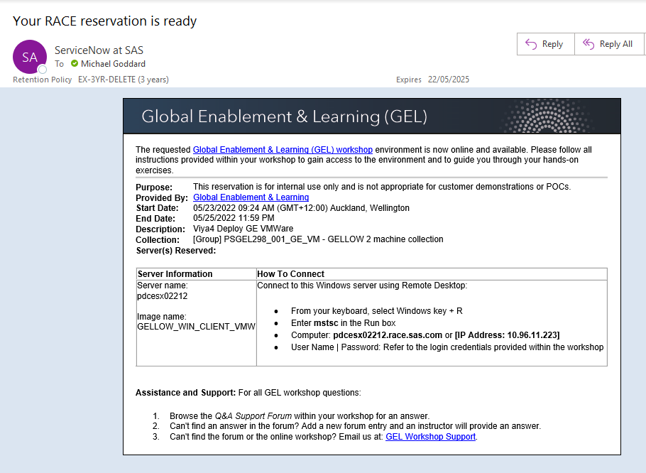

# Access Environments

- [Access Environments](#access-environments)
  - [Register yourself to be part of the STICExnetUsers group](#register-yourself-to-be-part-of-the-sticexnetusers-group)
  - [Book a RACE Collection](#book-a-race-collection)
  - [Connect to your Collection](#connect-to-your-collection)
  - [Next steps](#next-steps)

## Register yourself to be part of the STICExnetUsers group

* If you are not yet a member of the **STICExnetUsers** group, you need to join it.
  * [Click here](mailto:dlmanager@wnt.sas.com?subject=Subscribe%20STICEXNETUsers) to prepare an email request to join **STICExnetUsers** group
    * This should open up a new e-mail to the address: `dlmanager@wnt.sas.com` with the subject: `Subscribe STICEXNETUsers`
  * Send the email as-is, without any changes
  * If the link does not open an email client, simply send an email to `dlmanager@wnt.sas.com` with the subject: `Subscribe STICEXNETUsers`
* Once the email is sent, you will be notified via email of the creation of the account-- or that you are already a member.
* Your account membership should be updated and ready for use within 1 hour
* Sometimes, it takes much longer than 1 hour for this group membership to propagate through the network.
* To expedite the group membership, simply log out of the SAS network and log back in.
* Until the group membership occurs, you will get a message that you do not have access and won't be able reserve the environment.
## Book a RACE Collection

* We will use a RACE machine as a jumphost to interact with AKS

* [Book the collection](http://race.exnet.sas.com/Reservations?action=new&imageId=467949&imageKind=C&comment=Viya4%20Deploy%20GE%20VMWare&purpose=PST&sso=PSGEL298&schedtype=SchedTrainEDU&startDate=now&endDateLength=0&discardonterminate=y), which comes with one Windows client and one Linux machine.

* **ONLY IF YOU ARE UNABLE TO BOOK THE VMWARE COLLECTION ABOVE**
    * This collection uses Azure based machines which are part of the wider RACE network.
    * It should only be used when the VMWare based RACE machines are not available.
    * You should only book the collection for 4 hours at a time, as there is a cost to SAS when these machines are used.
    * Book the [Azure based Collection](http://race.exnet.sas.com/Reservations?action=new&imageId=474657&imageKind=C&comment=Viya4%20Deploy%20GE%20Azure&purpose=PST&sso=PSGEL298&schedtype=SchedTrainEDU&startDate=now&endDateLength=0&discardonterminate=y) which comes with one Windows client and one Linux machine.

* Once the collection has been started, you should receive an email like the one below.

    

## Connect to your Collection

* Connect to the Windows Machine of your RACE collection (as `Student/Metadata0`).
* In the Hands-on instructions, **we will run the commands run from the sasnode1 session from within MobaXterm** on the RACE client machine.

---

## Next steps

* Now you can select the desired learning path:

  * [Standard - create the AKS cluster](Track-A-Standard/00-Common/00_100_Creating_an_AKS_Cluster.md)

  OR

  * [Fully Automated](Track-B-Automated/03_500_Full_Automation_of_AKS_Deployment.md)

* If you are not sure of the differences between the available learning path, refer to the [README](README.md) file.

---

<!-- startnav -->
* [Access and Setup / 00 001 Access Environments](/Access_and_Setup/00_001_Access_Environments.md)**<-- you are here**
* [README](/README.md)
* [Track A-Standard/00-Common / 00 100 Creating an AKS Cluster](/Track-A-Standard/00-Common/00_100_Creating_an_AKS_Cluster.md)
* [Track A-Standard/00-Common / 00 110 Performing the prerequisites](/Track-A-Standard/00-Common/00_110_Performing_the_prerequisites.md)
* [Track A-Standard/00-Common / 00 400 Cleanup](/Track-A-Standard/00-Common/00_400_Cleanup.md)
* [Track A-Standard/00-Common / 00 490 Cleanup Information](/Track-A-Standard/00-Common/00_490_Cleanup_Information.md)
* [Track A-Standard/01-Manual / 01 200 Deploying Viya 4 on AKS](/Track-A-Standard/01-Manual/01_200_Deploying_Viya_4_on_AKS.md)
* [Track A-Standard/01-Manual / 01 210 Deploy a second namespace in AKS](/Track-A-Standard/01-Manual/01_210_Deploy_a_second_namespace_in_AKS.md)
* [Track A-Standard/01-Manual / 01 220 CAS Customizations](/Track-A-Standard/01-Manual/01_220_CAS_Customizations.md)
* [Track A-Standard/01-Manual / 01 230 Install monitoring and logging](/Track-A-Standard/01-Manual/01_230_Install_monitoring_and_logging.md)
* [Track A-Standard/01-Manual / 01 240 Stop shrink and Start-scale in AKS](/Track-A-Standard/01-Manual/01_240_Stop-shrink_and_Start-scale_in_AKS.md)
* [Track A-Standard/02-DepOp / 02 300 Deployment Operator environment set up](/Track-A-Standard/02-DepOp/02_300_Deployment_Operator_environment_set-up.md)
* [Track A-Standard/02-DepOp / 02 310 Using the DO with a Git Repository](/Track-A-Standard/02-DepOp/02_310_Using_the_DO_with_a_Git_Repository.md)
* [Track A-Standard/02-DepOp / 02 330 Using the Orchestration Tool](/Track-A-Standard/02-DepOp/02_330_Using_the_Orchestration_Tool.md)
* [Track B-Automated / 03 500 Full Automation of AKS Deployment](/Track-B-Automated/03_500_Full_Automation_of_AKS_Deployment.md)
* [Track B-Automated / 03 590 Cleanup](/Track-B-Automated/03_590_Cleanup.md)
<!-- endnav -->
