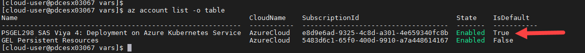

# Creating an AKS cluster (Using a RACE JumpHost)

- [Creating an AKS cluster (Using a RACE JumpHost)](#creating-an-aks-cluster-using-a-race-jumphost)
  - [Introduction](#introduction)
    - [GitHub Project: SAS Viya 4 IaC for Microsoft Azure](#github-project-sas-viya-4-iac-for-microsoft-azure)
  - [Review the SAS Viya 4 IaC for Azure prerequisites](#review-the-sas-viya-4-iac-for-azure-prerequisites)
  - [Connect to your Collection](#connect-to-your-collection)
    - [Has the Collection finished bootstrapping?](#has-the-collection-finished-bootstrapping)
    - [Make sure kubectl is installed](#make-sure-kubectl-is-installed)
    - [Make sure jq is installed](#make-sure-jq-is-installed)
    - [Install Azure CLI and Login with the workshop Service Principle](#install-azure-cli-and-login-with-the-workshop-service-principle)
    - [Set the Azure CLI defaults](#set-the-azure-cli-defaults)
    - [Set up Terraform](#set-up-terraform)
    - [Obtain the Terraform templates](#obtain-the-terraform-templates)
    - [Set-up the Terraform configuration](#set-up-the-terraform-configuration)
    - [Initialize Terraform](#initialize-terraform)
  - [Provision the AKS cluster with Terraform](#provision-the-aks-cluster-with-terraform)
    - [Create an ssh key](#create-an-ssh-key)
    - [Customize the Terraform variables](#customize-the-terraform-variables)
    - [Generate a Terraform plan](#generate-a-terraform-plan)
  - [Stand up AKS cluster and Validate](#stand-up-aks-cluster-and-validate)
    - [Apply the Terraform plan](#apply-the-terraform-plan)
      - [In case it did not work for you](#in-case-it-did-not-work-for-you)
    - [Get your environment variables](#get-your-environment-variables)
    - [Using the Azure CLI and Portal to view the resources](#using-the-azure-cli-and-portal-to-view-the-resources)
      - [Using the Azure CLI](#using-the-azure-cli)
      - [Using the Azure Portal](#using-the-azure-portal)
    - [Getting the kubectl config file for your newly built AKS cluster](#getting-the-kubectl-config-file-for-your-newly-built-aks-cluster)
    - [Configure kubectl auto-completion](#configure-kubectl-auto-completion)
  - [Troubleshooting](#troubleshooting)
  - [References](#references)
  - [Next Steps](#next-steps)
  - [Table of Contents for the Standard Track required exercises](#table-of-contents-for-the-standard-track-required-exercises)
  - [Complete Hands-on Navigation Index](#complete-hands-on-navigation-index)

## Introduction

In this hands-on we use the GitHub 'viya4-iac-azure' project to build the Azure Kubernetes Service cluster.

### GitHub Project: SAS Viya 4 IaC for Microsoft Azure

SAS has developed a publicly available GitHub project called "**SAS Viya 4 Infrastructure as Code (IaC) for Microsoft Azure**" that uses Terraform and Modules from the Terraform Registry to create and configure Azure infrastructure components needed to deploy SAS Viya 4.x products on an AKS cluster.

<https://github.com/sassoftware/viya4-iac-azure>


We will get and use the Terraform templates from there to automate the AKS cluster provisioning.

## Review the SAS Viya 4 IaC for Azure prerequisites

* In this exercise, we will us the [SAS Viya 4 IaC for Azure](https://github.com/sassoftware/viya4-iac-azure) project.
* The project is available in GitHub and has several pre-requisites, such as :
  * Access to an Azure Subscription and Identity with 'Contributor' role
  * Terraform or Docker

## Connect to your Collection

* Connect to the Windows Machine of your RACE collection (as Student/Metadata0).
* In the following steps, **we will run the commands run from the sasnode1 session from within MobaXterm** on the RACE client machine.

See [00_001_Access_Environments.md](../../Access_and_Setup/00_001_Access_Environments.md) to book the Collection if you have not already done so.

### Has the Collection finished bootstrapping?

If you connect to the collection as soon as you receive the confirmation e-mail, the collection is probably still in the process of self-configuring.

You need to wait until that process is done. (around 10 minutes, usually).

In order to confirm that the bootstrapping is finished and successful, do the following:

1. Execute the following command on sasnode01:

    ```sh
    tail -f /opt/gellow_work/logs/gellow_summary.log
    ```

1. Wait for the last line to say:

    ```log
    PASS Final message: It seems everything deployed successfully!
    PASS Final message: You can start using this collection

    #####################################################################################
    ####### DONE WITH THE BOOTSTRAPPING OF THE MACHINE ##################################
    #####################################################################################
    ```

1. Now, you can hit `Ctrl +C` keys to exit the interactive "tail" command.

### Make sure kubectl is installed

* Run the command below to show the installed version.

    If you run the `kubectl version` command without any parameters the output will return two versions (client and server). The server version refers to the version of your Kubernetes API server. The client version refers to the version of your kubectl CLI.

    As you have not yet deployed the AKS cluster you need to filter for the client, otherwise an error will be displayed for the server connection. Use the following command to show the installed kubectl CLI version.

    ```bash
    kubectl version --client --short
    ```

    Or, to see all the client details run:

    ```sh
    kubectl version --client --output=yaml
    ```

### Make sure jq is installed

* Run the command below to show the installed version.

    ```bash
    jq --version
    ```

### Install Azure CLI and Login with the workshop Service Principle

1. Install the azure CLI client.

    ```bash
    sudo rpm --import https://packages.microsoft.com/keys/microsoft.asc
    echo -e "[azure-cli]
    name=Azure CLI
    baseurl=https://packages.microsoft.com/yumrepos/azure-cli
    enabled=1
    gpgcheck=1
    gpgkey=https://packages.microsoft.com/keys/microsoft.asc" | sudo tee /etc/yum.repos.d/azure-cli.repo
    sudo yum install azure-cli -y
    ```

1. Authenticate to Azure with the Workshop Service Principal.

    We will use one of the GEL workshop scripts to do this. It will save the environment variables for the workshop subscription.

    ```bash
    code_dir=$HOME"/PSGEL298-sas-viya-4-deployment-on-azure-kubernetes-service/scripts"

    bash -E ${code_dir}/utils/GEL.010.Define.Environment.sh logon-sp
    ```

### Set the Azure CLI defaults

* First, let's list the subscriptions we have access to and choose the default one:

    ```sh
    az account list -o table
    ```

    If `PSGEL298 SAS Viya 4: Deployment on Azure Kubernetes Service` is not the default, then we need to set it.

    You should see the following output.

    

  * Set the Azure subscription if **PSGEL298** isn't the default.

    ```sh
    WORK_DIR=$HOME/project/vars
    SubId=$(cat ${WORK_DIR}/.aztf_creds | grep ARM_SUBSCRIPTION_ID | awk -F'=' '{print $2}')
    # Set the subscription
    az account set -s ${SubId}
    ```

    Issue the `az account list -o table` command again to confirm the change.

* Now, we need to define the location we want. Let's list the locations, and choose one (eastus):

    ```bash
    az account list-locations -o table
    # The default region we choose is "eastus" but you can choose something else if you want.
    # If resources are unavailable in "eastus" try setting the region to "eastus2".
    AZUREREGION="eastus"
    #AZUREREGION="eastus2"
    az configure --defaults location=${AZUREREGION}

    rm -f ~/azureregion.txt
    echo ${AZUREREGION} > ~/azureregion.txt
    cat ~/azureregion.txt
    az configure --defaults location=${AZUREREGION}
    # Save the AZUREREGION info for next time we re-login
    ansible localhost -m lineinfile \
        -a "dest=~/.bashrc \
            regexp='^export AZUREREGION' \
            line='export AZUREREGION=$(cat ~/azureregion.txt)'" \
            --diff

    ```

  <details><summary>Click here to see a sample output of the available regions</summary>

  ```log
  [cloud-user@pdcesx04215 ~]$ az account list-locations -o table
  DisplayName               Name                 RegionalDisplayName
  ------------------------  -------------------  -------------------------------------
  East US                   eastus               (US) East US
  East US 2                 eastus2              (US) East US 2
  South Central US          southcentralus       (US) South Central US
  West US 2                 westus2              (US) West US 2
  Australia East            australiaeast        (Asia Pacific) Australia East
  Southeast Asia            southeastasia        (Asia Pacific) Southeast Asia
  North Europe              northeurope          (Europe) North Europe
  UK South                  uksouth              (Europe) UK South
  West Europe               westeurope           (Europe) West Europe
  Central US                centralus            (US) Central US
  North Central US          northcentralus       (US) North Central US
  West US                   westus               (US) West US
  South Africa North        southafricanorth     (Africa) South Africa North
  Central India             centralindia         (Asia Pacific) Central India
  East Asia                 eastasia             (Asia Pacific) East Asia
  Japan East                japaneast            (Asia Pacific) Japan East
  Korea Central             koreacentral         (Asia Pacific) Korea Central
  Canada Central            canadacentral        (Canada) Canada Central
  France Central            francecentral        (Europe) France Central
  Germany West Central      germanywestcentral   (Europe) Germany West Central
  Norway East               norwayeast           (Europe) Norway East
  Switzerland North         switzerlandnorth     (Europe) Switzerland North
  UAE North                 uaenorth             (Middle East) UAE North
  Brazil South              brazilsouth          (South America) Brazil South
  Central US (Stage)        centralusstage       (US) Central US (Stage)
  East US (Stage)           eastusstage          (US) East US (Stage)
  East US 2 (Stage)         eastus2stage         (US) East US 2 (Stage)
  North Central US (Stage)  northcentralusstage  (US) North Central US (Stage)
  South Central US (Stage)  southcentralusstage  (US) South Central US (Stage)
  West US (Stage)           westusstage          (US) West US (Stage)
  West US 2 (Stage)         westus2stage         (US) West US 2 (Stage)
  Asia                      asia                 Asia
  Asia Pacific              asiapacific          Asia Pacific
  Australia                 australia            Australia
  Brazil                    brazil               Brazil
  Canada                    canada               Canada
  Europe                    europe               Europe
  Global                    global               Global
  India                     india                India
  Japan                     japan                Japan
  United Kingdom            uk                   United Kingdom
  United States             unitedstates         United States
  East Asia (Stage)         eastasiastage        (Asia Pacific) East Asia (Stage)
  Southeast Asia (Stage)    southeastasiastage   (Asia Pacific) Southeast Asia (Stage)
  Central US EUAP           centraluseuap        (US) Central US EUAP
  East US 2 EUAP            eastus2euap          (US) East US 2 EUAP
  West Central US           westcentralus        (US) West Central US
  West US 3                 westus3              (US) West US 3
  South Africa West         southafricawest      (Africa) South Africa West
  Australia Central         australiacentral     (Asia Pacific) Australia Central
  Australia Central 2       australiacentral2    (Asia Pacific) Australia Central 2
  Australia Southeast       australiasoutheast   (Asia Pacific) Australia Southeast
  Japan West                japanwest            (Asia Pacific) Japan West
  Korea South               koreasouth           (Asia Pacific) Korea South
  South India               southindia           (Asia Pacific) South India
  West India                westindia            (Asia Pacific) West India
  Canada East               canadaeast           (Canada) Canada East
  France South              francesouth          (Europe) France South
  Germany North             germanynorth         (Europe) Germany North
  Norway West               norwaywest           (Europe) Norway West
  Switzerland West          switzerlandwest      (Europe) Switzerland West
  UK West                   ukwest               (Europe) UK West
  UAE Central               uaecentral           (Middle East) UAE Central
  Brazil Southeast          brazilsoutheast      (South America) Brazil Southeast
  [cloud-user@pdcesx04215 ~]$ az configure --defaults location=eastus
  [cloud-user@pdcesx04215 ~]$
  ```

  </details>

### Set up Terraform

* Install the Terraform YUM repository

    ```bash
    ## Install yum-config-manager to manage your repositories.
    sudo yum install -y yum-utils
    ## Use yum-config-manager to add the official HashiCorp Linux repository.
    sudo yum-config-manager --add-repo https://rpm.releases.hashicorp.com/RHEL/hashicorp.repo
    ```

* We want to pin our Terraform version to the version required by the "SAS Viya 4 IaC" tool.

    ```bash
    # we stick to 13.4 bc it is the required version to use with the viya4-iac version that works with azure files storage
    ## Install
    yum --showduplicate list terraform
    ## Pick up the version that is supported with viya4-iac
    sudo yum install terraform-1.0.0-1 -y
    ```

### Obtain the Terraform templates

The Terraform templates that we need comes from this [project](https://github.com/sassoftware/viya4-iac-azure).
Since they are public, they are not included in the payload tarball.

* Get the Terraform artifacts from GitHub and checkout a specific version

    ```bash
    rm -Rf ~/project/aks/viya4-iac-azure
    mkdir -p ~/project/aks/
    cd ~/project/aks/
    git clone https://github.com/sassoftware/viya4-iac-azure.git

    # Instead of being at the mercy of the latest changes, we pin to a specific version
    cd ~/project/aks/viya4-iac-azure/
    git fetch --all
    #IAC_AZURE_TAG=4.3.0 March 2022
    #IAC_AZURE_TAG=5.0.0 Apr 2022
    IAC_AZURE_TAG=5.0.0
    git checkout tags/${IAC_AZURE_TAG}
    ```

### Set-up the Terraform configuration

As you will be using Terraform interactively we will use the workshop SP Azure credentials when running Terraform from the Azure CLI.

1. Export all the Terraform environment variables

    ```bash
    TFCREDFILE=~/project/vars/.aztf_creds
    while read l; do
        echo "export $l"
        export $l
    done <${TFCREDFILE}
    ```

1. Edit the **main.tf** file to use Azure CLI authentication.

    The default configuration needs to be updated to use Azure CLI authentication. Run the following to update the 'main.tf' file.

    ```bash
    cd ~/project/aks/viya4-iac-azure

    sed -i '0,/subscription_id/{//d;}' ./main.tf
    sed -i '0,/client_id/{//d;}' ./main.tf
    sed -i '0,/client_secret/{//d;}' ./main.tf
    sed -i '0,/tenant_id/{//d;}' ./main.tf
    sed -i '0,/partner_id/{//d;}' ./main.tf
    sed -i '0,/use_msi/{//d;}' ./main.tf
    ```

### Initialize Terraform

* Run this command to initialize terraform in our environment.

  ```bash
  cd ~/project/aks/viya4-iac-azure
  #terraform init
  terraform init
  ```

  On completion, you should see output similar to the image below.

  

  The important part is **"Terraform has been successfully initialized!"**

## Provision the AKS cluster with Terraform

### Create an ssh key

* An ssh key needs to be created in case we create a jumphost VM with Terraform

    ```bash
    # ensure there is a .ssh dir in $HOME
    ansible localhost -m file \
        -a "path=$HOME/.ssh mode=0700 state=directory"


    # ensure there is an ssh key that we can use
    ansible localhost -m openssh_keypair \
        -a "path=~/.ssh/id_rsa type=rsa size=2048" --diff
    ```

### Customize the Terraform variables

There are many variables/settings/options that you can modify/edit within the TF templates using the variables.
See this [page](https://github.com/sassoftware/viya4-iac-azure/blob/main/variables.tf) in the IAC-Azure project for the list of available variables and default values.

You can also consult [this page](https://github.com/sassoftware/viya4-iac-azure/blob/main/docs/CONFIG-VARS.md) for a complete and readable list.

As an example, try to find which variable to use to increase the sizing of my Azure Database for PostgreSQL.

Let's create our Terraform variables file:

* ```gel-vars.tfvars``` with multiple node pools specialized : cas node pool, compute node pool, stateless and stateful node pool.
<!-- * ```gel-vars-minimal.tfvars``` minimal version with a default node pool containing only one node (if more resources are needed we rely on the AKS autoscaling feature) -->

To avoid having to cut and paste a large code block a template has been set-up. We need to update this for your environment.

1. Get the template for the 'tfvars' file.

    ```bash
    code_dir=$HOME"/PSGEL298-sas-viya-4-deployment-on-azure-kubernetes-service/scripts"
    work_dir=$HOME/project/aks/viya4-iac-azure
    # Copy and rename the template
    cp ${code_dir}/gelenable_tfvars/track_a_gel-vars.tfvars \
    ${work_dir}/gel-vars.tfvars
    ```

1. Update the template for your environment.

    The template needs to be updated for your environment. This includes setting the right prefix and tags for your resources.

    ```bash
    work_dir=$HOME/project/aks/viya4-iac-azure
    myPrefix=$(cat ~/MY_PREFIX.txt)
    myLocation=$(cat ~/azureregion.txt )
    myTags=$(cat ~/MY_TAGS.txt)", \"gel_project\" = \"PSGEL298 Track-A\" "
    k8s_version="1.21.9"

    # Update the prefix
    sed -i 's/{{tfvars_prefix}}/'"${myPrefix}"'/' ${work_dir}/gel-vars.tfvars
    # Update the location
    sed -i 's/{{tfvars_location}}/'"${myLocation}"'/' ${work_dir}/gel-vars.tfvars
    # Set K8s version
    sed -i 's/{{tfvars_k8s_version}}/'"${k8s_version}"'/' ${work_dir}/gel-vars.tfvars
    # Update the tags
    sed -i 's/{{tfvars_tags}}/'"${myTags}"'/' ${work_dir}/gel-vars.tfvars
    ```

1. Review the Terraform variables file.

    Take a moment to review and understand the content of the file. It defines how our Kubernetes cluster will provisioned in Azure.

    ```sh
    work_dir=$HOME/project/aks/viya4-iac-azure
    less ${work_dir}/gel-vars.tfvars
    ```

   * It defines the node pools and what kind of Azure Instance sizes will be used for the Kubernetes Workers.
   * Note, with Stable 2021.2.6 (April 2022) and with LTS 2022.2 (when available in November 2022) there was a change to the default workload classes, the 'connect' workload class is now optional. Therefore, the default configuration no longer needs a 'connect' node pool. 
       * You will see that we have still defined the 'connect' node pool, but the minimum number of nodes is zero.
       * This has been done for possible future lab exercises. It will allow you to test enabling the patch transformers to make use of the 'connect' node pool.

   * Hit "q" to quit from the interactive "less" command.

### Generate a Terraform plan

1. Let's generate the TF plan corresponding to the AKS cluster with multiple node pools.

    ```bash
    # generate the TF plan corresponding to the AKS cluster with multiple node pools
    cd ~/project/aks/viya4-iac-azure
    #terraform plan -input=false \
    terraform plan -input=false \
        -var-file=./gel-vars.tfvars \
        -out ./my-aks.plan
    ```

    * Once completed you should see something like the following.

        

1. Review the generated plan.

    ```sh
    #TFPLAN=my-aks-minimal.plan
    TFPLAN=my-aks.plan
    cd ~/project/aks/viya4-iac-azure
    #terraform show ${TFPLAN}
    terraform show ${TFPLAN}
    ```

    * The plan shows all the infrastructure components that will be created in Azure to support the Viya deployment : Virtual network, Subnets, Public IPs, Network Security Groups, an Azure Postgres DB, an Azure Kubernetes Cluster with several node pools and associated instance types.
    * A first resource group named per your SAS ID or NAME (```<YOUR SAS ID>```viya4aks-rg) is created to hold all the provisioned components.
    * Then when the AKS cluster is created in the first Resource group, it will trigger the creation of the second resource group (the name starts with "MC" and also contains your SAS ID) that will contains all the Kubernetes cluster infrastructure (VM scalesets, Disks, Storage accounts, Public IP, etc...).

## Stand up AKS cluster and Validate

### Apply the Terraform plan

Now we can deploy the AKS cluster with the TF plan. In our testing it takes less than 10 minutes.

1. Run the following command to provision the AKS cluster using the Terraform plan.

    ```bash
    # Deploy the AKS cluster with the TF plan
    TFPLAN=my-aks.plan
    # by default, we go with the multi node pools AKS cluster but you can choose the minimal one to test
    cd ~/project/aks/viya4-iac-azure
    # apply the TS plan and generate a log in case of disconnection.
    time terraform apply "./${TFPLAN}" 2>&1 \
    | tee -a /tmp/terraform-apply.log
    ```

* You will first see the progress of the Terraform plan being executed to provision the AKS infrastructure.

    

* Finally, you should see some text reporting that the TF plan run is now complete.  FYI, the TF output provides some detail for some hosts, then some additional text, then the remaining details about the hosts. It will look similar to the following.

  

#### In case it did not work for you

If that did not work see the [Troubleshooting Notes](../00-Common/00_900_Troubleshooting.md).

### Get your environment variables

There are a number of configuration variables that are needed for the lab exercises. Now that the AKS cluster has been provisioned let's collect them and save them to a file for later use.

* Get the environment variables from the Terraform configuration.

    ```bash
    WORK_DIR=$HOME/project/vars
    rm -f ${WORK_DIR}/variables.txt
    cd ~/project/aks/viya4-iac-azure/
    echo "subscription::"$(cat ${WORK_DIR}/.aztf_creds | grep subscription | awk -F'=' '{print $2}') | tee -a ${WORK_DIR}/variables.txt
    echo "tenant::"$(cat ${WORK_DIR}/.aztf_creds | grep tenant | awk -F'=' '{print $2}') | tee -a ${WORK_DIR}/variables.txt
    echo "cluster-name::"$(terraform output -raw cluster_name) | tee -a ${WORK_DIR}/variables.txt
    echo "resource-group::"$(terraform output -raw prefix)"-rg" | tee -a ${WORK_DIR}/variables.txt
    echo "node-res-group::MC_"$(terraform output -raw prefix)"-rg_"$(terraform output -raw cluster_name)"_"$(terraform output -raw location) | tee -a ${WORK_DIR}/variables.txt
    echo "prefix::"$(terraform output -raw prefix) | tee -a ${WORK_DIR}/variables.txt
    echo "location::"$(terraform output -raw location) | tee -a ${WORK_DIR}/variables.txt
    echo "postgres-server::"$(terraform output postgres_servers | grep fqdn | awk -F'= "' '{print $2}' | sed 's/"//g') | tee -a ${WORK_DIR}/variables.txt
    echo "postgres-admin::"$(terraform output postgres_servers | grep admin | awk -F'= "' '{print $2}' | sed 's/"//g') | tee -a ${WORK_DIR}/variables.txt
    printf "\nYour environment varables\n-------------------------\n$(cat ${WORK_DIR}/variables.txt) \n\n"
    ```

### Using the Azure CLI and Portal to view the resources

When the AKS was built two resource groups were created. The first resource group contains the Kubernetes service resources. A second resource group is also created.

The second resource group, known as the 'node resource group', contains all of the infrastructure resources associated with the cluster. These resources include the Kubernetes node VMs, virtual networking, and storage. By default, the node resource group has a name like *MC_myResourceGroup_myAKSCluster_eastus*.

AKS automatically deletes the node resource group whenever the cluster is deleted, so it should only be used for resources that share the cluster's lifecycle.

#### Using the Azure CLI

You can use the Azure CLI to confirm that you have successfully created the resources. For example, using the to list command (`az group list -otable`) or the show command (`az group show -n ResourceGroupName -otable`) to show the resource groups.

* Run the `az group list` command to confirm your resource groups. But we will put some formatting around it.

    ```bash
    printf "\n\nYour Resource Groups are:\n" && az group list -otable | grep $(cat ~/MY_PREFIX.txt) && printf "\n"
    ```

    You will see the resource groups names, the regions where they have been created and the status. For example.

    

* View the primary resource group.

    You can use the 'az resource list' command (`az resource list --resource-group`) to view the resources in a resource group.

    ```sh
    WORK_DIR=$HOME/project/vars
    rg=$(cat ${WORK_DIR}/variables.txt | grep resource-group | awk -F'::' '{print $2}')
    az resource list --resource-group ${rg} -otable
    ```

#### Using the Azure Portal

1. Access the Azure Portal.

    Open the browser on your Windows client and access the Azure Portal, [Click here](https://portal.azure.com).

    Login with user '**gatedemo001@gelenable.sas.com**' and password 'Metadata0' (with a zero).

1. Login with `gatedemo001@gelenable.sas.com`.

    

1. Enter password `Metadata0` and "Sign in".

    

1. Select '**No**' for the 'Stay signed in?' prompt.

    

You will now see the main page for the Azure Portal.


* View your resource groups.

    

* Filter for this workshop.

    If you do not see the PSGEL298 subscription you will need to set the filter for this workshop subscription (PSGEL298 SAS Viya 4: Deployment on Azure Kubernetes Service)

    

* You should now see a list of all the current resource groups for the PSGEL298 subscription, so you need to filter for your resources.

    Run the following to get your resource prefix.

    ```sh
    code_dir=$HOME"/PSGEL298-sas-viya-4-deployment-on-azure-kubernetes-service/scripts"
    bash ${code_dir}/utils/WhatsMyDetails.sh -a prefix
    ```

    You will see output similar to the following.

    

    Use the resource prefix to filter the output in the Azure Portal.

* You should now see that two new resource groups have been created.

    

    *Note: If you don't see your resource groups, you might not be looking in the correct subscription. If you don't see the '**PSGEL298 SAS Viya 4: Deployment on Azure Kubernetes Service**' subscription you might have to change the global subscription filter in the "Subscription" menu*


* Browse in the Azure portal to see all resources created in the resource groups.

    For example.

  

### Getting the kubectl config file for your newly built AKS cluster

1. First, let's generate the config file with a recognizable name:

    ```bash
    # generate the config file with a recognizable name
    STUDENT=$(cat ~/MY_PREFIX.txt)
    cd ~/project/aks/viya4-iac-azure
    mkdir -p ~/.kube
    terraform output -raw kube_config > ~/.kube/${STUDENT}-aks-kubeconfig.conf
    ```

1. Then, let's make a symlink to it for easier access:

    ```bash
    SOURCEFOLDER=~/.kube/${STUDENT}-aks-kubeconfig.conf
    ansible localhost -m file \
      -a "src=$SOURCEFOLDER \
          dest=~/.kube/config state=link" \
      --diff

    ```

      * You can use that config file to configure Lens.
      * You can also download and install the latest version of [Lens](https://k8slens.dev/) on the RACE client machine.
      * If you have the application "Lens" on your desktop, and if you are VPN'ed directly to Cary, that will work too.

1. Now run the kubectl command to check if your cluster is there !

    ```sh
    kubectl get nodes
    ```

    You should see something like the following:

    ```log
    NAME                                STATUS   ROLES   AGE     VERSION
    aks-cas-22223626-vmss000000         Ready    agent   8m33s   v1.21.9
    aks-compute-22223626-vmss000000     Ready    agent   8m34s   v1.21.9
    aks-stateful-22223626-vmss000000    Ready    agent   8m34s   v1.21.9
    aks-stateless-22223626-vmss000000   Ready    agent   8m34s   v1.21.9
    aks-system-22223626-vmss000000      Ready    agent   10m     v1.21.9
    ```

    _Note : Don't worry if you don't see more nodes (for example, only one node for stateful and stateless), they will be dynamically provisionned by the cluster auto-scaler during the deployment._

1. Run the following command to list the StorageClass information.

    ```sh
    # Get the StorageClass information
    kubectl get sc
    ```

    You should see output similar to the following.

    ```log
    NAME                    PROVISIONER          RECLAIMPOLICY   VOLUMEBINDINGMODE      ALLOWVOLUMEEXPANSION   AGE
    azurefile               file.csi.azure.com   Delete          Immediate              true                   8m57s
    azurefile-csi           file.csi.azure.com   Delete          Immediate              true                   8m57s
    azurefile-csi-premium   file.csi.azure.com   Delete          Immediate              true                   8m57s
    azurefile-premium       file.csi.azure.com   Delete          Immediate              true                   8m57s
    default (default)       disk.csi.azure.com   Delete          WaitForFirstConsumer   true                   8m57s
    managed                 disk.csi.azure.com   Delete          WaitForFirstConsumer   true                   8m57s
    managed-csi             disk.csi.azure.com   Delete          WaitForFirstConsumer   true                   8m57s
    managed-csi-premium     disk.csi.azure.com   Delete          WaitForFirstConsumer   true                   8m57s
    managed-premium         disk.csi.azure.com   Delete          WaitForFirstConsumer   true                   8m57s
    ```

### Configure kubectl auto-completion

The Kubernetes command-line tool, `kubectl`, allows you to run commands against Kubernetes clusters. You can use `kubectl` to deploy applications, inspect and manage cluster resources, and view logs.

`kubectl` provides autocompletion support for Bash and Zsh, which can save you a lot of typing.

* Run the command below to enable it in your environment:

  ```bash
  source <(kubectl completion bash)
  ansible localhost \
      -m lineinfile \
      -a "dest=~/.bashrc \
          line='source <(kubectl completion bash)' \
          state=present" \
      --diff
  ```

---

## Troubleshooting

If you have problems with the AKS build see the [Troubleshooting Notes](../00-Common/00_900_Troubleshooting.md).

## References

* AKS cluster auto-scaling: <https://docs.microsoft.com/en-us/azure/aks/cluster-autoscaler>

---

## Next Steps

**Congratulations ! You should now have a running AKS cluster.** :-)

Now that you have created the AKS cluster, the next exercise will perform the required prerequisites for Viya deployment.

Click [here](./00_110_Performing_the_prerequisites.md) to move onto the next exercise: ***00_110_Performing_the_prerequisites.md***

## Table of Contents for the Standard Track required exercises

<!--Navigation for this set of labs-->
* [00 100 Creating an AKS Cluster](../00-Common/00_100_Creating_an_AKS_Cluster.md) **<-- You are here**
* [00 110 Performing the prerequisites](../00-Common/00_110_Performing_the_prerequisites.md)

---

## Complete Hands-on Navigation Index

<!-- startnav -->
* [Access and Setup / 00 001 Access Environments](/Access_and_Setup/00_001_Access_Environments.md)
* [README](/README.md)
* [Track A-Standard/00-Common / 00 100 Creating an AKS Cluster](/Track-A-Standard/00-Common/00_100_Creating_an_AKS_Cluster.md)**<-- you are here**
* [Track A-Standard/00-Common / 00 110 Performing the prerequisites](/Track-A-Standard/00-Common/00_110_Performing_the_prerequisites.md)
* [Track A-Standard/00-Common / 00 400 Cleanup](/Track-A-Standard/00-Common/00_400_Cleanup.md)
* [Track A-Standard/00-Common / 00 490 Cleanup Information](/Track-A-Standard/00-Common/00_490_Cleanup_Information.md)
* [Track A-Standard/01-Manual / 01 200 Deploying Viya 4 on AKS](/Track-A-Standard/01-Manual/01_200_Deploying_Viya_4_on_AKS.md)
* [Track A-Standard/01-Manual / 01 210 Deploy a second namespace in AKS](/Track-A-Standard/01-Manual/01_210_Deploy_a_second_namespace_in_AKS.md)
* [Track A-Standard/01-Manual / 01 220 CAS Customizations](/Track-A-Standard/01-Manual/01_220_CAS_Customizations.md)
* [Track A-Standard/01-Manual / 01 230 Install monitoring and logging](/Track-A-Standard/01-Manual/01_230_Install_monitoring_and_logging.md)
* [Track A-Standard/01-Manual / 01 240 Stop shrink and Start-scale in AKS](/Track-A-Standard/01-Manual/01_240_Stop-shrink_and_Start-scale_in_AKS.md)
* [Track A-Standard/02-DepOp / 02 300 Deployment Operator environment set up](/Track-A-Standard/02-DepOp/02_300_Deployment_Operator_environment_set-up.md)
* [Track A-Standard/02-DepOp / 02 310 Using the DO with a Git Repository](/Track-A-Standard/02-DepOp/02_310_Using_the_DO_with_a_Git_Repository.md)
* [Track A-Standard/02-DepOp / 02 330 Using the Orchestration Tool](/Track-A-Standard/02-DepOp/02_330_Using_the_Orchestration_Tool.md)
* [Track B-Automated / 03 500 Full Automation of AKS Deployment](/Track-B-Automated/03_500_Full_Automation_of_AKS_Deployment.md)
* [Track B-Automated / 03 590 Cleanup](/Track-B-Automated/03_590_Cleanup.md)
<!-- endnav -->
