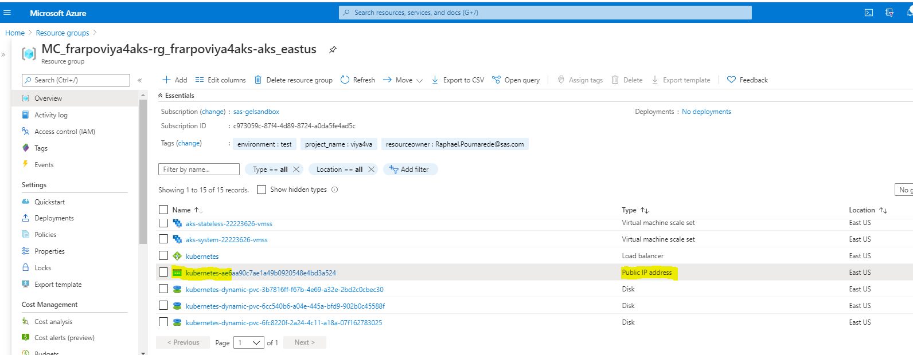

# Prepare the cluster for SAS Viya

- [Prepare the cluster for SAS Viya](#prepare-the-cluster-for-sas-viya)
  - [Introduction](#introduction)
  - [Create a project and working folder](#create-a-project-and-working-folder)
  - [Prep the cluster](#prep-the-cluster)
    - [Install cert-manager](#install-cert-manager)
    - [Install the NGINX ingress controller](#install-the-nginx-ingress-controller)
    - [Install Metrics server (for HPA)](#install-metrics-server-for-hpa)
    - [Install the nfs-provisioner to create a RWX StorageClass](#install-the-nfs-provisioner-to-create-a-rwx-storageclass)
  - [Set-up the DNS Aliases](#set-up-the-dns-aliases)
    - [Step 1. Define a DNS entry in Azure for the public IP](#step-1-define-a-dns-entry-in-azure-for-the-public-ip)
      - [Automated method to define a DNS entry in Azure for public IP](#automated-method-to-define-a-dns-entry-in-azure-for-public-ip)
      - [EXAMPLE: Using the Azure Portal](#example-using-the-azure-portal)
    - [Step 2. Create the wildcard DNS alias for your cluster](#step-2-create-the-wildcard-dns-alias-for-your-cluster)
      - [Using the DNS Within GELENABLE Azure AD Tenant](#using-the-dns-within-gelenable-azure-ad-tenant)
      - [Validate the DNS alias is working](#validate-the-dns-alias-is-working)
  - [Attached the GEL Registry to your AKS cluster](#attached-the-gel-registry-to-your-aks-cluster)
  - [Create the Network Security Group (NSG) Rules](#create-the-network-security-group-nsg-rules)
  - [Set-up additional tools](#set-up-additional-tools)
    - [Confirm 'kustomize' installation](#confirm-kustomize-installation)
    - [Confirm 'yq' installation](#confirm-yq-installation)
    - [Install the SAS Viya CLI](#install-the-sas-viya-cli)
    - [Copy the OKViya script](#copy-the-okviya-script)
    - [Set-up GELLDAP](#set-up-gelldap)
    - [Set-up WhatsMyDetails](#set-up-whatsmydetails)
  - [References](#references)
  - [Next Steps](#next-steps)
  - [Table of Contents for the Standard Track required exercises](#table-of-contents-for-the-standard-track-required-exercises)
  - [Complete Hands-on Navigation Index](#complete-hands-on-navigation-index)

## Introduction

At this point you should have completed the steps to create the AKS cluster, see [here](00_100_Creating_an_AKS_Cluster.md).

If you look at the namespaces in the cluster (kubectl get ns) you should see the following.

```log
$ kubectl get ns
NAME              STATUS   AGE
default           Active   17m
kube-node-lease   Active   17m
kube-public       Active   17m
kube-system       Active   17m
```

Before you can deploy SAS Viya in your AKS cluster there are a number of prerequisites that need to be implemented, including:

* An Ingress controller and
* cert-manager.

The following steps guide you through implementing the prerequisites.

There is also "nice to have" stuff such as the OKViya4 tool to monitor services startup, mirror manager (in case  we'd like to setup our own registry), the tools for monitoring and alerting, etc...

## Create a project and working folder

* Create create a working directory for your project work.

    ```bash
    # Create the project and working folders
    mkdir -p ~/project/deploy/test
    mkdir -p ~/project/deploy/working

    cd ~/project/deploy/
    ```

    We will use the 'working' folder for the files required to prep the cluster and the 'test' folder will be used for the Viya configuration files.

## Prep the cluster

### Install cert-manager

***Note, with Stable-2021.2.6 the default configuration has changed to use the SAS provided OpenSSL generator. We will still deploy cert-manager so that it can be used.***

* We install cert-manager in its own namespace

    ```bash
    # not idempotent, to recreate, you'll need to delete the cert-manager crds
    kubectl create namespace cert-manager
    helm repo add jetstack https://charts.jetstack.io
    helm repo update
    helm install cert-manager jetstack/cert-manager \
        --namespace cert-manager \
        --version v1.6.1  \
        --set installCRDs=true \
        --set extraArgs='{--enable-certificate-owner-ref=true}'
    ```

_Note : it is required to configure front door TLS, enable internal Via services communications encryption, and also to deploy the Viya logging tool (Kibana) with TLS._

### Install the NGINX ingress controller

We will install the NGINX ingress controller using Helm.

1. Run the code below to install the NGINX ingress controller.

    ```bash
    # Get the Cloud NAT IP
    cd ~/project/aks/viya4-iac-azure
    export NATIP=$(terraform output -raw nat_ip)

    # Create the NGNIX namespace
    kubectl delete ns ingress-nginx
    kubectl create ns ingress-nginx
    # Install the Helm repo
    helm repo add ingress-nginx https://kubernetes.github.io/ingress-nginx
    helm repo update
    # Install the ingress controller (NGINX)
    # We install it in HA mode
    # We allow the Cary network range and RACE Azure clients IPs to access
    # Feb 2022 : increased ingress version as now "latest" K8s version is 1.22
    helm install  ingress-nginx --namespace ingress-nginx  \
        --set controller.service.externalTrafficPolicy=Local \
        --set controller.service.sessionAffinity=None \
        --set controller.service.loadBalancerSourceRanges="{10.244.0.0/16,149.173.0.0/16,52.226.102.80/31}" \
        --set controller.config.use-forwarded-headers="true" \
        --set controller.autoscaling.enabled=true \
        --set controller.autoscaling.minReplicas=2 \
        --set controller.autoscaling.maxReplicas=5 \
        --set controller.resources.requests.cpu=100m \
        --set controller.resources.requests.memory=500Mi \
        --set controller.autoscaling.targetCPUUtilizationPercentage=90 \
        --set controller.autoscaling.targetMemoryUtilizationPercentage=90 \
         --version 4.0.13 \
        ingress-nginx/ingress-nginx

    kubectl wait -n ingress-nginx --for=condition=available  --all deployments --timeout=60s
    ```

* After you deployed nginx, you can run:

    ```sh
    kubectl get svc -n ingress-nginx
    ```

    You should see output similar to the following.

    ```log
    NAME            TYPE           CLUSTER-IP     EXTERNAL-IP    PORT(S)                      AGE
    ingress-nginx   LoadBalancer   10.0.178.173   20.102.9.213   80:30380/TCP,443:30991/TCP   26s
    ```

* Let's store the external IP of the Load Balancer for that IP as an environment variable.

  ```sh
  LBIP=$(kubectl get service -n ingress-nginx | grep LoadBalancer | awk '{print $4}')
  echo LBIP = $LBIP
  ```

  It is a useful information and you will see that we use it later.

  It corresponds to the public IP assigned to the AKS cluster which is also visible in the Azure portal (go the "**MC_**" resource group that corresponds to your own cluster and you will see a new Public IP address resource starting with "**kubernetes**").

  

  The public IP allows the access to our Viya 4 applications from the outside.

### Install Metrics server (for HPA)

* Install the K8s metrics server

    ```bash
    kubectl apply -f https://github.com/kubernetes-sigs/metrics-server/releases/download/v0.6.1/components.yaml
    ```

### Install the nfs-provisioner to create a RWX StorageClass

<!-- This code block is for using a NFS Server rather than AzureFile for shared storage for Viya -->

We will use the NFS Server, that was created as part of the Terraform IaC build, for shared storage. For this we will install a nfs-provisioner and create a new RWX StorageClass.

1. First we need to get the NFS Server IP address.

    ```bash
    #Get the NFS Server IP address
    cd ~/project/aks/viya4-iac-azure
    export NFSIP=$(terraform output -raw rwx_filestore_endpoint)
    echo "NFS Server IP:" ${NFSIP}
    ```

1. Install the NFS provisioner and create a new Storage Class using the NFS Server. We will name the storage class '**sas-nfs**' to reflect that it is using the NFS Server.

    ```bash
    cd ~/project/
    kubectl delete ns nfs
    kubectl create ns nfs
    helm repo add nfs-subdir-external-provisioner https://kubernetes-sigs.github.io/nfs-subdir-external-provisioner/
    helm repo update
    helm install nfs-subdir-external-provisioner  \
    --set nfs.server=${NFSIP} \
    --set nfs.path=/export/pvs \
    --namespace nfs \
    --version  4.0.16 \
    --set podSecurityPolicy.enabled=true \
    --set storageClass.name="sas-nfs" \
    --set storageClass.archiveOnDelete=false \
    --set nfs.mountOptions="{noatime,nodiratime,'rsize=262144','wsize=262144'}" \
    nfs-subdir-external-provisioner/nfs-subdir-external-provisioner
    ```

1. Confirm the new StorageClass (**sas-nfs**) has been created.

    ```sh
    kubectl get sc
    ```

    You should see the following output.

    ```log
    NAME                    PROVISIONER                                     RECLAIMPOLICY   VOLUMEBINDINGMODE      ALLOWVOLUMEEXPANSION
    azurefile               file.csi.azure.com                              Delete          Immediate              true
    azurefile-csi           file.csi.azure.com                              Delete          Immediate              true
    azurefile-csi-premium   file.csi.azure.com                              Delete          Immediate              true
    azurefile-premium       file.csi.azure.com                              Delete          Immediate              true
    default (default)       disk.csi.azure.com                              Delete          WaitForFirstConsumer   true
    managed                 disk.csi.azure.com                              Delete          WaitForFirstConsumer   true
    managed-csi             disk.csi.azure.com                              Delete          WaitForFirstConsumer   true
    managed-csi-premium     disk.csi.azure.com                              Delete          WaitForFirstConsumer   true
    managed-premium         disk.csi.azure.com                              Delete          WaitForFirstConsumer   true
    sas-nfs                 cluster.local/nfs-subdir-external-provisioner   Delete          Immediate              true
    ```

    If you look at the pods running in the nfs namespace you should see the `nfs-subdir-external-provisioner` pod running.

<!-- Use this code if using AzureFiles
### Create new StorageClass to support RWX

By default, PVCs are owned by the root user. In Microsoft Azure environments, we must define a storageClass in which we explicitly set mountOptions for each PVC in order to allow non-root users to access them.

If we do not allow access by the sas user account, at a minimum, we will see permission errors.

In your custom storageClass definition, the UID and GID mount options must match the container process ID (which is 1001, sas, by default).

* Let's create our "sas-azurefile" custom storage class.

    ```bash
    #Create custom StorageClass to support RWX
    cd ~/project/deploy/working
    cat << 'EOF' > StorageClass-AzureFile-RWX.yaml
    kind: StorageClass
    apiVersion: storage.k8s.io/v1
    metadata:
      name: sas-azurefile
    provisioner: kubernetes.io/azure-file
    mountOptions:
      - dir_mode=0777
      - file_mode=0777
      - uid=1001
      - gid=1001
    parameters:
      skuName: Standard_LRS
    allowVolumeExpansion: true
    EOF
    ```

* Now let's apply the manifest

    ```bash
    # Create the storage class
    #kubectl apply -f StorageClass-RWX.yaml
    ```

    You can use `kubectl get sc` to confirm that the "sas-azurefile" storage class has been created. For example.

    ```log
    $ kubectl get sc
    NAME                PROVISIONER                RECLAIMPOLICY   VOLUMEBINDINGMODE      ALLOWVOLUMEEXPANSION   AGE
    azurefile           kubernetes.io/azure-file   Delete          Immediate              true                   105m
    azurefile-premium   kubernetes.io/azure-file   Delete          Immediate              true                   105m
    default (default)   kubernetes.io/azure-disk   Delete          WaitForFirstConsumer   true                   2m12s
    managed-premium     kubernetes.io/azure-disk   Delete          WaitForFirstConsumer   true                   105m
    sas-azurefile       kubernetes.io/azure-file   Delete          Immediate              true                   17s
    ```

-->

<!-- Remove this as SAS doesn't support / recommend using multiple AZ for Viya

### Optional: Update default storage class to support statefulset on multiple AZ

When creating AKS cluster with nodes/(node pools) in multiple AZs, there is a need to create a storage class with the plugin - 'WaitForFirstConsumer'.

Currently Dynamic Volumes for Viya pods - consul, rabbit & cacheserver, are created with 'VolumeBindingMode' set to 'Immediate' with default(AzureDisk) Storage.

Reference : <https://gitlab.sas.com/CloudOps4Viya/k8s-quickstarts-tf/azure-aks-4-viya/-/issues/13>

* Run the code below to update the default storage class, (it has to be done before deploying Viya):

    ```sh
    cat << 'EOF' > ~/project/deploy/working/DefaultStorageClassUpdate.yaml
    ## Reference: https://kubernetes.io/docs/concepts/storage/storage-classes/#volume-binding-mode
    kind: StorageClass
    apiVersion: storage.k8s.io/v1
    allowVolumeExpansion: true
    metadata:
      annotations:
        storageclass.beta.kubernetes.io/is-default-class: "true"
      labels:
        kubernetes.io/cluster-service: "true"
      name: default
    provisioner: kubernetes.io/azure-disk
    parameters:
      storageaccounttype: Standard_LRS
      kind: managed
    volumeBindingMode: WaitForFirstConsumer
    ## TODO: if needed
    ## allowedTopologies:
    ## - matchLabelExpressions:
    ##   - key: failure-domain.beta.kubernetes.io/zone
    ##     values:
    ##     - us-east2-a
    ##     - us-east2-b
    EOF

    # now let's apply the manifest
    kubectl delete sc default

    kubectl apply -f ~/project/deploy/working/DefaultStorageClassUpdate.yaml
    # verify default sc is updated
    kubectl get sc default
    ```

    You should see output similar to the following.

    ```log
    NAME                PROVISIONER                RECLAIMPOLICY   VOLUMEBINDINGMODE      ALLOWVOLUMEEXPANSION   AGE
    default (default)   kubernetes.io/azure-disk   Delete          WaitForFirstConsumer   true                   0s
    ```
-->

## Set-up the DNS Aliases

You will need to register this ingress IP with your DNS provider such that:

* An A record (ex. example.com) points to the <ingress_ip>

* A wildcard (ex *.example.com) is also needed that points to the <ingress_ip>

### Step 1. Define a DNS entry in Azure for the public IP

#### Automated method to define a DNS entry in Azure for public IP

Let's use the Azure CLI to associate the DNS to the newly created Public IP address.

* First we need to get the LB Public IP id (as defined in the Azure Cloud).

    <!-- cheatcodes
    ```bash
    # before creating the DNS alias, we need to let some time for azure to create the public IP after we applied the ingress manifest
    sleep 60
    ```
    -->

    ```bash
    WORK_DIR=$HOME/project/vars
    node_res_group=$(cat ${WORK_DIR}/variables.txt | grep node-res-group | awk -F'::' '{print $2}')
    # get the LB Public IP id (as defined in the Azure Cloud)
    PublicIPId=$(az network lb show \
      -g ${node_res_group} -n kubernetes \
      --query "frontendIpConfigurations[].publicIpAddress.id" \
      --out table | grep kubernetes\
      )
    echo $PublicIPId
    ```

<!-- some az query examples
  PublicIPId=$(az network lb show -g MC_${STUDENT}viya4aks-rg_${STUDENT}viya4aks-aks_$(cat ~/azureregion.txt) -n kubernetes --query "frontendIpConfigurations[].publicIpAddress.id" --out tsv)
  PublicIPId=$(az network lb show -g MC_${STUDENT}viya4aks-rg_${STUDENT}viya4aks-aks_$(cat ~/azureregion.txt) -n kubernetes --query "frontendIpConfigurations[].publicIpAddress.id" --out table |grep kubernetes | awk -F "/" '{print $(NF)}')
  -->

* Now,  we use the Public IP Id to create and associate a DNS alias:

    ```bash
    #STUDENT=$(cat ~/MY_PREFIX.txt | awk -F'-' '{print $1}')
    RG=$(cat ${WORK_DIR}/variables.txt | grep resource-group | awk -F'::' '{print $2}')
    # Use the Id to associate a DNS alias
    az network public-ip update \
        -g ${node_res_group} \
        --ids $PublicIPId --dns-name ${RG}
    ```

* Validate that the DNS name is working using nslookup

    ```bash
    #get the FQDN
    FQDN=$(az network public-ip show --ids "${PublicIPId}" --query "{ fqdn: dnsSettings.fqdn }" --out tsv)
    echo $FQDN

    # Use nslookup for the FQDN
    nslookup $FQDN
    ```

    You should see output similar to the following, for your Student ID.

    ```log
    Server:         149.173.5.54
    Address:        149.173.5.54#53

    Non-authoritative answer:
    Name:   snzmgo-p03067-rg.eastus.cloudapp.azure.com
    Address: 20.121.252.115
    ```

    Again, if you look at the resource in the Azure Portal you should see the new DNS name.

    

    This confirms that the DNS name is working.

#### EXAMPLE: Using the Azure Portal

As you only have READ access to resources in the Azure Portal the following is to illustrate how this would be done.

* Open the Azure portal and navigate to the "**MC_**" resource group (which was created "behind the scene" for your AKS cluster).

    <!-- -->

* Then click on the Public IP address item for kubernetes (the name of the Public IP starts with "**kubernetes**"), select "Configuration" and type a DNS label as below.
* Please use your "Student ID" (for Viya Kubernetes).

    

### Step 2. Create the wildcard DNS alias for your cluster

* In Azure we can associate only **one** DNS alias to our public IP, so we will do it for the web application.
* For things like the SAS CONNECT service or the logging and monitoring domain (grafana.xxx, alertmanager.xxx) ingresses, we can use our internal [SAS DNS registry](https://names.sas.com) to create the required DNS aliases.
* A wildcard alias would also be needed if you were to run multiple SAS Viya namespaces in your cluster, making them available to the outside world using the Ingress controller.

Real life customers will likely have their own domains and be in position to request named or wildcard DNS aliases to support as many Viya environments as they want in the same AKS cluster.

In the GELENABLE subscription we have a DNS service that you can use.

#### Using the DNS Within GELENABLE Azure AD Tenant

The GELENABLE Azure AD Tenant includes a domain registration for gelenable.sas.com. In addition, an Azure DNS zone has been created for gelenable.sas.com. The nameserver details for gelenable.sas.com have also been updated to point to the Azure DNS servers for this zone.  This allows for DNS names under gelenable.sas.com to be managed within Azure.

This means that DNS records placed in the Azure DNS zone can be resolved internally at SAS, including within RACE EXNET, and externally.

1. Create the DNS entries.

    ```bash
    # Set-up variables
    WORK_DIR=$HOME/project/vars
    RG=$(cat ${WORK_DIR}/variables.txt | grep resource-group | awk -F'::' '{print $2}')
    node_res_group=$(cat ${WORK_DIR}/variables.txt | grep node-res-group | awk -F'::' '{print $2}')
    GEL_PERSISTENT_SUB=$(cat ${WORK_DIR}/.aztf_creds | grep GEL_PERSISTENT_SUB| awk -F'=' '{print $2}')
    SUBSCRIPTION=$(cat ${WORK_DIR}/.aztf_creds | grep subscription_id | awk -F'=' '{print $2}')

    # Get the Public IP for the Ingress loadbalancer
    LBIP=$(kubectl get service -n ingress-nginx | grep LoadBalancer | awk '{print $4}')
    # Get the Public IP name and ID
    PublicIPName=$(az network public-ip list --subscription ${SUBSCRIPTION} --out table | grep ${LBIP} | awk '{print $1}')
    PublicIPID=$(az network public-ip show -g ${node_res_group} -n ${PublicIPName} --query "id" -o tsv)

    # Create DNS Entries in the GELENABLE DNS
    az network dns record-set a create -g gel_dns --subscription ${GEL_PERSISTENT_SUB} \
    -z gelenable.sas.com -n ${RG} --target-resource "${PublicIPID}"
    az network dns record-set a create -g gel_dns --subscription ${GEL_PERSISTENT_SUB} \
    -z gelenable.sas.com -n *.${RG} --target-resource "${PublicIPID}"
    ```

#### Validate the DNS alias is working

* Use nslookup to confirm.

    ```sh
    RG=$(cat ${WORK_DIR}/variables.txt | grep resource-group | awk -F'::' '{print $2}')
    INGFQDN="*.${RG}.gelenable.sas.com"

    nslookup $INGFQDN
    ```

    You should see output similar to the following.

    ```log
    $ nslookup $INGFQDN
    Server:         149.173.5.54
    Address:        149.173.5.54#53

    Non-authoritative answer:
    Name:   *.snzmgo-p03067-rg.gelenable.sas.com
    Address: 20.232.2.225
    ```

## Attached the GEL Registry to your AKS cluster

Within the '**persistent resources**' subscription we have step-up an Azure Container Registry (ACR) instance (`gelcontainerregistry`) to cache images to avoid problems with the Docker pull limits and to provide images for tools such as GELLDAP.

You need to attach your cluster to the registry in order to access it.

1. Run the following to attach the GEL Registry to your AKS cluster.

    ```bash
    WORK_DIR=$HOME/project/vars
    RG=$(cat ${WORK_DIR}/variables.txt | grep resource-group | awk -F'::' '{print $2}')
    myCluster=$(cat ${WORK_DIR}/variables.txt | grep cluster-name | awk -F'::' '{print $2}')
    gelACR="/subscriptions/5483d6c1-65f0-400d-9910-a7a448614167/resourceGroups/GEL_ContainerRegistry/providers/Microsoft.ContainerRegistry/registries/gelcontainerregistry"
    # Attach the GEL Registry
    az aks update -g ${RG} -n ${myCluster} --attach-acr ${gelACR}
    ```

    It might take a while to run. If you see "Running", **DO NOT INTERRUPT THE EXECUTION OF THE COMMAND !**

## Create the Network Security Group (NSG) Rules

Within the GEL workshop environment there is an instance of the Azure Active Directory Domain Services (AADDS) that we can use for the lab exercises. To access this you need to define a NSG rule.

1. Run the following script to create the required NSG rule.

    ```bash
    # Create the AADDS NSG rule
    code_dir=$HOME"/PSGEL298-sas-viya-4-deployment-on-azure-kubernetes-service/scripts"
    bash ${code_dir}/utils/GEL.020.Create.AADDS.NSG.rule.sh
    ```

## Set-up additional tools

### Confirm 'kustomize' installation

**Kustomize** will be used as part of the build steps. It has been installed on the Linux server, so let's confirm the version that has been installed.

* Run the command below.

    ```bash
    kustomize version
    ```

### Confirm 'yq' installation

* **yq** is a very handy tool to manipulate yaml files. It has been installed as part of the Linux set-up. Let's confirm the version that has been installed.

    ```bash
    yq --version
    ```

### Install the SAS Viya CLI

Later in the exercises you will make use of the 'sas-viya' CLI to query the Viya configuration. Let's install it now.

1. Install the SAS Viya CLI.

    ```bash
    code_dir=$HOME"/PSGEL298-sas-viya-4-deployment-on-azure-kubernetes-service/scripts/cli"
    bash ${code_dir}/GEL.Install.CLI.sh
    ```

### Copy the OKViya script

* The OKViya script is a very handy tool to manage the Viya 4 applications (get status, start, stop), let's get him from the payload tarball.

    ```bash
    # Copy the OKViya script from the payload
    cp ~/payload/gel_OKViya4/gel_OKViya4.sh* \
        ~/project/deploy/working
    ```

### Set-up GELLDAP

During the lab exercises you will use GELLDAP (an instance of OpenLDAP) for identities. Perform the following steps to prepare the files for deployment.

1. Clone the GELLDAP project into the project directory.

    ```bash
    #clean up
    rm -Rf ~/project/gelldap
    cd ~/project/
    # git clone the GELLDAP project
    git clone https://gelgitlab.race.sas.com/GEL/utilities/gelldap.git
    cd ~/project/gelldap/
    git fetch --all
    GELLDAP_BRANCH=int_images
    # switch to the desired branch
    git reset --hard origin/${GELLDAP_BRANCH}
    ```

1. Build the GELLDAP manifest (gelldap-build.yaml)

    ```bash
    cd ~/project/gelldap/no_TLS
    kustomize build -o ~/project/gelldap/gelldap-build.yaml
    ```

1. Edit the build YAML to set the image registry to the Azure GEL Registry (gelcontainerregistry.azurecr.io).

    ```bash
    cd ~/project/gelldap/
    sed -i 's/gelharbor.race.sas.com/gelcontainerregistry.azurecr.io/' ./gelldap-build.yaml
    ```

### Set-up WhatsMyDetails

We have created a script to help display the environment variables and URLs that you will be using. Let's set this up now.

1. Copy the 'WhatsMyDetails' script.

    ```bash
    code_dir=$HOME"/PSGEL298-sas-viya-4-deployment-on-azure-kubernetes-service/scripts"
    cp ${code_dir}/utils/WhatsMyDetails.sh ~/WhatsMyDetails.sh
    chmod +x ~/WhatsMyDetails.sh
    ```

1. Using WhatsMyDetails.

    ```bash
    ~/WhatsMyDetails.sh --help
    ```

---

## References

<https://rndconfluence.sas.com/confluence/display/RNDDEVOPS/Azure+How+To+Articles>

---

## Next Steps

That completes the set-up tasks.

Now decide which Standard Deployment Method to follow:

* Click [here](../01-Manual/01_200_Deploying_Viya_4_on_AKS.md) to follow the Manual Deployment Method: ***01_200_Deploying_Viya_4_on_AKS.md***

OR

* Click [here](../02-DepOp/02_300_Deployment_Operator_environment_set-up.md) to follow the Deployment Operator Method: ***02_300_Deployment_Operator_environment_set-up.md***

## Table of Contents for the Standard Track required exercises

<!--Navigation for this set of labs-->
* [00 100 Creating an AKS Cluster](../00-Common/00_100_Creating_an_AKS_Cluster.md)
* [00 110 Performing the prerequisites](../00-Common/00_110_Performing_the_prerequisites.md) **<-- You are here**

---

## Complete Hands-on Navigation Index
<!-- startnav -->
* [Access and Setup / 00 001 Access Environments](/Access_and_Setup/00_001_Access_Environments.md)
* [README](/README.md)
* [Track A-Standard/00-Common / 00 100 Creating an AKS Cluster](/Track-A-Standard/00-Common/00_100_Creating_an_AKS_Cluster.md)
* [Track A-Standard/00-Common / 00 110 Performing the prerequisites](/Track-A-Standard/00-Common/00_110_Performing_the_prerequisites.md)**<-- you are here**
* [Track A-Standard/00-Common / 00 400 Cleanup](/Track-A-Standard/00-Common/00_400_Cleanup.md)
* [Track A-Standard/00-Common / 00 490 Cleanup Information](/Track-A-Standard/00-Common/00_490_Cleanup_Information.md)
* [Track A-Standard/01-Manual / 01 200 Deploying Viya 4 on AKS](/Track-A-Standard/01-Manual/01_200_Deploying_Viya_4_on_AKS.md)
* [Track A-Standard/01-Manual / 01 210 Deploy a second namespace in AKS](/Track-A-Standard/01-Manual/01_210_Deploy_a_second_namespace_in_AKS.md)
* [Track A-Standard/01-Manual / 01 220 CAS Customizations](/Track-A-Standard/01-Manual/01_220_CAS_Customizations.md)
* [Track A-Standard/01-Manual / 01 230 Install monitoring and logging](/Track-A-Standard/01-Manual/01_230_Install_monitoring_and_logging.md)
* [Track A-Standard/01-Manual / 01 240 Stop shrink and Start-scale in AKS](/Track-A-Standard/01-Manual/01_240_Stop-shrink_and_Start-scale_in_AKS.md)
* [Track A-Standard/02-DepOp / 02 300 Deployment Operator environment set up](/Track-A-Standard/02-DepOp/02_300_Deployment_Operator_environment_set-up.md)
* [Track A-Standard/02-DepOp / 02 310 Using the DO with a Git Repository](/Track-A-Standard/02-DepOp/02_310_Using_the_DO_with_a_Git_Repository.md)
* [Track A-Standard/02-DepOp / 02 330 Using the Orchestration Tool](/Track-A-Standard/02-DepOp/02_330_Using_the_Orchestration_Tool.md)
* [Track B-Automated / 03 500 Full Automation of AKS Deployment](/Track-B-Automated/03_500_Full_Automation_of_AKS_Deployment.md)
* [Track B-Automated / 03 590 Cleanup](/Track-B-Automated/03_590_Cleanup.md)
<!-- endnav -->
