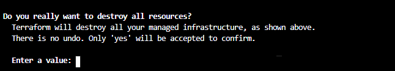

# Clean up the resources in the Cloud

- [Clean up the resources in the Cloud](#clean-up-the-resources-in-the-cloud)
  - [README First!](#readme-first)
  - [General information](#general-information)
    - [Deleting the AKS Cluster with Terraform](#deleting-the-aks-cluster-with-terraform)
    - [Deleting the AKS cluster from the Azure portal](#deleting-the-aks-cluster-from-the-azure-portal)
  - [Complete Hands-on Navigation Index](#complete-hands-on-navigation-index)

## README First!

To delete the cluster and related resources see [Using the GEL Clean-up script](./00_400_Cleanup.md#using-the-gel-clean-up-script).

***You need to use the provided script to fully clean-up after the lab exercises***.

## General information

The 'Alternative Methods' detailed below are provided as an example only.


### Deleting the AKS Cluster with Terraform

For completeness the following describes how to use Terraform to delete the AKS cluster.

* If it is a new bash session, you need to reset the IDs in the environment variables as explained in the "Figure out some Ids" section.

    ```sh
    # reset the TF Credentials IDs in the env variables in case they were lost.
    WORK_DIR=$HOME/project/vars
    TFCREDFILE=${WORK_DIR}/.aztf_creds
    while read l; do
        echo "export $l"
        export $l
    done <${TFCREDFILE}
    cd ~/project/aks/viya4-iac-azure/
    terraform destroy -var-file=./gel-vars.tfvars
    ```

* You need to confirm the deletion

    

* It can take a while...and sometimes fail.

* Run it as many time as required until you see something like :

    ```log
    module.azure_rg.azurerm_resource_group.azure_rg: Destroying... [id=/subscriptions/c973059c-87f4-4d89-8724-a0da5fe4ad5c/resourceGroups/frarporg]
    module.azure_rg.azurerm_resource_group.azure_rg: Still destroying... [id=/subscriptions/c973059c-87f4-4d89-8724-a0da5fe4ad5c/resourceGroups/frarporg, 10s elapsed]
    module.azure_rg.azurerm_resource_group.azure_rg: Still destroying... [id=/subscriptions/c973059c-87f4-4d89-8724-a0da5fe4ad5c/resourceGroups/frarporg, 20s elapsed]
    module.azure_rg.azurerm_resource_group.azure_rg: Still destroying... [id=/subscriptions/c973059c-87f4-4d89-8724-a0da5fe4ad5c/resourceGroups/frarporg, 30s elapsed]
    module.azure_rg.azurerm_resource_group.azure_rg: Destruction complete after 33s

    Destroy complete! Resources: 5 destroyed.
    ```

### Deleting the AKS cluster from the Azure portal

While it is possible to delete resources using the Azure Portal, for the workshop environment this is NOT possible. The 'gatedemoxxx' users only have READ access to the resources, therefore, it is not possible to use the Portal to delete the resources.

---

## Complete Hands-on Navigation Index
<!-- startnav -->
* [Access and Setup / 00 001 Access Environments](/Access_and_Setup/00_001_Access_Environments.md)
* [README](/README.md)
* [Track A-Standard/00-Common / 00 100 Creating an AKS Cluster](/Track-A-Standard/00-Common/00_100_Creating_an_AKS_Cluster.md)
* [Track A-Standard/00-Common / 00 110 Performing the prerequisites](/Track-A-Standard/00-Common/00_110_Performing_the_prerequisites.md)
* [Track A-Standard/00-Common / 00 400 Cleanup](/Track-A-Standard/00-Common/00_400_Cleanup.md)
* [Track A-Standard/00-Common / 00 490 Cleanup Information](/Track-A-Standard/00-Common/00_490_Cleanup_Information.md)**<-- you are here**
* [Track A-Standard/01-Manual / 01 200 Deploying Viya 4 on AKS](/Track-A-Standard/01-Manual/01_200_Deploying_Viya_4_on_AKS.md)
* [Track A-Standard/01-Manual / 01 210 Deploy a second namespace in AKS](/Track-A-Standard/01-Manual/01_210_Deploy_a_second_namespace_in_AKS.md)
* [Track A-Standard/01-Manual / 01 220 CAS Customizations](/Track-A-Standard/01-Manual/01_220_CAS_Customizations.md)
* [Track A-Standard/01-Manual / 01 230 Install monitoring and logging](/Track-A-Standard/01-Manual/01_230_Install_monitoring_and_logging.md)
* [Track A-Standard/01-Manual / 01 240 Stop shrink and Start-scale in AKS](/Track-A-Standard/01-Manual/01_240_Stop-shrink_and_Start-scale_in_AKS.md)
* [Track A-Standard/02-DepOp / 02 300 Deployment Operator environment set up](/Track-A-Standard/02-DepOp/02_300_Deployment_Operator_environment_set-up.md)
* [Track A-Standard/02-DepOp / 02 310 Using the DO with a Git Repository](/Track-A-Standard/02-DepOp/02_310_Using_the_DO_with_a_Git_Repository.md)
* [Track A-Standard/02-DepOp / 02 330 Using the Orchestration Tool](/Track-A-Standard/02-DepOp/02_330_Using_the_Orchestration_Tool.md)
* [Track B-Automated / 03 500 Full Automation of AKS Deployment](/Track-B-Automated/03_500_Full_Automation_of_AKS_Deployment.md)
* [Track B-Automated / 03 590 Cleanup](/Track-B-Automated/03_590_Cleanup.md)
<!-- endnav -->
