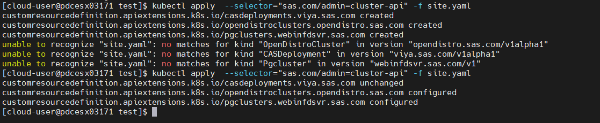
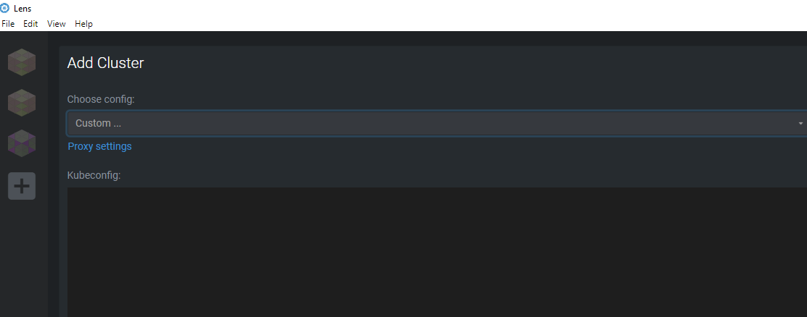
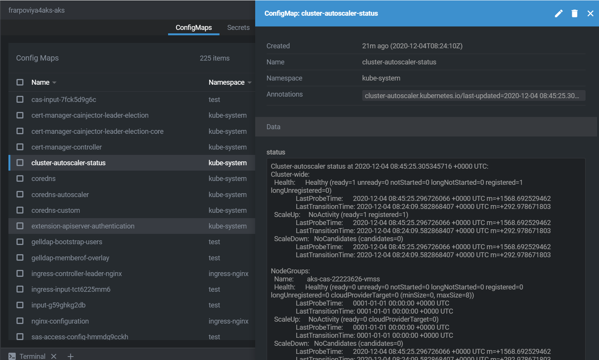
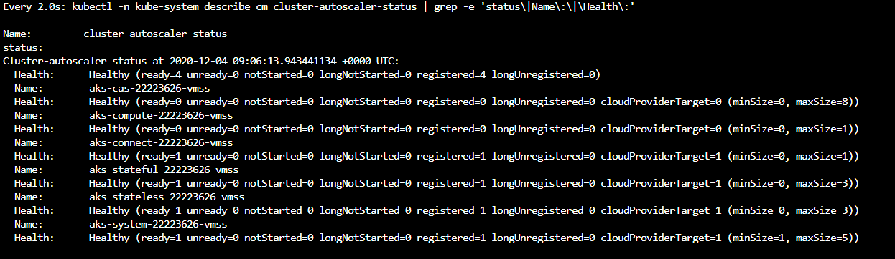
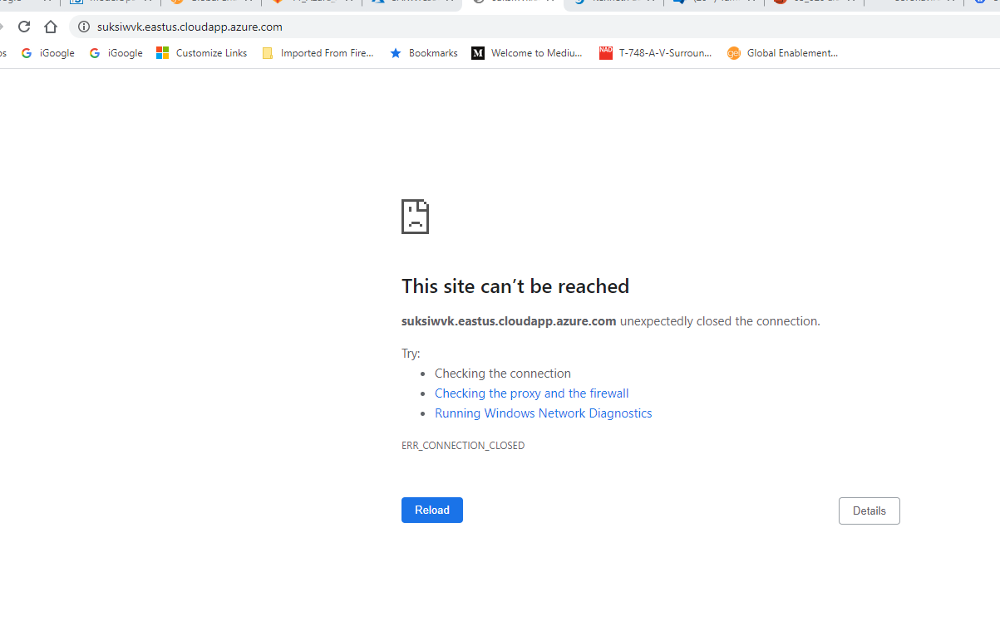
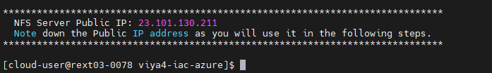
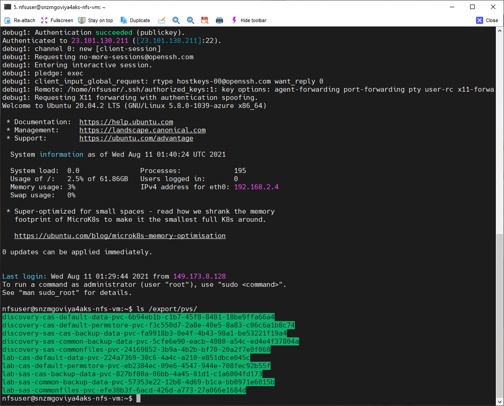

# Deploy Viya 4 in AKS

- [Deploy Viya 4 in AKS](#deploy-viya-4-in-aks)
  - [Introduction](#introduction)
  - [Prepare the Order's Deployment Assets](#prepare-the-orders-deployment-assets)
  - [Create a site-config directory](#create-a-site-config-directory)
  - [Creating a sitedefault file](#creating-a-sitedefault-file)
  - [Preparing the TLS configuration](#preparing-the-tls-configuration)
  - [Create the storage class patch for the 'sas-nfs' StorageClass](#create-the-storage-class-patch-for-the-sas-nfs-storageclass)
  - [Create the external Postgres configuration](#create-the-external-postgres-configuration)
  - [Kustomize the "TEST" deployment](#kustomize-the-test-deployment)
    - [Create the kustomization file](#create-the-kustomization-file)
    - [Build step](#build-step)
  - [Deploy Viya in your AKS cluster](#deploy-viya-in-your-aks-cluster)
    - [Create the namespace for Viya](#create-the-namespace-for-viya)
    - [Deploy the GELLDAP app in our AKS Cluster](#deploy-the-gelldap-app-in-our-aks-cluster)
    - [Deployment : Apply the Kubernetes manifests](#deployment--apply-the-kubernetes-manifests)
  - [Monitor the Viya services startup](#monitor-the-viya-services-startup)
    - [Waiting for the environment to report "ready" state](#waiting-for-the-environment-to-report-ready-state)
    - [Watching pod status using the "kubectl get pods" command](#watching-pod-status-using-the-kubectl-get-pods-command)
    - [Monitor with OKViya](#monitor-with-okviya)
      - [Watching the environment come up](#watching-the-environment-come-up)
    - [Monitor the cluster with lens](#monitor-the-cluster-with-lens)
    - [Monitor the Cluster-autoscaler](#monitor-the-cluster-autoscaler)
  - [Validation](#validation)
    - [Confirm the SAS Viya cadence that was deployed](#confirm-the-sas-viya-cadence-that-was-deployed)
    - [Connect to your Viya applications](#connect-to-your-viya-applications)
  - [EXAMPLE: SSH to the NFS Server VM](#example-ssh-to-the-nfs-server-vm)
  - [Troubleshooting](#troubleshooting)
    - [The deployment is stuck with only 30 to 50% of the pods in a running state](#the-deployment-is-stuck-with-only-30-to-50-of-the-pods-in-a-running-state)
    - [Almost all my pods are fully READY except a few ones](#almost-all-my-pods-are-fully-ready-except-a-few-ones)
    - [A Consul pod is not running](#a-consul-pod-is-not-running)
  - [Next Steps](#next-steps)
  - [Table of Contents for the Manual Deployment Method exercises](#table-of-contents-for-the-manual-deployment-method-exercises)
  - [Complete Hands-on Navigation Index](#complete-hands-on-navigation-index)

## Introduction

In this exercise you will deploy the "Test" SAS Viya environment. For this we will use the following configuration:

* Use an external Azure Postgres instance.
* An SMP CAS Server.
* Use the DNS name that you created for the AKS cluster, not the DNS alias in the GELENABLE DNS (you will make use of the wildcard DNS in later exercises).
* Use the GEL OpenLDAP for authentication.

## Prepare the Order's Deployment Assets

In order to keep the materials in this course up to date, we will use a script to generate the assets. In a normal scenario, you would :
   1. log in to the <https://my.sas.com/> portal and
   1. download a .tgz file containing your assets
   1. explode the .tgz into the `~/project/deploy/test/` directory
   1. which would create `~/project/deploy/test/sas-bases`

Instead, the script will do all of that for us.

* Please run the following command (copy-paste all lines together)

    ```bash
    cd ~/project/
    CADENCE_NAME='stable'
    CADENCE_VERSION='2021.2.6'

    bash /opt/gellow_code/scripts/common/generate_sas_bases.sh \
          --cadence-name ${CADENCE_NAME} \
          --cadence-version ${CADENCE_VERSION} \
          --order-nickname 'simple' \
          --output-folder ~/project/deploy/test
    ```

## Create a site-config directory

* We need to create a "site-config" to store our specific configuration (it is a separated space from the Software provided manifests).

    ```bash
    mkdir -p ~/project/deploy/test/site-config/
    cd ~/project/deploy/test

    ```

## Creating a sitedefault file

* Since we installed GELLDAP we can pre-configure the LDAP access.
* Let's copy the provided file in the proper location:

    ```bash
    # Copy the gelldap site-default
    cp ~/project/gelldap/no_TLS/gelldap-sitedefault.yaml \
       ~/project/deploy/test/site-config/

    ```

<!-- * Generate a sitedefault.yaml just to define the default password for the sasboot account

    ```sh
    tee  ~/project/deploy/test/site-config/sitedefault.yaml > /dev/null << "EOF"
    ---
    config:
      application:
        sas.logon.initial:
          user: sasboot
          password: lnxsas
    EOF
    ```
-->

## Preparing the TLS configuration

By default all internal communications are TLS encrypted. With Stable 2021.2.6 SAS has replaced the default certificate generator used in the SAS Viya deployment with openssl (For the LTS cadence, this change will be available with LTS 2022.2).

More details are available in the “Certificate Generators” section of the security README file located at $deploy/sas-bases/examples/security/README.md

For this configuration we will use "TLS for full-stack" TLS mode, using openssl to generate the ingress certificate.

* Prepare the TLS configuration.

    ```bash
    cd ~/project/deploy/test
    mkdir -p ./site-config/security/

    cp ~/project/deploy/test/sas-bases/examples/security/openssl-generated-ingress-certificate.yaml \
    ~/project/deploy/test/site-config/security/
    ```

## Create the storage class patch for the 'sas-nfs' StorageClass

* Run this code to create a patch that we will reference in our kustomization.yaml file.

    ```bash
    mkdir -p ~/project/deploy/test/site-config/
    cat > ~/project/deploy/test/site-config/storageclass.yaml <<-EOF
    kind: PersistentStorageClass
    metadata:
      name: wildcard
    spec:
      storageClassName: sas-nfs #Storage Class using the NFS Server
    EOF
    ```

## Create the external Postgres configuration

SAS Viya 2021.1.4 introduced a new method of connecting your SAS Viya deployment to an external instance of PostgreSQL.

An example of how to complete the configuration is provided in the `$deploy/sas-bases/examples/postgres/configure/` directory, customers would follow the instructions in the README file.

A customer would copy the example ***external-postgres.yaml*** and update it for their environment.

* Create the configuration folder.

    ```bash
    # Create the configuration folder.
    mkdir -p ~/project/deploy/test/site-config/postgres/
    ```

If you want to see the default run the following command to copy the file.

* Copy the external postgres config file.

    ```sh
    cp -p ~/project/deploy/test/sas-bases/examples/postgres/configure/external-postgres.yaml \
    ~/project/deploy/test/site-config/postgres/
    chmod u+w ~/project/deploy/test/site-config/postgres/external-postgres.yaml
    ```

Now update the postgres config file for your environment.

You could edit the file, but let's rewrite the configuration file with the required values.  For this we will use some of the environment variables that were extracted from Terraform earlier (when the AKS cluster was built).

* Generate the `external-postgres.yaml` file.

    ```bash
    # Get database environment variables.
    WORK_DIR=$HOME/project/vars
    DB_SERVER=$(cat ${WORK_DIR}/variables.txt | grep postgres-server | awk -F'::' '{print $2}')
    DB_USER=$(cat ${WORK_DIR}/variables.txt | grep postgres-admin | awk -F'::' '{print $2}')
    # Generate the configuration file
    cat > ~/project/deploy/test/site-config/postgres/external-postgres.yaml <<-EOF
    # To specify an external PostgreSQL instance for your SAS deployment
    apiVersion: webinfdsvr.sas.com/v1
    kind: Pgcluster
    metadata:
      name: postgres                     # Name of Pgcluster resource
      annotations:
        sas.com/default-database: "true"
    spec:
      internal: false                    # false: sas should use an external PostgreSQL
      connection:
        host: ${DB_SERVER}               # host name for the entrypoint to the PostgreSQL cluster
        port: 5432                       # port for the entrypoint to the PostgreSQL cluster
        ssl: false                       # external cluster requires an SSL connection
      rolesecret: postgres-user          # name of secret holding credentials
      database: SharedServices           # database on external cluster SAS should use

    ---
    # You must define a secret with the role username/password for the database.
    apiVersion: v1
    kind: Secret
    metadata:
      name: postgres-user                # Name of the secret containing external PostgreSQL credentials
      labels:
        pg-cluster: postgres
    stringData:
      username: ${DB_USER}               # username key is the name of the role
      password: LNX_sas_123              # password key is the password for the role
    EOF
    ```

Note, this configuration does not use SSL for the postgres connection, see '`ssl: false`'.

Along with this configuration, you might have noticed in the Terraform configuration (gel-vars.tfvars) that the Postgres DB was created with the following setting '`ssl_enforcement_enabled = false`'.

While this is not a recommended configuration, it is being used to simplify the lab environment.

---

## Kustomize the "TEST" deployment

In this step we edit the kustomization.yaml file in order to generate Kubernetes manifests that are :

* Using a custom Storage Class to support RWX access for components that needs it (CAS, backup manager, etc...).
* Using an external Azure postgres in our 'Test' environment.
* For this deployment you will use the DNS name that you created for the AKS cluster, not the DNS alias in the GELENABLE DNS (you will make use of the wildcard DNS in later exercises).
* You will use the GEL OpenLDAP for authentication.

### Create the kustomization file

* Create the kustomization.yaml file with the external postgres DB configuration and the reference to the storage class path.

    ```bash
    WORK_DIR=$HOME/project/vars
    RG=$(cat ${WORK_DIR}/variables.txt | grep resource-group | awk -F'::' '{print $2}')
    NS=test
    INGRESS_SUFFIX=${RG}.$(cat ~/azureregion.txt).cloudapp.azure.com

    cat > ~/project/deploy/test/kustomization.yaml <<-EOF
    ---
    namespace: ${NS}
    resources:
      - sas-bases/base
      #- sas-bases/overlays/cert-manager-issuer # TLS
      - site-config/security/openssl-generated-ingress-certificate.yaml   # New with Stable 2021.2.6 using openssl
      - sas-bases/overlays/network/networking.k8s.io # New with Stable 2021.1.6
      #- sas-bases/overlays/internal-postgres
      - site-config/postgres/external-postgres.yaml # Required from 2021.1.4 for External PostgreSQL
      - sas-bases/overlays/cas-server
      - sas-bases/overlays/update-checker # added update checker
      - sas-bases/overlays/cas-server/auto-resources # CAS-related
      - sas-bases/overlays/internal-elasticsearch # Stable 2020.1.3
    configurations:
      - sas-bases/overlays/required/kustomizeconfig.yaml
    transformers:
      - sas-bases/overlays/internal-elasticsearch/internal-elasticsearch-transformer.yaml # Stable 2020.1.3
      - sas-bases/overlays/internal-elasticsearch/sysctl-transformer.yaml # Stable 2020.1.3 (must be after TLS but before required/transformers)
      - sas-bases/overlays/required/transformers.yaml
      #- sas-bases/overlays/internal-postgres/internal-postgres-transformer.yaml
      - sas-bases/overlays/external-postgres/external-postgres-transformer.yaml
      #- site-config/security/cert-manager-provided-ingress-certificate.yaml # TLS
      - sas-bases/overlays/cas-server/auto-resources/remove-resources.yaml # CAS-related
      #- sas-bases/overlays/scaling/zero-scale/phase-0-transformer.yaml
      #- sas-bases/overlays/scaling/zero-scale/phase-1-transformer.yaml

    # With 2021.1.3 we use kustomize components (instead of transformers for TLS configuration)
    components:
      - sas-bases/components/security/core/base/full-stack-tls
      - sas-bases/components/security/network/networking.k8s.io/ingress/nginx.ingress.kubernetes.io/full-stack-tls

    # set a custom Storage Class for PersistentVolumeClaims, as it's not currently possible to change the default SC in AKS
    # a new SC is required to support ReadWriteMany access
    # Note: annotationSelector is how we limit which PV use azurefiles/RWX versus default RWO.
    patches:
    - path: site-config/storageclass.yaml
      target:
        kind: PersistentVolumeClaim
        annotationSelector: sas.com/component-name in (sas-backup-job,sas-data-quality-services,sas-commonfiles,sas-cas-operator,sas-model-publish,sas-pyconfig)

    configMapGenerator:
      - name: ingress-input
        behavior: merge
        literals:
          - INGRESS_HOST=${INGRESS_SUFFIX}
      - name: sas-shared-config
        behavior: merge
        literals:
          - SAS_SERVICES_URL=https://${INGRESS_SUFFIX}

    secretGenerator:
      - name: sas-consul-config            ## This injects content into consul. You can add, but not replace
        behavior: merge
        files:
          - SITEDEFAULT_CONF=site-config/gelldap-sitedefault.yaml ## with 2020.1.5, the sitedefault.yaml config becomes a secretGenerator
    EOF
    ```

After you revise the base kustomization.yaml file, continue your SAS Viya deployment as documented.

<!--
### Configure CAS MPP - Moved to 01_210

By default CAS is installed with a SMP CAS Server, use the following commands to create the configuration to use a MPP CAS Server.

* Run the commands below to configure CAS with 3 workers.

    ```sh
    # Copy the PatchTransformer from the examples
    cp -p ~/project/deploy/test/sas-bases/examples/cas/configure/cas-manage-workers.yaml \
          ~/project/deploy/test/site-config/cas-manage-workers.yaml

    # Set the required number of workers
    _numberOfWorkers=3

    # Modify the project site-config/cas-manage-workers.yaml file with the required number of workers
    sed -i "s/{{ NUMBER-OF-WORKERS }}/${_numberOfWorkers}/g" \
         ~/project/deploy/test/site-config/cas-manage-workers.yaml

    # Add a new transformer
    printf "
    - command: update
      path: transformers[+]
      value:
        site-config/cas-manage-workers.yaml
    " | yq -I 4 w -i -s - ~/project/deploy/test/kustomization.yaml
    ```
-->

### Build step

At this point, we are ready to generate or populate the Kubernetes manifest files with Kustomize.

* Run the kustomize build command.

    ```bash
    cd ~/project/deploy/test
    kustomize build -o site.yaml
    ```

At this point you are ready to deploy the SAS Viya environment.

## Deploy Viya in your AKS cluster

### Create the namespace for Viya

* Run this command to create the "test" namespace in our AKS cluster

    ```bash
    kubectl create ns test
    ```

### Deploy the GELLDAP app in our AKS Cluster

In the previous step, we prepared the manifest file for the GELLDAP app, but we did not install it.

* Let's do it now by running the command below.

    ```bash
    kubectl apply -f ~/project/gelldap/gelldap-build.yaml -n test
    ```

### Deployment : Apply the Kubernetes manifests

We are now ready to apply the manifests in our AKS cluster to deploy and start the Viya 4 containers. There are 3 level of admin in the resources defined in the site.yaml:

  * "cluster-wide" (operators/crds, service accounts, roles)
  * "cluster-local" (rolebindings, pvc, config map, secrets, podtemplates)
  * "namespace" (the rest of the resources)

  Each resource has a label for it, the key is "sas.com/admin" and the value is one of the 3 levels (You can search for "sas.com/admin: <administration scope level>" keyword in the site.yaml to see the corresponding resources).

With Stable 2021.2.1 the order of the apply commands has changed. Use the following steps to manually deploy SAS Viya:

1. Apply cluster-api resources to the cluster. As an administrator with cluster permissions, run.

    ```bash
    cd ~/project/deploy/test
    kubectl apply --selector="sas.com/admin=cluster-api" -f site.yaml
    # Wait for Custom Resource Deployment to be deployed
    kubectl wait  --for condition=established --timeout=60s -l "sas.com/admin=cluster-api" crd
    ```

    You may see an error after the apply, stating that "`unable to recognize "site.yaml": no matches for kind ...`" If get this error, issue the kubectl apply command again, see below.

    

1. As an administrator with cluster permissions, run.

    ```bash
    # Apply the "cluster wide" configuration in site.yaml (CRDs, Roles, Service Accounts)
    kubectl apply --selector="sas.com/admin=cluster-wide" -f site.yaml
    ```

1. As an administrator with local cluster permissions, run.

    ```bash
    # Apply the "cluster local" configuration in site.yaml that matches label "sas.com/admin=cluster-local" and delete all the other resources that are not in the file and match label "sas.com/admin=cluster-local".
    kubectl apply --selector="sas.com/admin=cluster-local" -f site.yaml --prune
    ```

1. As an administrator with namespace permissions, run.

    ```bash
    # Apply the configuration in manifest.yaml that matches label "sas.com/admin=namespace" and delete all the other resources that are not in the file and match label "sas.com/admin=namespace".
    kubectl apply --selector="sas.com/admin=namespace" -f site.yaml --prune
    ```

    The kubectl apply command might cause the following message to be displayed:

    ```log
    error: error pruning nonNamespaced object
    ```

    Doing this will create all required content in kubernetes and the Viya start-up is now in process.

For the next time we want to start the Viya 4 containers, you can simply reapply the site.yaml file with the command below (since the components created outside of the namespace scope will already be there)

    ```sh
    cd ~/project/deploy/test
    kubectl -n test apply -f site.yaml
    ```

## Monitor the Viya services startup

* There are several ways to monitor your Viya deployment progress.
* Pick one of the method presented below (sas-readiness, GEL_OKViya4 script, Lens)
* If after 50-70 minutes your environment is still not ready ...it's time to start debugging.
* Make sure you are not in one of the situation described in the [Troubleshooting](#troubleshooting) paragraph.
* If not you can use commands like "kubectl describe" or "kubectl logs" to troubleshoot your issues.
* Watching pod status with the "kubectl get pods" command.

_Note: The Kubernetes Lens tool is also very handy to look at logs and Kuberenetes events (you can learn a lot about Kubernetes just by using it)._

### Waiting for the environment to report "ready" state

* The following command will only return when the environment is ready (or after 45 minutes):

    ```sh
    time kubectl -n test wait \
         --for=condition=ready \
         pod \
         --selector='app.kubernetes.io/name=sas-readiness' \
          --timeout=2700s

    ```

* The following command will monitor the log of the readiness pod:

    ```sh
    watch -c -n 20 'kubectl -n test logs \
         --selector=app.kubernetes.io/name=sas-readiness \
          | tail -n 1  '

    ```

### Watching pod status using the "kubectl get pods" command

* You can also use standard kubectl commands to watch the status.

    ```sh
    watch kubectl get pods -n test -o wide
    ```

    Or, to filter on status.

    ```sh
    watch 'kubectl get pods -n test -o wide | grep 0/ | grep -v Comp'

### Monitor with OKViya

#### Watching the environment come up

* Watch the environment start using the `gel_OKViya4.sh` script:

    ```bash
    cd ~/project/deploy/working
    ./gel_OKViya4.sh -n test --wait -ps -hs "https://"
    ```

* If you prefer to see the tested URL (showing the curl command with the ingress host), you can type :

    ```sh
    cd ~/project/deploy/working
    ./gel_OKViya4.sh -n test --wait -ps -co lines -hs "https://"
    ```

* At the end you should see something like :

  

* You can also use tmux to have a multi-windows monitoring:

* This will kick off a tmux session called "test_watch":

    ```sh
    #watch kubectl get pods -o wide -n test

    SessName=test_watch

    tmux new -s $SessName -d
    tmux send-keys -t $SessName "time ~/project/deploy/working/gel_OKViya4.sh -n test --wait --pod-status"  C-m
    tmux split-window -v -t $SessName
    tmux send-keys -t $SessName "watch 'kubectl get pods -o wide -n test | grep 0/ | grep -v Completed '"  C-m

    ```

* And this will attach you to it:

    ```sh
    tmux attach -t $SessName
    ```

### Monitor the cluster with lens

* What is [Lens](https://github.com/lensapp/lens/) ?

  * Lens is a great IDE to take control of your Kubernetes cluster.
  * It is a standalone application for MacOS, Windows and Linux operating systems.
  * It is open source and free.

* In the Lens github project, click on "Releases", then download and install Lens on your machine.

* Get your Cluster config file

You can use the MobaXterm integrated text editor

* Then browse in the Files view to display the content of .kube/config file

  

* Copy the content of the config file.

* Open Lens, click on "Add cluster" for "Choose config", select "Custom"

  

* and paste the content of the config file.

* Click on "Add Cluster" and then you should see something that looks like that :

  

* You can see the nodes, pods, configuration, logs etc... very easily. You can also start a Terminal from there to run kubectl commands against your Cluster.

* A successful deployment would look like that in Lens:

  

### Monitor the Cluster-autoscaler

During the deployment, then when you stop and restart the Viya services, the Azure Cluster autoscaler will either provision additionnal nodes or decomission them to meet the pods requests.
There is a way to monitor the progress of the Cloud autoscaler (and potentially identify if it is stalled) in Kubernetes.
Kubernetes keep track of the autoscaler status in the cluster-auto-scaler configMap (in the kube-system namespace).

* If you are using Lens you can see it easily:

  

* Otherwhise you can run the command to get the cluster auto-scaler status at a point in time :

    ```sh
    kubectl -n kube-system describe cm cluster-autoscaler-status
    ```

* Monitor the status in real time

    ```sh
    watch "kubectl -n kube-system describe cm cluster-autoscaler-status | grep -e 'status\|Name\:\|\Health\:'"
    ```

* You should see something like this :

    

* Finally you can also monitor the Kubernetes events and filter on a specific pattern, for example :

    ```sh
    kubectl get events --sort-by=.metadata.creationTimestamp -n test | grep ScaleUp
    ```

## Validation

<!-- Wait for cheatcode deployment
```bash
printf "\n\nA final check to confirm that the Viya pods are ready, using the 'sas-readiness' probe (This may take a few minutes to complete).\n\n"
set -x;

kubectl wait --for=condition=Ready pod --selector="app.kubernetes.io/name=sas-readiness" --timeout=30m -n test

(set +x; printf "\n\nSAS Viya is now ready for use.\n\nConfirm the cadence version that was deployed.\n")

kubectl -n test get cm -o yaml | grep ' SAS_CADENCE'
```
-->

### Confirm the SAS Viya cadence that was deployed

* To confirm the cadence version and release, run the following command:

    ```sh
    kubectl -n test get cm -o yaml | grep ' SAS_CADENCE'
    ```

    You should see output similar to the following, but for the cadence release that was available at the time of your deployment.

    ```yaml
    SAS_CADENCE_DISPLAY_NAME: Stable 2021.2.6
    SAS_CADENCE_DISPLAY_SHORT_NAME: Stable
    SAS_CADENCE_DISPLAY_VERSION: 2021.2.6
    SAS_CADENCE_NAME: stable
    SAS_CADENCE_RELEASE: "20220517.1652758233835"
    SAS_CADENCE_VERSION: 2021.2.6
    ```

### Connect to your Viya applications

Use the Windows client machine in your RACE Collection to connect to your SAS Viya environment.

* Run the command below to get the url printed in the shell terminal, then you can just click on it (with the CTRL key).

    ```sh
    WORK_DIR=$HOME/project/vars
    RG=$(cat ${WORK_DIR}/variables.txt | grep resource-group | awk -F'::' '{print $2}')
    echo "https://${RG}.$(cat ~/azureregion.txt).cloudapp.azure.com/SASDrive"
    ```

    As an alternative you can use the 'WhatsMyDetails' script. Use the URL for the "Test deployment".

    ```sh
    # Get the Track-A URLs
    ~/WhatsMyDetails.sh -a urls
    ```

When the SAS Logon page appears, then connect as user **sastest1** or **sasadm** (password is "**lnxsas**").

<!--
#### Make sure you are on the Cary Network

* If you see something like that when you try to open the url :

  

  It is likely that your workstation has an IP that is not in the authorized IP range to access the environment.

  By default in the ingress definition, we allowed the Cary Headquarter IP range. So the best way to get an IP in this range from your own workstation is to be on the Cary Direct VPN (profile 3 usually).
-->

---

## EXAMPLE: SSH to the NFS Server VM

This is an example of how to connect to the NFS Server. Unfortunately, due to the firewall rules it is not possible to SSH from the RACE.EXNET machine, as the internal firewall prevents SSH outbound connections from the RACE.EXNET network.

The following steps illustrate how you might connect to the NFS Server.

* First, you need to get the Public IP for the NFS Server.

    ```sh
    cd ~/project/aks/viya4-iac-azure
    NFS_Server_Public_IP=$(terraform output -raw nfs_public_ip)
    cat << EOF

    ******************************************************************************
      NFS Server Public IP: ${NFS_Server_Public_IP}
      Note down the Public IP address as you will use it in the following steps.
    ******************************************************************************

    EOF
    ```

    You should see output similar to the following for your environment.

    

<!--
1. Using MobaXterm download the `id_rsa` key from the RACE jumphost. It is in the `.ssh` directory (~/.ssh/id_rsa).

* The easiest approach might be to copy the file to the MobaXtrem home, '.ssh' folder. In the example below the file was renamed to 'iac_id_rsa'.
-->

* SSH to the NFS Server (VM) using the Public IP address.

    For example, using the key that you created for the IAC deployment.

    ```sh
    ssh -v -i .ssh/id_rsa nfsuser@<NFS_Server_Public_IP>
    ```

* You would use the following command to see the folders under the NFS mount.

    ```sh
    ls /export/pvs
    ```

    The following is an example output.

    

    In the image above the connection was made after a number of the DepOp labs had been completed. You can see the folders for two Viya environments (discovery and lab).

---

## Troubleshooting

### The deployment is stuck with only 30 to 50% of the pods in a running state

* Symptoms :
  * sas-data-mining-services is not running
  * One 3rd of the Pods are running the others are crashlooping

* Hints:
  * The microservice logs show a problem to contact the sas-authorization service
  * The sas-authorization pod log shows errors in the SSL connection to PostgreSQL

* Root cause :
  * sas-authorization fails in the initial SSL "hand shake" with PostgreSQL (possibly because of the [Java version](https://stackoverflow.com/questions/21245796/javax-net-ssl-sslhandshakeexception-remote-host-closed-connection-during-handsh), as a consequence many pods can not start because they can not talk to sas-authorization microservice.

* Solution : restart the sas-authorization pod.

    ```sh
    kubectl -n test get po -l "app=sas-authorization" | awk '{ print $1 }' | xargs -I % kubectl delete pod % -n test
    ```

### Almost all my pods are fully READY except a few ones

* Symptoms :
  * a few pods not ready (READY column shows 0/1)
  * containers with the "waiting status"
  * containers fails to contact postgres (EOFException: SSL peer shut down incorrectly)

* Hints:
  * The microsservice logs show a problem to contact the sas-authorization service

* Root cause :
  * potentially cluster autoscaling RACE condition and SSL negociation failure with postgreSQL because of different protocol versions.

* Solution : restart the pods that are not READY.

    ```sh
    kubectl -n test get po | grep "0/" | awk '{ print $1 }' | xargs -I % kubectl delete pod % -n test
    ```

### A Consul pod is not running

* Symptoms :
  * Consul has 2 running pods not READY ("0/1") and 1 pod is "pending"

* Root cause :
  * The stateful additional node was not properly started by the azure autoscaler (network issues).

* Solution : increase max count for the stateful node pools in azure portal, the missing consul instance should restart automatically.

<!-- If you restart then the env does not come up bc of RabbitMQ "mnesia" database issues.

* You can scale rabbit to 0, delete the rabbit PVCs, then scale back to 3. I hope to have this patch promoted later today or tomorrow.

    ```sh
    kubectl delete pvc sas-viya-rabbitmq-data-volume-sas-rabbitmq-server-0
    kubectl delete pvc sas-viya-rabbitmq-data-volume-sas-rabbitmq-server-1
    kubectl delete pvc sas-viya-rabbitmq-data-volume-sas-rabbitmq-server-2
    ```

from <https://rndjira.sas.com/browse/NGMTS-15211>
 -->

---

## Next Steps

Now that you have manually deployed Viya, let's deploy a second namespace.

Click [here](../01-Manual/01_210_Deploy_a_second_namespace_in_AKS.md) to move onto the next exercise: ***01_210_Deploy_a_second_namespace_in_AKS.md***

## Table of Contents for the Manual Deployment Method exercises

<!--Navigation for this set of labs-->
* [00-Common / 00 100 Creating an AKS Cluster](../00-Common/00_100_Creating_an_AKS_Cluster.md)
* [00-Common / 00 110 Performing the prerequisites](../00-Common/00_110_Performing_the_prerequisites.md)
* [01-Manual / 01 200 Deploying Viya 4 on AKS](./01_200_Deploying_Viya_4_on_AKS.md) **<-- You are here**
* [01-Manual / 01 210 Deploy a second namespace in AKS](./01_210_Deploy_a_second_namespace_in_AKS.md)
* [01-Manual / 01 220 CAS Customizations](./01_220_CAS_Customizations.md)
* [01-Manual / 01 230 Install monitoring and logging](./01_230_Install_monitoring_and_logging.md)
* [01-Manual / 01 240 Stop shrink and Start-scale in AKS](./01_240_Stop-shrink_and_Start-scale_in_AKS.md)
* [00-Common / 00 400 Cleanup](../00-Common/00_400_Cleanup.md)

---

## Complete Hands-on Navigation Index
<!-- startnav -->
* [Access and Setup / 00 001 Access Environments](/Access_and_Setup/00_001_Access_Environments.md)
* [README](/README.md)
* [Track A-Standard/00-Common / 00 100 Creating an AKS Cluster](/Track-A-Standard/00-Common/00_100_Creating_an_AKS_Cluster.md)
* [Track A-Standard/00-Common / 00 110 Performing the prerequisites](/Track-A-Standard/00-Common/00_110_Performing_the_prerequisites.md)
* [Track A-Standard/00-Common / 00 400 Cleanup](/Track-A-Standard/00-Common/00_400_Cleanup.md)
* [Track A-Standard/00-Common / 00 490 Cleanup Information](/Track-A-Standard/00-Common/00_490_Cleanup_Information.md)
* [Track A-Standard/01-Manual / 01 200 Deploying Viya 4 on AKS](/Track-A-Standard/01-Manual/01_200_Deploying_Viya_4_on_AKS.md)**<-- you are here**
* [Track A-Standard/01-Manual / 01 210 Deploy a second namespace in AKS](/Track-A-Standard/01-Manual/01_210_Deploy_a_second_namespace_in_AKS.md)
* [Track A-Standard/01-Manual / 01 220 CAS Customizations](/Track-A-Standard/01-Manual/01_220_CAS_Customizations.md)
* [Track A-Standard/01-Manual / 01 230 Install monitoring and logging](/Track-A-Standard/01-Manual/01_230_Install_monitoring_and_logging.md)
* [Track A-Standard/01-Manual / 01 240 Stop shrink and Start-scale in AKS](/Track-A-Standard/01-Manual/01_240_Stop-shrink_and_Start-scale_in_AKS.md)
* [Track A-Standard/02-DepOp / 02 300 Deployment Operator environment set up](/Track-A-Standard/02-DepOp/02_300_Deployment_Operator_environment_set-up.md)
* [Track A-Standard/02-DepOp / 02 310 Using the DO with a Git Repository](/Track-A-Standard/02-DepOp/02_310_Using_the_DO_with_a_Git_Repository.md)
* [Track A-Standard/02-DepOp / 02 330 Using the Orchestration Tool](/Track-A-Standard/02-DepOp/02_330_Using_the_Orchestration_Tool.md)
* [Track B-Automated / 03 500 Full Automation of AKS Deployment](/Track-B-Automated/03_500_Full_Automation_of_AKS_Deployment.md)
* [Track B-Automated / 03 590 Cleanup](/Track-B-Automated/03_590_Cleanup.md)
<!-- endnav -->
