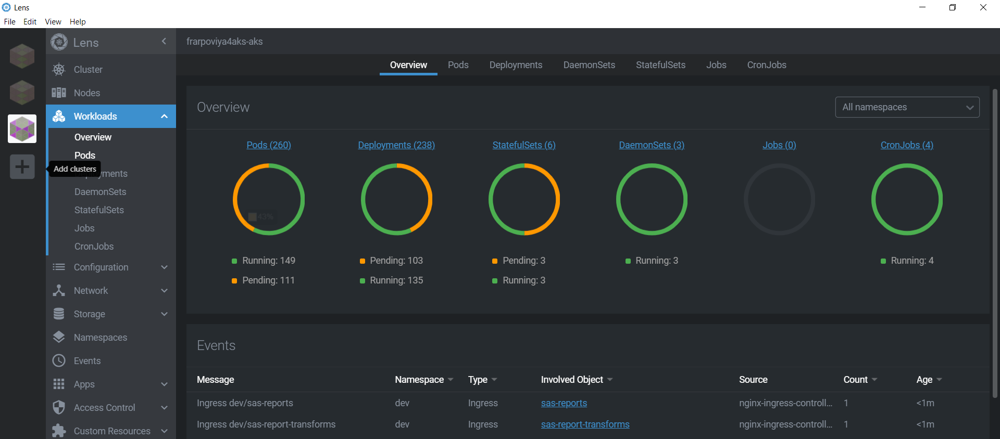
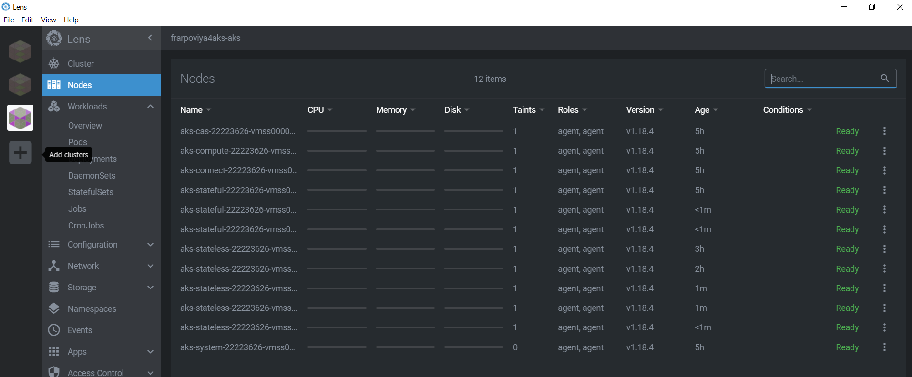

# Optional : Deploy and start a second Viya Environment

- [Optional : Deploy and start a second Viya Environment](#optional--deploy-and-start-a-second-viya-environment)
  - [Introduction](#introduction)
  - [Use the non-default name for the external postgresDB](#use-the-non-default-name-for-the-external-postgresdb)
  - [Use the GEL AD (Azure Active Directory Domain Services)](#use-the-gel-ad-azure-active-directory-domain-services)
    - [Configure CAS MPP](#configure-cas-mpp)
  - [Prepare another kustomize file for prod](#prepare-another-kustomize-file-for-prod)
  - [Watch the cluster autoscaling](#watch-the-cluster-autoscaling)
    - [Deploy the PROD Viya environment](#deploy-the-prod-viya-environment)
  - [Monitor progress using Kubernetes Lens](#monitor-progress-using-kubernetes-lens)
    - [Check the new Nodes](#check-the-new-nodes)
  - [Using the Azure Portal](#using-the-azure-portal)
  - [Check the new PostgreSQL Database](#check-the-new-postgresql-database)
  - [Confirm the MPP CAS Server change](#confirm-the-mpp-cas-server-change)
  - [Validation](#validation)
    - [Confirm the configuration for the GEL AD](#confirm-the-configuration-for-the-gel-ad)
    - [Login to SAS Viya](#login-to-sas-viya)
    - [Start a session with the CAS Server](#start-a-session-with-the-cas-server)
  - [Next Steps](#next-steps)
  - [Table of Contents for the Manual Deployment Method exercises](#table-of-contents-for-the-manual-deployment-method-exercises)
  - [Complete Hands-on Navigation Index](#complete-hands-on-navigation-index)

## Introduction

Thanks to the concept of the Kubernetes namespaces, it is very easy to deploy another Viya environment in the same AKS cluster. As we will see, it is possible to build on an existing configuration, the only real challenge is on the Ingress controller, unique names must be used for the 'INGRESS_HOST' and 'SAS_SERVICES_URL'.

Let's see how to deploy another Viya environment in the "**prod**" namespace.

For this we will do the following:

* Continue to use an external Azure Postgres instance.
* Change to using a MPP CAS Server.
* Use the GEL AD (Azure Active Directory Domain Services) for authentication.
* Use the GEL DNS and the gelenable.sas.com alias that you set-up earlier.

## Use the non-default name for the external postgresDB

* We want to use the same external PostgreSQL server to host both environment SAS Data Server infrastructure. The default database name is 'SharedServices'.

* In order to create multiple databases on a single external PG server, we need to use different database name per each deployment. This new configuration also needs to be referenced in the kustomization.yaml.

* See the README for more details: `/sas-bases/examples/postgres/configure/README.md`

Run the following to create the 'prod' configuration.

1. Create the configuration folder.

    ```bash
    # Create the configuration folder.
    mkdir -p ~/project/deploy/prod/site-config/postgres/
    ```

1. Once again, we will generate the `external-postgres.yaml` file.

    The following changes need to be made to differentiate the 'prod' configuration from the 'test' configuration:

    * The name of the Pgcluster resource must be unique, '**postgres-prod**' will be used.
    * The 'rolesecret' will be set to: **postgres-prod-user**
    * The database name will be set to: **SharedServicesPROD**

    ```bash
    # Get database environment variables.
    WORK_DIR=$HOME/project/vars
    DB_SERVER=$(cat ${WORK_DIR}/variables.txt | grep postgres-server | awk -F'::' '{print $2}')
    DB_USER=$(cat ${WORK_DIR}/variables.txt | grep postgres-admin | awk -F'::' '{print $2}')
    # Generate the configuration file
    cat > ~/project/deploy/prod/site-config/postgres/external-postgres.yaml <<-EOF
    # To specify an external PostgreSQL instance for your SAS deployment
    apiVersion: webinfdsvr.sas.com/v1
    kind: Pgcluster
    metadata:
      name: postgres-prod                # Name of Pgcluster resource
      annotations:
        sas.com/default-database: "true"
    spec:
      internal: false                    # false: sas should use an external PostgreSQL
      connection:
        host: ${DB_SERVER}               # host name for the entrypoint to the PostgreSQL cluster
        port: 5432                       # port for the entrypoint to the PostgreSQL cluster
        ssl: false                       # external cluster requires an SSL connection
      rolesecret: postgres-prod-user     # name of secret holding credentials
      database: SharedServicesPROD       # database on external cluster SAS should use

    ---
    # You must define a secret with the role username/password for the database.
    apiVersion: v1
    kind: Secret
    metadata:
      name: postgres-prod-user           # Name of the secret containing external PostgreSQL credentials
      labels:
        pg-cluster: postgres-prod
    stringData:
      username: ${DB_USER}               # username key is the name of the role
      password: LNX_sas_123              # password key is the password for the role
    EOF
    ```

    _Note, again this configuration does not use SSL for the postgres connection, see '`ssl: false`'_.

## Use the GEL AD (Azure Active Directory Domain Services)

In the TEST environment you used the GEL OpenLDAP running in your AKS cluster. In this exercise you will use the GEL AD.

1. Get the sitedefault for the GEL AADDS.

    ```bash
    mkdir -p ~/project/deploy/prod/site-config/
    cp /opt/gellow_code/scripts/loop/gelenable/gelenable_site-config/gelenable-sitedefault.yaml \
    ~/project/deploy/prod/site-config/gelenable-sitedefault.yaml
    ```

### Configure CAS MPP

By default CAS is installed with a SMP CAS Server, use the following commands to create the configuration to use a MPP CAS Server.

* Run the commands below to configure CAS with 3 workers.

    ```bash
    # Copy the PatchTransformer from the examples
    cp -p ~/project/deploy/test/sas-bases/examples/cas/configure/cas-manage-workers.yaml \
          ~/project/deploy/prod/site-config/cas-manage-workers.yaml

    # Set the required number of workers
    _numberOfWorkers=3

    # Modify the project site-config/cas-manage-workers.yaml file with the required number of workers
    sed -i "s/{{ NUMBER-OF-WORKERS }}/${_numberOfWorkers}/g" \
         ~/project/deploy/prod/site-config/cas-manage-workers.yaml
    ```

The next step is to update (create) the `kustomization.yaml` file for the 'prod' deployment.

## Prepare another kustomize file for prod

We need to use a new namespace name, a new ingress, adjust the sas-shared-config and adjust the External Postgres configuration to allow the new deployment to utilize a different PG Database (from the one already created and use for the test deployment). The PG database used for the "prod" namespace will be named "SharedServicesPROD".

For this deployment you will now use the DNS alias you created in the GELENABLE DNS. With a prefix of "prod". For example, "prod.*your_prefix*.gelenable.sas.com".

1. Create the 'prod' kustomization.yaml file.

    ```bash
    cd ~/project/deploy/prod

    WORK_DIR=$HOME/project/vars
    RG=$(cat ${WORK_DIR}/variables.txt | grep resource-group | awk -F'::' '{print $2}')
    INGRESS_SUFFIX=prod.${RG}.gelenable.sas.com
    DB_HOST=$(cat ${WORK_DIR}/variables.txt | grep postgres-server | awk -F'::' '{print $2}')
    cat > ~/project/deploy/prod/kustomization.yaml <<-EOF
    ---
    namespace: prod
    resources:
      - ../test
      - site-config/postgres/external-postgres.yaml  ## Update for SharedServicesPROD

    transformers:
      - site-config/cas-manage-workers.yaml  # Update for MPP CAS

    configMapGenerator:
      - name: ingress-input
        behavior: merge
        literals:
          - INGRESS_HOST=${INGRESS_SUFFIX}

      - name: sas-shared-config
        behavior: merge
        literals:
          - SAS_SERVICES_URL=https://${INGRESS_SUFFIX}
          - SAS_DATABASE_DATABASE=SharedServicesPROD

    secretGenerator:
      - name: sas-consul-config            ## This injects content into consul. You can add, but not replace
        behavior: merge
        files:
          - SITEDEFAULT_CONF=site-config/gelenable-sitedefault.yaml     ## Update to use the GEL ADDS

    EOF
    ```

1. Build the manifests. 

    ```bash
    cd ~/project/deploy/prod
    # Build the PROD manifests
    kustomize build -o site.yaml
    ```

**Caveat: if you change the "test" configuration, those changes will also apply to "prod" if you re-build and re-apply the manifests for 'prod'.**

## Watch the cluster autoscaling

You might have not noticed it yet but we configured our Terraform template in a way that our AKS cluster is using quite small VMs (all our instance type comes with only 4 vcpu). Also we start with only one VM per Node pool (1 VM for CAS, 1 for stateless, 1 for stateful, etc...).
Of course it will not be enough to have a running Viya 4 environment. But the AKS cluster will automatically scale out to accomoadate the pod requests.

When we start the deployment we have only 6 VMs (one by node pool), but at the end additional nodes have been automatically provisionned to match the pods workload requests thanks to the Azure auto-scaler.

The benefit of that is that as long as we don't start the Viya environment, the cost remains limited also when we stop viya (by scaling down to 0 all our pods), then the AKS cluster will adjust the infrastructure by scaling down the number of Azure VMs to match with the Kubernetes cluster workload current request (without loosing the user content thanks to the Persistent Volumes).

* Now before deploying a secondary Viya environment, let's see how many nodes we have for now

   

### Deploy the PROD Viya environment

To trigger an expansion (autoscaling) of the AKS cluster we can deploy the PROD environment. While you can use Lens to view, control and monitor the cluster, we will make use of **tmux** for this exercise. Note, there are additional screenshots of Lens in the following sections.

You should still have the 'Test' environment running, which is using an SMP CAS server. One of the changes you will see is the CAS node pool scale for the production MPP CAS Server.

We will start by setting up **tmux** to monitor the progress of the PROD deployment.

1. In MobaXterm open a second session with 'sasnode01'.

1. Use the following to configure the tmux session.

    We will setup three panes, one to monitor the CAS Server pods, one to watch the AKS nodes, and the third to monitor the progress of the pods.

    ```sh
    SessName=prod_watch

    tmux new -s $SessName -d
    tmux send-keys -t $SessName "watch 'kubectl get pods -n prod -o wide | grep sas-cas-server'"  C-m
    tmux split-window -v -p 80 -t $SessName
    tmux send-keys -t $SessName "watch 'kubectl get nodes'"  C-m
    tmux split-window -h -p 60 -t $SessName
    tmux send-keys -t $SessName "watch 'kubectl get pods -n prod | grep 0/ | grep -v Comp'"  C-m
    ```

1. Attach it to your session.

    ```sh
    tmux attach -t $SessName
    ```

    You will initially see "No resources found in prod namespace", as the 'prod' namespace has not been created as yet. Now you are ready to deploy SAS Viya.

1. Switch back to your original MobaXterm session.

1. Now let's deploy another Viya in the new namespace.

    ```bash
    # Create the prod namespace
    kubectl create ns prod
    # Deploy Viya
    cd ~/project/deploy/prod
    kubectl apply -f site.yaml -n prod
    ```

1. Watch the deployment progress in tmux.

    As the 'PROD' deployment proceeds you should see output similar to the following.

    _Hint, you may have to maximise MobaXterm to fully see the output_.

    

1. Once the deployment has completed remember to close (exit) the tmux session.

## Monitor progress using Kubernetes Lens

* While the pods are starting in the "prod" namespace, you can monitor the pods and watch the number of nodes in Lens.

  

* You can also running this command in your terminal:

    ```sh
    watch "kubectl get nodes -o wide"
    ```

### Check the new Nodes

* After a little while, you will see the new nodes that have been automatically provisioned by Azure.

  

* You can also see that in the Azure Portal. Click on the "Kubernetes service" resource into your own "Resource Group" (`<MY_PREFIX>`-rg), then on the left menu, select "Node pools".

    To get the resource group names you can use one of our scripts.

    ```sh
    ~/WhatsMyDetails.sh -a rg
    ```

## Using the Azure Portal

In the Portal...

* Click on the link that sends you to the node pools page. From there you can see the current number of nodes in each pool and the node details.

    

* Select a node pool to see the details, this page also allows you to change the settings. For example, this is where you can scale a node pool. The image is for the Stateful node pool.

    

## Check the new PostgreSQL Database

* Open the Azure portal and click on the "Azure Database for PostgreSQL Server" resource into your own "Resource Group" (`<MY_PREFIX>`-rg), you should see that a new Database called "SharedServicesPROD" has been created.

  

<!--
### Update Viya to respond to the new Alias

Once the alias is created, go back to your kustomization.yaml file and replace `<YOUR_FullyQualifiedDomainName>` by `<YOUR_Alias>`:

```yaml
namespace: <YOUR_NAMESPACE>


configMapGenerator:
- name: ingress-input
  behavior: merge
  literals:
  - INGRESS_HOST=<YOUR_ALIAS>
- name: sas-shared-config
  behavior: merge
  literals:
  - SAS_SERVICES_URL=http://<YOUR_ALIAS>
```

where `<YOUR_Alias>` could be anything matching the wildcard defined in ´<YOUR_GENERIC_ALIAS>`

Because of the start (`*`) in your CNAME record, any prefix would be valid:

* `prod.{resource-group}.gelenable.sas.com`
* `notprod.{resource-group}.gelenable.sas.com`
* `whatever.{resource-group}.gelenable.sas.com`
* `really.anything.{resource-group}.gelenable.sas.com`
* `I.AM.MAKING.A.POINT.HERE.{resource-group}.gelenable.sas.com`
* `ok.enough.{resource-group}.gelenable.sas.com`

Using this method, you can now create as many distinct environment in your kubernetes cluster as you want, and you'll have an infinity of names for them.

Once your `kustomization.yaml` has been updated with the desired Alias, make sure to re-build and re-apply the `site.yaml`, in order to update all the ingress definitions.
-->

## Confirm the MPP CAS Server change

* Use the following command to confirm the CAS Server deployment.

    ```sh
    kubectl get pods -n prod -o wide | grep sas-cas-server
    ```

  You should see output similar to the following for your environment. As you can see, the Viya environment now has a CAS Controller and 3 Workers. You can also see the hosts (nodes) where the CAS pods are running. You get this by using the '-o wide' parameter.

  

## Validation

### Confirm the configuration for the GEL AD

To confirm the new configuration (the override of the test configuration) you could login to SAS Environment Manager, but lets use the SAS Viya CLI to query the configuration.

1. Initialize the 'sas-viya' profile for the 'prod' environment.

    ```bash
    NS=prod
    code_dir=$HOME"/PSGEL298-sas-viya-4-deployment-on-azure-kubernetes-service/scripts/cli"
    bash ${code_dir}/GEL.Initialize.CLI.sh ${NS}
    ```

1. Login using the sas-viya CLI.

    ```bash
    export SSL_CERT_FILE=/tmp/${NS}_ca_certificate.pem
    /opt/sas/viya/home/bin/sas-viya --profile ${NS} auth login -u sasboot -p lnxsas
    ```

1. Use the CLI to query the `sas.identities.providers.ldap.connection` definition.

    ```bash
    my_id=$(/opt/sas/viya/home/bin/sas-viya --profile ${NS} configuration configurations list -d sas.identities.providers.ldap.connection \
    |awk -F'Id' '{print $1}' | awk -F'sas.identities.providers.ldap.connection' '{print $1}')
    /opt/sas/viya/home/bin/sas-viya --profile ${NS} configuration configurations show --id ${my_id} | tee ~/${NS}_ldap_config.txt
    # Logout from the CLI
    /opt/sas/viya/home/bin/sas-viya --profile ${NS} auth logout
    ```

    If you still have the 'test' environment running you can run steps 1 thru 3 with the namespace set to 'test' (NS=test), to see the test configuration.

1. Review the output.

    If you look at the '**host**' and '**userDN**' values above you should see the following. These are the settings for the GEL AD. You will also see these values in the `gelenable-sitedefault.yaml` file.

    ```yaml
    host             : ldap-ext.gelenable.sas.com

    userDN           : CD=SAS LDAP Service Account,OU=AADDC Users,DC=gelenable,DC=sas,DC=com
    ```

    If you had extracted the definition for the 'test' deployment you would see different values. To make it easier to see the differences we have captured the output in a file and used 'icdiff' to compare the two environments. The output is shown in the image below.

    

    Now proceed to logging into the Viya environment.

### Login to SAS Viya

Login to confirm that the connection to the GEL AD is working.

1. To get the URL for the 'PROD' environment you can use the `WhatsMyDetails` utility script.

    ```sh
    ~/WhatsMyDetails.sh -a urls
    ```

    'Ctl-click' on the "PROD deployment" URL to launch the browser.

1. Login using the "PROD" URL.

    Your will now have to use one of the GEL Domain users to login to SAS Viya.

    | Username | Description | Password |
    |-------------|-------------------|-----------|
    | gatedemo001 | Standard user     | Metadata0 |
    | gatedemo002 | Standard user     | Metadata0 |
    | sasadm      | SAS administrator | Metadata0 |


### Start a session with the CAS Server

If you open SAS Studio you can start a session with the CAS Server.

1. Select **Program in SAS** and 'Run' the following command. This will start a CAS session using the session name 'prod'.

    ```sh
    cas prod;
    ```

    You should see the following output.

    

1. To close the CAS session, run the following command in the programming window.

    ```sh
    cas prod terminate;
    ```

1. Logout of SAS Studio when you are finished.

<!--
## Delete the namespace prod

* Run this command to get rid of all the resources in the prod namespace

    ```sh
    kubectl delete ns prod
    ```

* With lens, you should see very quickly that the pods are not running any longer.

  

In addition, after 10 minutes, the number of nodes, should also drop.
-->

---

## Next Steps

Now that you have manually deployed a second namespace, the next step is to make CAS customizations.

Click [here](./01_220_CAS_Customizations.md) to move onto the next exercise: ***01_220_CAS_Customizations.md***

## Table of Contents for the Manual Deployment Method exercises

<!--Navigation for this set of labs-->
* [00-Common / 00 100 Creating an AKS Cluster](../00-Common/00_100_Creating_an_AKS_Cluster.md)
* [00-Common / 00 110 Performing the prerequisites](../00-Common/00_110_Performing_the_prerequisites.md)
* [01-Manual / 01 200 Deploying Viya 4 on AKS](./01_200_Deploying_Viya_4_on_AKS.md)
* [01-Manual / 01 210 Deploy a second namespace in AKS](./01_210_Deploy_a_second_namespace_in_AKS.md) **<-- You are here**
* [01-Manual / 01 220 CAS Customizations](./01_220_CAS_Customizations.md)
* [01-Manual / 01 230 Install monitoring and logging](./01_230_Install_monitoring_and_logging.md)
* [01-Manual / 01 240 Stop shrink and Start-scale in AKS](./01_240_Stop-shrink_and_Start-scale_in_AKS.md)
* [00-Common / 00 400 Cleanup](../00-Common/00_400_Cleanup.md)

---

## Complete Hands-on Navigation Index

<!-- startnav -->
* [Access and Setup / 00 001 Access Environments](/Access_and_Setup/00_001_Access_Environments.md)
* [README](/README.md)
* [Track A-Standard/00-Common / 00 100 Creating an AKS Cluster](/Track-A-Standard/00-Common/00_100_Creating_an_AKS_Cluster.md)
* [Track A-Standard/00-Common / 00 110 Performing the prerequisites](/Track-A-Standard/00-Common/00_110_Performing_the_prerequisites.md)
* [Track A-Standard/00-Common / 00 400 Cleanup](/Track-A-Standard/00-Common/00_400_Cleanup.md)
* [Track A-Standard/00-Common / 00 490 Cleanup Information](/Track-A-Standard/00-Common/00_490_Cleanup_Information.md)
* [Track A-Standard/01-Manual / 01 200 Deploying Viya 4 on AKS](/Track-A-Standard/01-Manual/01_200_Deploying_Viya_4_on_AKS.md)
* [Track A-Standard/01-Manual / 01 210 Deploy a second namespace in AKS](/Track-A-Standard/01-Manual/01_210_Deploy_a_second_namespace_in_AKS.md)**<-- you are here**
* [Track A-Standard/01-Manual / 01 220 CAS Customizations](/Track-A-Standard/01-Manual/01_220_CAS_Customizations.md)
* [Track A-Standard/01-Manual / 01 230 Install monitoring and logging](/Track-A-Standard/01-Manual/01_230_Install_monitoring_and_logging.md)
* [Track A-Standard/01-Manual / 01 240 Stop shrink and Start-scale in AKS](/Track-A-Standard/01-Manual/01_240_Stop-shrink_and_Start-scale_in_AKS.md)
* [Track A-Standard/02-DepOp / 02 300 Deployment Operator environment set up](/Track-A-Standard/02-DepOp/02_300_Deployment_Operator_environment_set-up.md)
* [Track A-Standard/02-DepOp / 02 310 Using the DO with a Git Repository](/Track-A-Standard/02-DepOp/02_310_Using_the_DO_with_a_Git_Repository.md)
* [Track A-Standard/02-DepOp / 02 330 Using the Orchestration Tool](/Track-A-Standard/02-DepOp/02_330_Using_the_Orchestration_Tool.md)
* [Track B-Automated / 03 500 Full Automation of AKS Deployment](/Track-B-Automated/03_500_Full_Automation_of_AKS_Deployment.md)
* [Track B-Automated / 03 590 Cleanup](/Track-B-Automated/03_590_Cleanup.md)
<!-- endnav -->
