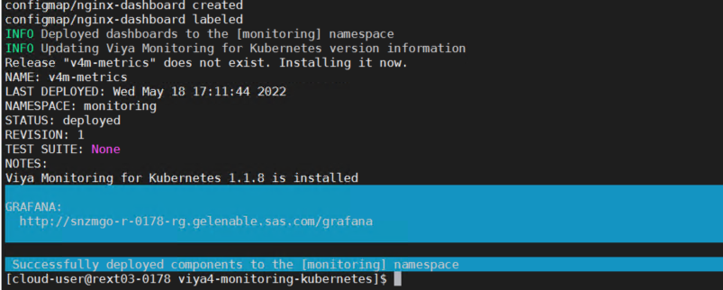

# Deploy SAS Viya Monitoring and logging in AKS (OPTIONAL)

- [Deploy SAS Viya Monitoring and logging in AKS (OPTIONAL)](#deploy-sas-viya-monitoring-and-logging-in-aks-optional)
  - [Introduction](#introduction)
  - [Preparation](#preparation)
  - [Deploy Monitoring tools](#deploy-monitoring-tools)
  - [Deploy Logging tools](#deploy-logging-tools)
  - [Optional: Remove the monitoring tools](#optional-remove-the-monitoring-tools)
  - [Optional: Remove the logging tools](#optional-remove-the-logging-tools)
  - [Troubleshooting](#troubleshooting)
  - [Next Steps](#next-steps)
  - [Table of Contents for the Manual Deployment Method exercises](#table-of-contents-for-the-manual-deployment-method-exercises)
  - [Complete Hands-on Navigation Index](#complete-hands-on-navigation-index)

## Introduction

In this optional hands-on, we want to leverage the [SAS Viya Monitoring for Kubernetes](https://github.com/sassoftware/viya4-monitoring-kubernetes) scripts and customization options to deploy monitoring, alerts, and log aggregation for SAS Viya 4.x.

The monitoring solution is based on opensource tools such as [Prometheus](https://prometheus.io/docs/introduction/overview/), [Grafana](https://grafana.com/) and [Alert Manager](https://prometheus.io/docs/alerting/latest/alertmanager/).

The logging solution is also based on opensource tools and includes the EFK stack ([Elasticsearch](https://www.elastic.co/elasticsearch/), [Fluent Bit](https://fluentbit.io/) and [Kibana](https://www.elastic.co/kibana)).

Monitoring and logging may be deployed independently or together. There are no hard dependencies between the two.

Note that, instead, in the Azure Cloud you could rely on the integrated **Azure Monitoring services** and especially with the AKS add-ons.
If you want to know more about it and even try it by yourself visit this [page](https://gitlab.sas.com/GEL/workshops/PSGEL260-sas-viya-4.0.1-administration/-/blob/master/04_Observability/04_031_Enabling_Azure_Monitor.md) from the GEL Administration VLE.

## Preparation

1. Clone the project

    ```bash
    cd ~/project/
    git clone https://github.com/sassoftware/viya4-monitoring-kubernetes.git

    # Instead of being at the mercy of the latest changes, we pin to a specific version
    cd ~/project/viya4-monitoring-kubernetes/
    git fetch --all
    # MONITORING_TAG=1.0.2
    # MONITORING_TAG=1.1.8 May 2022
    MONITORING_TAG=1.1.8

    git checkout tags/${MONITORING_TAG}
    ```

1. Copy the azure samples and set USER_DIR

    ```bash
    cd ~/project/viya4-monitoring-kubernetes/
    # clean up
    rm -Rf ~/project/viya4-monitoring-kubernetes/gel/
    # create a gel folder in monitoring
    mkdir -p ~/project/viya4-monitoring-kubernetes/gel/

    # copy azure samples
    cp -R ~/project/viya4-monitoring-kubernetes/samples/azure-deployment/* \
          ~/project/viya4-monitoring-kubernetes/gel/
    export USER_DIR=~/project/viya4-monitoring-kubernetes/gel
    ```

## Deploy Monitoring tools

1. Copy the user.env sample

    ```bash
    # copy user.env
    cp ~/project/viya4-monitoring-kubernetes/monitoring/user.env \
         ~/project/viya4-monitoring-kubernetes/gel/
    ```

1. Then edit ```$USER_DIR/monitoring/user-values-prom-operator.yaml``` to replace host.cluster.example.com with our ingress host.

    You can edit the file using ansible or manually:

   * Automatically (with ansible).

       ```bash
       # replace externalUrl
        WORK_DIR=$HOME/project/vars
        RG=$(cat ${WORK_DIR}/variables.txt | grep resource-group | awk -F'::' '{print $2}')
        gelenable_alias=${RG}.gelenable.sas.com
        ansible localhost -m replace -a "path=~/project/viya4-monitoring-kubernetes/gel/monitoring/user-values-prom-operator.yaml regexp='^    externalUrl: http://host.mycluster.example.com' replace='    externalUrl: http://${gelenable_alias}'" --diff

       # replace host
       ansible localhost -m replace -a "path=~/project/viya4-monitoring-kubernetes/gel/monitoring/user-values-prom-operator.yaml regexp='^    - host.mycluster.example.com' replace='    - ${gelenable_alias}'" --diff

       # replace root_url
       ansible localhost -m replace -a "path=~/project/viya4-monitoring-kubernetes/gel/monitoring/user-values-prom-operator.yaml regexp='^      root_url: http://host.mycluster.example.com' replace='      root_url: http://${gelenable_alias}'" --diff
       ```

   * Or, manually.

       Open the file in the MobaXterm editor

       ```sh
       code $USER_DIR/monitoring/user-values-prom-operator.yaml
       ```

       Replace manually all occurences of host.mycluster.example.com with our ingress host.

       ```yaml
       # Place overrides for the Prometheus Operator Helm Chart Here

       # Prometheus Operator Helm Chart
       # https://https://github.com/prometheus-community/helm-charts/tree/main/charts/kube-prometheus-stack
       #
       # CRDs
       # https://github.com/coreos/prometheus-operator/blob/master/Documentation/api.md
       #
       # Default Values
       # https://github.com/prometheus-community/helm-charts/blob/main/charts/kube-prometheus-stack/values.yaml

       # Sample ingress configuration
       # NOTE: Edit hostnames and ingress port

       prometheus:
       service:
         type: ClusterIP
         nodePort: null
       ingress:
         enabled: true
         annotations:
         kubernetes.io/ingress.class: nginx
         hosts:
           - host.mycluster.example.com
         paths:
           - /prometheus
       prometheusSpec:
         routePrefix: /prometheus
         externalUrl: http://host.mycluster.example.com/prometheus
         storageSpec:
         volumeClaimTemplate:
           spec:
           storageClassName: azuredisk-v4m

       alertmanager:
       service:
         type: ClusterIP
         nodePort: null
       ingress:
         enabled: true
         annotations:
           kubernetes.io/ingress.class: nginx
         hosts:
           - host.mycluster.example.com
         paths:
           - /alertmanager
       alertmanagerSpec:
         routePrefix: /alertmanager
         externalUrl: http://host.mycluster.example.com/alertmanager
         storage:
           volumeClaimTemplate:
             spec:
               storageClassName: azuredisk-v4m

       grafana:
       "grafana.ini":
          server:
          protocol: http
          domain: host.mycluster.example.com
          root_url: http://host.mycluster.example.com/grafana
          serve_from_sub_path: true
       service:
         type: ClusterIP
         nodePort: null
       ingress:
         enabled: true
         hosts:
           - host.mycluster.example.com
         path: /grafana
       testFramework:
         enabled: false
       persistence:
         storageClassName: azuredisk-v4m
       ```

1. Create the "azuredisk-v4m" storage class

    We use the sample for azure which refers to the "azuredisk-v4m" storage class. So we need to create it.

    ```bash
    # copy the "azuredisk-v4m" storage class manifest
    cp -R ~/project/viya4-monitoring-kubernetes/samples/azure-deployment/azuredisk-v4m.yaml ~/project/viya4-monitoring-kubernetes/gel/monitoring/
    # create the storage class for the monitoring and logging tools
    kubectl apply -f ~/project/viya4-monitoring-kubernetes/gel/monitoring/azuredisk-v4m.yaml
    ```

    You can check that the new "**azuredisk-v4m**" storage class has been created using `kubectl get sc`. The output should look similar to the following.

    ```log
    NAME                    PROVISIONER                                     RECLAIMPOLICY   VOLUMEBINDINGMODE     ...
    azuredisk-v4m           kubernetes.io/azure-disk                        Delete          WaitForFirstConsumer   
    azurefile               file.csi.azure.com                              Delete          Immediate              
    azurefile-csi           file.csi.azure.com                              Delete          Immediate              
    azurefile-csi-premium   file.csi.azure.com                              Delete          Immediate              
    azurefile-premium       file.csi.azure.com                              Delete          Immediate              
    default (default)       disk.csi.azure.com                              Delete          WaitForFirstConsumer   
    managed                 disk.csi.azure.com                              Delete          WaitForFirstConsumer   
    managed-csi             disk.csi.azure.com                              Delete          WaitForFirstConsumer   
    managed-csi-premium     disk.csi.azure.com                              Delete          WaitForFirstConsumer   
    managed-premium         disk.csi.azure.com                              Delete          WaitForFirstConsumer   
    sas-nfs                 cluster.local/nfs-subdir-external-provisioner   Delete          Immediate 
    ```

1. Deploy the monitoring tool

    ```bash
    export USER_DIR=~/project/viya4-monitoring-kubernetes/gel
    export GRAFANA_ADMIN_PASSWORD="lnxsas"
    ~/project/viya4-monitoring-kubernetes/monitoring/bin/deploy_monitoring_cluster.sh
    ```

    If you see something like in the screenshot below, it means that the monitoring project was successfully deployed in the cluster.

    


1. Now, lets deploy the SAS Viya monitoring in our Viya namespace.

    **Before you issue the command below update the namespace (VIYA_NS=) to the Viya environment that you currently have running**. For example, 'VIYA_NS=test' or 'VIYA_NS=prod'.

    ```bash
    VIYA_NS=prod ~/project/viya4-monitoring-kubernetes/monitoring/bin/deploy_monitoring_viya.sh
    ```

    If you see something like in the screenshot below, it means that the monitoring project was successfully deployed in our viya namespace.

    

1. Validate: run the code below and click on the Monitoring links

    ```sh
    ~/WhatsMyDetails.sh -a monitoring
    ```

   * Connect as "admin" with `lnxsas` as the password.

   * When you open Grafana, you should see something similar to the image below.

       

## Deploy Logging tools

<!-- wait for cheatcodes
```bash
echo "Waiting for the Monitoring deployment to complete / stabilize"
sleep 2m
```
-->

1. Create a dir for the logging tools

    ```bash
    mkdir -p ~/project/viya4-monitoring-kubernetes/gel/logging
    ```

1. Copy the azure sample

    ```bash
    cp -R ~/project/viya4-monitoring-kubernetes/samples/azure-deployment/logging ~/project/viya4-monitoring-kubernetes/gel
    export USER_DIR=~/project/viya4-monitoring-kubernetes/gel
    ```

1. Copy the user.env sample

    ```bash
    cp ~/project/viya4-monitoring-kubernetes/logging/user.env ~/project/viya4-monitoring-kubernetes/gel/logging
    ```

<!--
   * Add the 3 lines below in the logging/user.env file (because the script uses uuidgen which is not installed in the Azure shell)

    ```log
    ES_KIBANASERVER_PASSWD="lnxsas"
    ES_LOGCOLLECTOR_PASSWD="lnxsas"
    ES_METRICGETTER_PASSWD="lnxsas"
    ```

   * You can also do it by running the block of commands below

    ```sh
    echo "ES_KIBANASERVER_PASSWD=\"lnxsas\"" > ~/project/viya4-monitoring-kubernetes/gel/logging/user.env
    echo "ES_LOGCOLLECTOR_PASSWD=\"lnxsas\"" >> ~/project/viya4-monitoring-kubernetes/gel/logging/user.env
    echo "ES_METRICGETTER_PASSWD=\"lnxsas\"" >> ~/project/viya4-monitoring-kubernetes/gel/logging/user.env
    ```
-->

4. Preset the Kibana admin password and logadm password

    ```bash
    echo "ES_ADMIN_PASSWD=\"lnxsas\"" >> ~/project/viya4-monitoring-kubernetes/gel/logging/user.env
    echo "LOG_CREATE_LOGADM_USER=true" >> ~/project/viya4-monitoring-kubernetes/gel/logging/user.env
    echo "LOG_LOGADM_PASSWD=\"lnxsas\"" >> ~/project/viya4-monitoring-kubernetes/gel/logging/user.env
    ```

1. Then edit the '$USER_DIR/logging/user-values-elasticsearch-open.yaml' file to replace `host.mycluster.example.com` with your ingress host.

    Run the following to update the configuration.

    ```bash
    WORK_DIR=$HOME/project/vars
    RG=$(cat ${WORK_DIR}/variables.txt | grep resource-group | awk -F'::' '{print $2}')
    gelenable_alias=${RG}.gelenable.sas.com
    sed -i 's/host.mycluster.example.com/'${gelenable_alias}'/' $USER_DIR/logging/user-values-elasticsearch-open.yaml
    ```

1. Edit the 'user-values-osd-opensearch.yaml' file to replace `host.cluster.example.com` with your ingress host.

    Run the following to update the configuration.

    ```bash
    WORK_DIR=$HOME/project/vars
    RG=$(cat ${WORK_DIR}/variables.txt | grep resource-group | awk -F'::' '{print $2}')
    gelenable_alias=${RG}.gelenable.sas.com
    sed -i 's/host.cluster.example.com/'${gelenable_alias}'/' $USER_DIR/logging/user-values-osd-opensearch.yaml
    ```

1. Create the 'user-values-elasticsearch-opensearch.yaml' configuration.

    ```bash
    cat > $USER_DIR/logging/user-values-elasticsearch-opensearch.yaml << EOF
    persistence:
      storageClass: azuredisk-v4m

    # Elasticsearch ingress is optional
    ingress:
      ingressClassName: nginx
      annotations:
        nginx.ingress.kubernetes.io/configuration-snippet: |
          rewrite (?i)/elasticsearch/(.*) /$1 break;
          rewrite (?i)/elasticsearch$ / break;
        nginx.ingress.kubernetes.io/rewrite-target: /elasticsearch
        nginx.ingress.kubernetes.io/backend-protocol: HTTP
      enabled: true
      path: /elasticsearch
      pathType: Prefix
      hosts:
        - ${gelenable_alias}
    #  tls:
    #    - secretName: elasticsearch-ingress-tls-secret
    #      hosts:
    #        - ${gelenable_alias}
    EOF
    ```

1. Deploy the logging tool

    ```bash
    export USER_DIR=~/project/viya4-monitoring-kubernetes/gel
    ~/project/viya4-monitoring-kubernetes/logging/bin/deploy_logging_open.sh
    ```

    At the end you should see something like:

    

    * Troubleshooting, if the logging deployment fails.
    
        If you get an error that the 'PVC' was not ready, then delete the logging namespace and redeploy the logging tools.

        ```sh
        # Run this if you get a deployment error
        ## Delete the namespace
        kubectl delete ns logging
        ## Redeploy
        export USER_DIR=~/project/viya4-monitoring-kubernetes/gel
        ~/project/viya4-monitoring-kubernetes/logging/bin/deploy_logging_open.sh
        ```

  <!-- To cater for problems with the automated Logging install
  ```bash
  set +x
  # Set the colour codes
  Color_Off='\033[0m'       # Text Reset
  BRed='\033[1;31m'         # Bold Red  

  printf "\n\nDid you get the following error?\n\n"
  printf "${BRed}ERROR It appears that the PVC [data-v4m-es-master-0] associated with the [v4m-es-master-0] node has not been bound to a PV.${Color_Off}\n\n"

  read -r -p "Did you get the PVC ERROR? [Y/N]:" input

  case $input in
    [yY][eE][sS]|[yY])
      printf "\nStarting reinstall\n\n"
      kubectl delete ns logging
      # Redeploy
      export USER_DIR=~/project/viya4-monitoring-kubernetes/gel
      ~/project/viya4-monitoring-kubernetes/logging/bin/deploy_logging_open.sh
    ;;
        
    [nN][oO]|[nN])
      printf "\nContinuing...\n"
    ;;
        
    *)
      echo "Invalid input, continuing..."
    ;;
  esac
  set -x
  ```
  -->

9. Validate the deployment.

    * Run the code below and click on the link.

      ```bash
      ~/WhatsMyDetails.sh -a monitoring
      ```

    * Login as "**admin**" with **`lnxsas`** as the password.

      

    * Select the tenant and confirm.

      

    * Select 'Visualize & analyze' to progress to the Kibana Dashbaord.

      

    * Open the "**Log Message Volumes with Level**" dashboard.

      From the Dashboards page open the "Log Message Volumes with Level" dashboard. You should see something similar to the image below.

      

## Optional: Remove the monitoring tools

* Remove the monitoring infrastructure.

    ```yaml
    Update VIYA_NS for the Viya namespace that you are using.
    For example, VIYA_NS=test or VIYA_NS=prod.
    ```

    ```sh
    # Optional: Remove SAS Viya monitoring
    # Run this section once per Viya namespace
    export VIYA_NS=prod
    ~/project/viya4-monitoring-kubernetes/monitoring/bin/remove_monitoring_viya.sh
    # Remove cluster monitoring
    ~/project/viya4-monitoring-kubernetes/monitoring/bin/remove_monitoring_cluster.sh
    # delete the namespace
    kubectl delete ns monitoring
    ```

Removing cluster monitoring does not remove persistent volume claims by default. A re-install after removal should retain existing data. Manually delete the PVCs or the namespace to delete previously collected monitoring data.

## Optional: Remove the logging tools

* Remove Kibana.

    ```sh
    # uninstall logging
    export USER_DIR=~/project/viya4-monitoring-kubernetes/gel
    ~/project/viya4-monitoring-kubernetes/logging/bin/remove_logging_open.sh
    #then delete namespace
    kubectl delete ns logging
    ```

## Troubleshooting

* Expose kube-proxy Metrics ([source](https://github.com/sassoftware/viya4-monitoring-kubernetes/tree/master/monitoring))

    Some clusters are deployed with the kube-proxy metrics listen address set to 127.0.0.1, which prevents Prometheus from collecting metrics. To enable kube-proxy metrics, which are used in the Kubernetes / Proxy dashboard, run this command:

    ```sh
    # Change metricsBindAddress to 0.0.0.0:10249
    kubectl create configmap kube-proxy --from-literal=metricsBindAddress=0.0.0.0:10249 -n kube-system
    # Restart all kube-proxy pods
    kubectl delete po -n kube-system -l component=kube-proxy
    # Pods will automatically be recreated
    ```

---

## Next Steps

Now that you have installed monitoring and logging functionality, Let's look at scaling (down and up) the deployed environment.

Click [here](./01_240_Stop-shrink_and_Start-scale_in_AKS.md) to move onto the next exercise: ***01_240_Stop-shrink_and_Start-scale_in_AKS.md***

## Table of Contents for the Manual Deployment Method exercises

<!--Navigation for this set of labs-->
* [00-Common / 00 100 Creating an AKS Cluster](../00-Common/00_100_Creating_an_AKS_Cluster.md)
* [00-Common / 00 110 Performing the prerequisites](../00-Common/00_110_Performing_the_prerequisites.md)
* [01-Manual / 01 200 Deploying Viya 4 on AKS](./01_200_Deploying_Viya_4_on_AKS.md)
* [01-Manual / 01 210 Deploy a second namespace in AKS](./01_210_Deploy_a_second_namespace_in_AKS.md)
* [01-Manual / 01 220 CAS Customizations](./01_220_CAS_Customizations.md)
* [01-Manual / 01 230 Install monitoring and logging](./01_230_Install_monitoring_and_logging.md) **<-- You are here**
* [01-Manual / 01 240 Stop shrink and Start-scale in AKS](./01_240_Stop-shrink_and_Start-scale_in_AKS.md)
* [00-Common / 00 400 Cleanup](../00-Common/00_400_Cleanup.md)

---

## Complete Hands-on Navigation Index
<!-- startnav -->
* [Access and Setup / 00 001 Access Environments](/Access_and_Setup/00_001_Access_Environments.md)
* [README](/README.md)
* [Track A-Standard/00-Common / 00 100 Creating an AKS Cluster](/Track-A-Standard/00-Common/00_100_Creating_an_AKS_Cluster.md)
* [Track A-Standard/00-Common / 00 110 Performing the prerequisites](/Track-A-Standard/00-Common/00_110_Performing_the_prerequisites.md)
* [Track A-Standard/00-Common / 00 400 Cleanup](/Track-A-Standard/00-Common/00_400_Cleanup.md)
* [Track A-Standard/00-Common / 00 490 Cleanup Information](/Track-A-Standard/00-Common/00_490_Cleanup_Information.md)
* [Track A-Standard/01-Manual / 01 200 Deploying Viya 4 on AKS](/Track-A-Standard/01-Manual/01_200_Deploying_Viya_4_on_AKS.md)
* [Track A-Standard/01-Manual / 01 210 Deploy a second namespace in AKS](/Track-A-Standard/01-Manual/01_210_Deploy_a_second_namespace_in_AKS.md)
* [Track A-Standard/01-Manual / 01 220 CAS Customizations](/Track-A-Standard/01-Manual/01_220_CAS_Customizations.md)
* [Track A-Standard/01-Manual / 01 230 Install monitoring and logging](/Track-A-Standard/01-Manual/01_230_Install_monitoring_and_logging.md)**<-- you are here**
* [Track A-Standard/01-Manual / 01 240 Stop shrink and Start-scale in AKS](/Track-A-Standard/01-Manual/01_240_Stop-shrink_and_Start-scale_in_AKS.md)
* [Track A-Standard/02-DepOp / 02 300 Deployment Operator environment set up](/Track-A-Standard/02-DepOp/02_300_Deployment_Operator_environment_set-up.md)
* [Track A-Standard/02-DepOp / 02 310 Using the DO with a Git Repository](/Track-A-Standard/02-DepOp/02_310_Using_the_DO_with_a_Git_Repository.md)
* [Track A-Standard/02-DepOp / 02 330 Using the Orchestration Tool](/Track-A-Standard/02-DepOp/02_330_Using_the_Orchestration_Tool.md)
* [Track B-Automated / 03 500 Full Automation of AKS Deployment](/Track-B-Automated/03_500_Full_Automation_of_AKS_Deployment.md)
* [Track B-Automated / 03 590 Cleanup](/Track-B-Automated/03_590_Cleanup.md)
<!-- endnav -->
