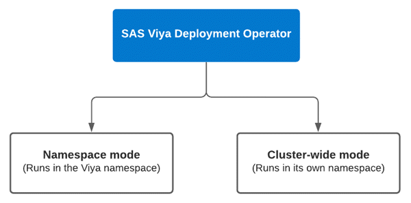
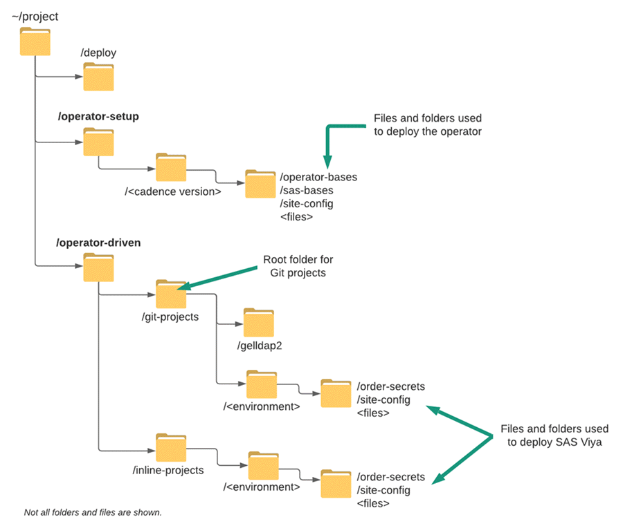

# Deployment Operator environment set-up

- [Deployment Operator environment set-up](#deployment-operator-environment-set-up)
  - [Introduction](#introduction)
    - [Using the Deployment Operator to deploy and update SAS Viya](#using-the-deployment-operator-to-deploy-and-update-sas-viya)
    - [File system structure for the lab exercises](#file-system-structure-for-the-lab-exercises)
  - [Let's get started](#lets-get-started)
    - [1. You have used the full-automation deployment script to deploy Kubernetes and SAS Viya](#1-you-have-used-the-full-automation-deployment-script-to-deploy-kubernetes-and-sas-viya)
    - [2. You performed a manual deployment of Kubernetes and SAS Viya](#2-you-performed-a-manual-deployment-of-kubernetes-and-sas-viya)
    - [3. Kubernetes and SAS Viya have not been deployed](#3-kubernetes-and-sas-viya-have-not-been-deployed)
  - [Installation and set-up of GitLab](#installation-and-set-up-of-gitlab)
    - [Initialize the Git user and create the folder for the Git projects](#initialize-the-git-user-and-create-the-folder-for-the-git-projects)
  - [OPTIONAL: Test the GitLab instance by setting up the GELLDAP Git Project](#optional-test-the-gitlab-instance-by-setting-up-the-gelldap-git-project)
  - [Deploying the SAS Viya Deployment Operator](#deploying-the-sas-viya-deployment-operator)
    - [Create the working directory](#create-the-working-directory)
    - [Get the order assets, license and certificates](#get-the-order-assets-license-and-certificates)
    - [Deploy the SAS Viya Deployment Operator](#deploy-the-sas-viya-deployment-operator)
      - [Step 1. Edit the transformer.yaml](#step-1-edit-the-transformeryaml)
      - [Step 2. Edit kustomization.yaml for cluster-wide scope](#step-2-edit-kustomizationyaml-for-cluster-wide-scope)
      - [Step 3. Build and Apply the manifests](#step-3-build-and-apply-the-manifests)
    - [Checking the deployment (optional)](#checking-the-deployment-optional)
  - [Getting the Orchestration Tool](#getting-the-orchestration-tool)
    - [Pull the sas-orchestration image from SAS](#pull-the-sas-orchestration-image-from-sas)
  - [Troubleshooting](#troubleshooting)
    - [If the Gitlab Server installation loops for ever](#if-the-gitlab-server-installation-loops-for-ever)
    - [How to fix the Gitlab namespace deleting stuck in "terminating" state](#how-to-fix-the-gitlab-namespace-deleting-stuck-in-terminating-state)
  - [Next Steps](#next-steps)
  - [Table of Contents for the Deployment Operator exercises](#table-of-contents-for-the-deployment-operator-exercises)
  - [Complete Hands-on Navigation Index](#complete-hands-on-navigation-index)

## Introduction

This lab contains a set of exercises to provide experience with using the SAS Viya Deployment Operator.

The SAS Viya Deployment Operator watches the cluster for a Custom Resource (CR) of the `Kind: SASDeployment`. The data in the SASDeployment custom resource is used by the operator when installing SAS Viya.

The operator can run in two modes:

* *"Namespace"* mode:
  * A long-lived pod inside the Viya namespace
* *"Cluster-wide"* mode
  * A long-lived pod in its own namespace, separate from the Viya namespace(s).

This is illustrated below.



In this set of exercises you will use the operator in cluster-wide mode. The advantage of using the operator in cluster-wide mode is that you can delete the Viya namespace without deleting (killing) the operator.

### Using the Deployment Operator to deploy and update SAS Viya

The Deployment Operator can be used to perform the following tasks:

* Deploy SAS Viya.

    You can use the Deployment Operator to deploy a new instance of SAS Viya. This can be for the latest release of a cadence version, or to deploy a specific cadence release.

* Update SAS Viya to a new cadence release or a new cadence version.

    You can use the Deployment Operator to update an existing Viya deployment. The operator can be used to apply the latest hotfixes within a cadence version, or to update to a new cadence version. For example, updating from LTS 2021.1 to LTS 2021.2, or Stable 2021.2.3 to Stable 2021.2.6.

    These tasks are coverved in the [SAS Viya 4: Administration](https://eduvle.sas.com/course/view.php?id=1974) workshop.

* Making an administration change.

    The Deployment Operator can also be used to make an administration change, to make an update to the Viya configuration. For example, a change from using a SMP CAS Server to a MPP CAS Server.

---

### File system structure for the lab exercises

Before you start the lab exercises let's take a moment to discuss the file system structure that will be used. To date for the other exercises you have been using the `~/project/deploy/` folder.

For this set of exercises you will use the structure shown in the image below.



* The `/operator-setup` folder is the root folder for the configuration files for the deployment operator itself. We recommend organising the files by cadence version of the operator being used. For example, stable-202x.y.z or lts-202x.y.
* The `/operator-driven` folder is the root folder for the Viya environment(s) kustomisation and input files.
* When using the deployment operator there are two possible ways of providing the input files:
  1. Storing them in a **git** repository
  1. Passing them as **inline** content in a YAML file
  * Hence, the '**git-projects**' and '**inline-projects**' folders.
* Although both methods will be covered, the **git** method is likely to be better and easier than the alternative, and so that is the first one we'll cover.

## Let's get started


In this lab exercise you will perform a number of steps to establish the environment in order to use the Deployment Operator to deploy SAS Viya.

Before starting this lab exercise, it's important to that you confirm your entry point prior to this lab exercise. Choose **one** of the entry points below which reflect what you have done so far and then read their accompanying notes:

1. You have used the full-automation script to deploy Kubernetes and SAS Viya.
1. You performed a manual deployment of Kubernetes and SAS Viya.
1. Kubernetes and SAS Viya have NOT been deployed.

### 1. You have used the full-automation deployment script to deploy Kubernetes and SAS Viya

This assumes you have completed all the steps within [Full automation of deployment](../../Track-B-Automated/03_500_Full_Automation_of_AKS_Deployment.md) exercise.
If you have completed the *03_500_Full_Automation_of_AKS_Deployment.md* lab exercise, then the first step before proceeding with the Deployment Operator exercises below is to clean-up any existing Viya deployments. The easiest way to do this is to delete the existing Viya namespace(s).

### 2. You performed a manual deployment of Kubernetes and SAS Viya

If you have completed the manual deployment lab exercises, then the first step before proceeding with the Deployment Operator exercises below is to clean-up any existing Viya deployments. The easiest way to do this is to delete the existing Viya namespace(s).

### 3. Kubernetes and SAS Viya have not been deployed

If you have yet to deploy the Kubernetes cluster and Viya using the previous exercises, then you have two options:

1. Complete the two prerequisite steps [00_100_Creating_an_AKS_Cluster.md](../00-Common/00_100_Creating_an_AKS_Cluster.md) and [00_110_Performing_the_prerequisites.md](../00-Common/00_110_Performing_the_prerequisites.md)

    Or

1. [Use the cheat-codes to build the AKS cluster and complete the pre-req's](../../Access_and_Setup/00_999_Fast_track_with_cheatcodes.md).

**_Note._** If you did perform an automatic or a manual deployment but you would like to start afresh with a clean environment, then you can delete the existing environment and start again using the steps within the following exercises:

1. [Delete the AKS cluster](../00-Common/00_400_Cleanup.md)
1. [Use the cheat-codes to build the AKS cluster and complete the pre-req's](../../Access_and_Setup/00_999_Fast_track_with_cheatcodes.md)

## Installation and set-up of GitLab

As a good practice you can, or should, use Git (or similar source code control system) to version control all the input and configuration files used to deploy a SAS Viya environment, even if you're not using the Deployment Operator.

To illustrate this we will create a Git project for the GELLDAP configuration and project(s) to store the SAS environments. We will also store the order secrets under the Viya environment project.

In preparation for the first deployment exercise you will now setup a Git server in your cluster. You would likely not do that at a customer, and instead use one of their existing Version Control system.

In this exercise we will run the GitLab instance in your AKS cluster. To make things easier for you we will script a number of the set-up tasks.

1. Install GitLab into your AKS cluster.

    To make life easier there is a script to create the GitLab instance. Run the following commands. This will take a few minutes to run.

    ```bash
    cd ~/project/
    code_dir=$HOME"/PSGEL298-sas-viya-4-deployment-on-azure-kubernetes-service/scripts"
    bash ${code_dir}/utils/GEL.310.Create.Gitlab.Instance.sh
    ```

### Initialize the Git user and create the folder for the Git projects

1. Create the working folder.

    ```bash
    # first delete it if it is already there
    rm -Rf ~/project/operator-driven/

    # Create the base working folder
    mkdir -p ~/project/operator-driven/working/
    cd ~/project/operator-driven/working/
    ```

1. Now tell git to remember your credentials. For this we will use a script (`config-git-user.sh`) to set the Git user to default Administrator (root) user.

    *You wouldn't do this at a customer site but it makes the lab easier and allows us to automate the deployment.*

    ```bash
    # Retrieve the root user password
    gitlab_root_pw=$(kubectl -n gitlab get secret \
    gitlab-gitlab-initial-root-password \
    -o jsonpath='{.data.password}' | base64 --decode )
    echo $gitlab_root_pw

    bash -c "cat << EOF > ~/project/operator-driven/working/config-git-user.sh
    #!/bin/bash
    git config --global credential.helper store
    git config --global http.sslVerify false

    git config --global user.name \"Administrator\"
    git config --global user.username \"root\"
    git config --global user.password \"${gitlab_root_pw}\"
    git config --global user.email \"admin@example.com\"

    printf \"\n** User config set\n\n\"
    EOF"

    chmod +x ~/project/operator-driven/working/config-git-user.sh
    ```

1. Run the `config-git-user.sh` script to initialise the Git client.

    ```bash
    cd ~/project/operator-driven/working/
    ./config-git-user.sh
    ```

1. Create the root folder for the Git Projects.

    ```bash
    mkdir -p ~/project/operator-driven/git-projects/
    ```

## OPTIONAL: Test the GitLab instance by setting up the GELLDAP Git Project

While in the next set of lab exercises we will use the GEL AD, we can use the GELLDAP application as a test project. 

* In the prep steps you cloned the GELLDAP project into the project directory, and set-up the manifest (gelldap-build.yaml).

1. Copy the GELLDAP files to your git (GELLDAP2) project.

    As we don't want to overwrite the '.git' folder in the GELLDAP2 project, you will copy the files in a staged approach. This is really just a problem in our VLE environment as you are coping the files from one Git project to another Git project.

    ```bash
    mkdir -p ~/project/operator-driven/git-projects/gelldap2

    # Copy the required files.
    cp -r ~/project/gelldap/Readme.md ~/project/operator-driven/git-projects/gelldap2/
    cp -r ~/project/gelldap/bases/ ~/project/operator-driven/git-projects/gelldap2/
    cp -r ~/project/gelldap/no_TLS/ ~/project/operator-driven/git-projects/gelldap2/
    cp -r ~/project/gelldap/yes_TLS/ ~/project/operator-driven/git-projects/gelldap2/
    cp -r ~/project/gelldap/gelldap-build.yaml ~/project/operator-driven/git-projects/gelldap2/

    cd ~/project/operator-driven/git-projects/gelldap2
    ls -al
    ```

    Your `/git-projects/gelldap2` folder should now look like the following.

    ```log
    drwxr-xr-x 5 cloud-user docker        91 May 10 22:58 .
    drwxrwxr-x 6 cloud-user cloud-user    22 May 10 22:58 ..
    drwxr-xr-x 4 cloud-user docker        62 May 10 22:58 bases
    drwxr-xr-x 4 cloud-user docker    163794 May 10 22:58 gelldap-build.yaml
    drwxr-xr-x 2 cloud-user docker       142 May 10 22:58 no_TLS
    -rw-r--r-- 1 cloud-user docker     12048 May 10 22:58 Readme.md
    drwxr-xr-x 2 cloud-user docker       166 May 10 22:58 yes_TLS
    ```

    Now you need to push the files to the GELLDAP2 project. We will automate these steps using a couple of scripts.

1. Run the following to create the `create-gelldap-project.sh` script.

    ```bash
    cd ~/project/operator-driven/working/
    WORK_DIR=$HOME/project/vars
    RG=$(cat ${WORK_DIR}/variables.txt | grep resource-group | awk -F'::' '{print $2}')
    GIT_HOST=${RG}.gelenable.sas.com
    PROJECT_URL=http://gitlab.${GIT_HOST}/root/gelldap2.git

    bash -c "cat << EOF > ~/project/operator-driven/working/create-gelldap-project.sh
    #!/bin/bash

    # Build the GELLDAP manifest (gelldap-build.yaml)
    #cd ~/project/operator-driven/git-projects/gelldap2/no_TLS

    #kustomize build -o ~/project/operator-driven/git-projects/gelldap2/gelldap-build.yaml

    cd ~/project/operator-driven/git-projects/gelldap2/

    # Set the registry to Azure GEL Registry - gelregistry.azurecr.io
    #sed -i 's/gelharbor.race.sas.com/gelregistry.azurecr.io/' ./gelldap-build.yaml

    # Initialize the GELLDAP2 repository
    git init
    git remote add origin ${PROJECT_URL}

    git add .
    git commit -m \"Initial commit to backup the GELLDAP files\"

    # Note this will throw an error for the first PUSH
    #  git push --set-upstream ${PROJECT_URL} master
    #git push ${PROJECT_URL}

    # This will error but it is expected
    # printf \"\n** This error is expected.\n\"
    # printf \"** The next step will push the project specifying the username and password.\n\"
    # printf \"\n\"

    EOF"

    # Set the execute permission
    chmod +x ~/project/operator-driven/working/create-gelldap-project.sh
    ```

1. Create the script to PUSH the files to the Git server.

    ```bash
    cd ~/project/operator-driven/working/
    # Set the host URL
    WORK_DIR=$HOME/project/vars
    RG=$(cat ${WORK_DIR}/variables.txt | grep resource-group | awk -F'::' '{print $2}')
    GIT_HOST=${RG}.gelenable.sas.com

    HOST_URL=http://gitlab.${GIT_HOST}
    PROJECT_URL=http://gitlab.${GIT_HOST}/root/gelldap2.git

    # Retrieve the GitLab root password
    GITLAB_ROOT_PW=$(kubectl -n gitlab get secret \
    gitlab-gitlab-initial-root-password \
    -o jsonpath='{.data.password}' | base64 --decode )
    #echo $GITLAB_ROOT_PW

    bash -c "cat << EOF > ~/project/operator-driven/working/push-gelldap-updates.sh
    #!/usr/bin/expect -f

    cd ~/project/operator-driven/git-projects/gelldap2/

    set timeout -1

    spawn git push ${PROJECT_URL}
    #spawn ./create-gelldap-project.sh

    #expect \"Username for '${HOST_URL}':\"
    expect \"Username for*\"
    send -- \"root\r\"

    expect \"Password for*\"
    send -- \"${GITLAB_ROOT_PW}\r\"

    expect eof

    EOF"

    # Set the execute permission
    chmod +x ~/project/operator-driven/working/push-gelldap-updates.sh
    ```

1. Run the following to push the files to the Git project.

    ```bash
    cd ~/project/operator-driven/working/

    # Create the project
    ./create-gelldap-project.sh

    # Push the files to the Git server
    ./push-gelldap-updates.sh
    ```

    *Note, if you get an authentication failure message then re-run the `**./push-gelldap-updates.sh**` script again.*

    <!-- Needed for the cheatcodes
    ```bash
    sleep 5
    cd ~/project/operator-driven/working/
    ./push-gelldap-updates.sh
    ```
    -->

This completes the initial deployment and set-up of GitLab, and the creation of the GELLDAP2 project.

If you want to login to GitLab to check the project, use the admin (root) user. Issue the following command to retrieve the password.

```sh
cat ~/gitlab-details.txt
```

***Note, You have to use the Windows Client from the workshop collection to access to your GitLab environment.***

Your GELLDAP2 project should now look similar to this.


## Deploying the SAS Viya Deployment Operator

Before you can deploy SAS Viya, the first step is to set-up and deploy the operator in the Kubernetes cluster. Use the following instructions to do this.

### Create the working directory

You need the create a directory to hold the files to configure the operator.

1. Issue the following command to create the working directory.

    ```bash
    DEPOP_VER=stable-2021.2.6
    mkdir -p ~/project/operator-setup/${DEPOP_VER}
    cd ~/project/operator-setup/${DEPOP_VER}
    ```

### Get the order assets, license and certificates

A customer might login to the SAS port (https://my.sas.com) and manually download the required assets, or they could make use of the Orders CLI.

In order to keep the materials in this course up to date, we will use a script to generate the assets.

The script will use the Orders CLI and do the following for us:

* Download a .tgz file containing your assets, the license and entitlement certificates, then
* Explode the .tgz into the target directory.

Run the following commands to complete this setup.

1. Please run the following command (copy-paste all lines together).

    ```bash
    CADENCE_NAME='stable'
    CADENCE_VERSION='2021.2.6'

    bash /opt/gellow_code/scripts/common/generate_sas_bases.sh \
      --cadence-name ${CADENCE_NAME} \
      --cadence-version ${CADENCE_VERSION} \
      --order-nickname 'simple' \
      --output-folder ~/project/operator-setup/${DEPOP_VER}
    ```

1. Save the order number for later.

    ```bash
    cd ~/project/operator-setup/${DEPOP_VER}
    ls -l *.zip | awk -F'_' '{print $2}' > ~/order.txt
    ```

1. Copy the operator files to the top level of the /operator-setup directory and make them writable.

    ```bash
    cd ~/project/operator-setup/${DEPOP_VER}
    cp -r sas-bases/examples/deployment-operator/deploy/* .
    # Set the permissions on the file
    chmod +w site-config/transformer.yaml

    ls -l
    ```

The directory should now look similar to the following (but with the assets for the cadence version that was downloaded).

```log
./stable-202x.y.z/
    └── kustomization.yaml
    ├── operator-base/
    ├── sas-bases/
    ├── SASViyaV4_9CKY1V_certs.zip
    ├── SASViyaV4_9CKY1V_license.jwt
    ├── SASViyaV4_9CKY1V_stable_2021.2.1_20211123.1637664865993_deploymentAssets_2021-11-25T040705.tgz
    └── site-config/
           └── cluster-wide-transformer.yaml
           └── transformer.yaml
```

The kustomization.yaml file in the `/operator-setup` directory is referred to as the '**operator kustomization.yaml**' file throughout the documentation.

---

### Deploy the SAS Viya Deployment Operator

Use the following steps to configure the operator for your environment.

#### Step 1. Edit the transformer.yaml

In the `transformer.yaml` file (_./operator-setup/site-config/transformer.yaml_) we need to set the namespace and the name for the operator ClusterRoleBinding that wil be used.

* Set namespace to: '**sasoperator**' and the name of the ClusterRole binding to '**sasopcrb**'.

  Issue the following commands to edit the file.

    ```bash
    cd ~/project/operator-setup/${DEPOP_VER}
    # Take a backup of the original file
    cp ./site-config/transformer.yaml ./site-config/transformer-bak.yaml

    # Update the default value for ClusterRole binding
    sed -i 's/{{\ NAME\-OF\-CLUSTERROLEBINDING\ }}/sasopcrb/' ./site-config/transformer.yaml
    # Update the default value for the namespace
    sed -i 's/{{\ NAME\-OF\-NAMESPACE\ }}/sasoperator/' ./site-config/transformer.yaml

    # Look at the difference to confirm the update
    icdiff site-config/transformer-bak.yaml site-config/transformer.yaml
    ```

>***Notes***
>
>*The SAS Viya Deployment Operator can be configured to respond to SASDeployment resources in its own namespace **only** (namespace scope) or in all SASDeployment resources in **all** namespaces (cluster-wide scope).*
>
>*If the operator is being used in 'namespace scope' the name of the namespace is the namespace where you will deploy SAS Viya. For example, lab or dev.*
>
>*If the operator is being used in cluster-wide scope then you need to update the kustomization.yaml file, see the next step.*

#### Step 2. Edit kustomization.yaml for cluster-wide scope

In this hands-on we will run the operator in cluster-wide scope ( but you could also run it only at the namespace level).

If the operator is being deployed in cluster-wide scope, the reference to `site-config/cluster-wide-transformer.yaml` in the operator kustomization.yaml should be uncommented.

1. Use the following command to uncomment the cluster-wide-transformer.yaml reference in the file kustomization.yaml.

    ```bash
    cd ~/project/operator-setup/${DEPOP_VER}
    sed -i 's/#- site-config/- site-config/' ./kustomization.yaml
    ```

#### Step 3. Build and Apply the manifests

The next step is to build and deploy the operator.

* Issue the following commands.

  ```bash
  # Create the namespace that will be used
  kubectl create ns sasoperator
  #
  cd ~/project/operator-setup/${DEPOP_VER}
  # Build the site.yaml for the deployment operator
  kustomize build -o operator-site.yaml
  # Apply the operator-site.yaml
  kubectl -n sasoperator apply -f operator-site.yaml
  ```

    You should see the following output.

    ```log
    $ kubectl -n sasoperator apply  -f operator-site.yaml
    customresourcedefinition.apiextensions.k8s.io/sasdeployments.orchestration.sas.com configured
    serviceaccount/sas-deployment-operator created
    role.rbac.authorization.k8s.io/sas-deployment-operator created
    clusterrole.rbac.authorization.k8s.io/sas-deployment-operator configured
    rolebinding.rbac.authorization.k8s.io/sas-deployment-operator created
    clusterrolebinding.rbac.authorization.k8s.io/sasoperator unchanged
    secret/sas-image-pull-secrets-hbk84mfhhk created
    secret/sas-license-c26m8mh9b8 created
    secret/sas-lifecycle-image-gtdccb7c2b created
    secret/sas-repositorywarehouse-certificates-fhf945mb44 created
    deployment.apps/sas-deployment-operator created
    ```

### Checking the deployment (optional)

To check what was created we can do the following:

1. List the pods running in the namespace

   ```sh
   kubectl get pods -n sasoperator
   ```

   You should see that the is one pod running. The output should look something like this.

   ```log
   NAME                                       READY   STATUS    RESTARTS   AGE
   sas-deployment-operator-79f5d86fc6-lzkfj   1/1     Running   0          25s
   ```

1. Now that the operator is running you can review the sas-deployment-operator pod.

   ```sh
   kubectl describe pod sas-deployment-operator -n sasoperator
   ```

1. Check that the ClusterRoleBinding has been created. If you have overridden the default name you should see this change.

    ```sh
    kubectl get ClusterRoleBinding | grep sas-deployment-operator
    ```

    You should see output similar to below.

    ```log
    sasopcrb                          ClusterRole/sas-deployment-operator
    ```

1. Look at the details for the ClusterRoleBinding.

   ```bash
   kubectl describe ClusterRole/sas-deployment-operator
   ```

   You should see output similar to below.

   ```log
   Name:         sas-deployment-operator
   Labels:       app.kubernetes.io/name=sas-deployment-operator
                 sas.com/admin=cluster-wide
                 sas.com/deployment=sas-viya
   Annotations:  sas.com/component-name: sas-deployment-operator
                 sas.com/component-version: 1.65.1-20211104.1636050582231
                 sas.com/version: 1.65.1
   PolicyRule:
     Resources                                        Non-Resource URLs  Resource Names  Verbs
     ---------                                        -----------------  --------------  -----
     clusterrolebindings.rbac.authorization.k8s.io    []                 []              [bind create delete escalate get list patch update watch]
     clusterroles.rbac.authorization.k8s.io           []                 []              [bind create delete escalate get list patch update watch]
     cronjobs.batch                                   []                 []              [create get list patch update watch delete]
     jobs.batch                                       []                 []              [create get list patch update watch delete]
     rolebindings.rbac.authorization.k8s.io           []                 []              [create get list watch update patch delete bind escalate]
     roles.rbac.authorization.k8s.io                  []                 []              [create get list watch update patch delete bind escalate]
     services                                         []                 []              [get list watch create]
     sasdeployments.orchestration.sas.com             []                 []              [get list watch update]
     configmaps                                       []                 []              [list delete]
     secrets                                          []                 []              [list get delete watch create update]
     serviceaccounts                                  []                 []              [list get delete watch create update]
     sasdeployments.orchestration.sas.com/finalizers  []                 []              [update]
   ```

## Getting the Orchestration Tool

The SASDeployment custom resource can be created and maintained using the Orchestration Tool.

The 'sas-orchestration' image includes several tools that help
deploy and manage the software. The instructions to deploy the orchestration tool are in the “Prerequisites” section of the README file at $deploy/sas-bases/examples/kubernetes-tools/README.md (for Markdown format) or $deploy/sas-bases/docs/using_kubernetes_tools_from_the_sas-orchestration_image.htm (for HTML format).

As we we will use the Orchestration Tool in the lab exercises we will set this up now.

### Pull the sas-orchestration image from SAS

Use the following steps.

1. Log in to the SAS Registry (cr.sas.com), and retrieve the `sas-orchestration` image.

    ```bash
    cd ~/project/operator-setup/${DEPOP_VER}

    # Get the order number
    ORDERNUM=$(echo $(ls ~/project/operator-setup/${DEPOP_VER}/*tgz) | sed 's/^.*SASViyaV4_/SASViyaV4_/' | cut -d "_" -f 2)

    # Get the sas-orchestration image version from the README
    IMAGE_VERSION=$(cat ~/project/operator-setup/${DEPOP_VER}/sas-bases/examples/kubernetes-tools/README.md | grep "docker tag cr.sas.com/viya-4-x64_oci_linux_2-docker/sas-orchestration:" | sed 's/^.*sas-orchestration:/sas-orchestration:/' | cut -d " " -f 1 | cut -d ":"  -f 2)

    # Login to Docker registry and pull the sas-orchestration image
    cat sas-bases/examples/kubernetes-tools/password.txt | docker login cr.sas.com --username ${ORDERNUM} --password-stdin
    docker pull cr.sas.com/viya-4-x64_oci_linux_2-docker/sas-orchestration:${IMAGE_VERSION}
    ```

1. Logout of cr.sas.com

    ```bash
    docker logout cr.sas.com
    ```

1. Replace the image tag

    Replace 'cr.sas.com/viya-4-x64_oci_linux_2-docker/sas-orchestration:x.xx.x-yyymmdd.xxxxxxxxxxxxx' with a local tag for ease of use. We will use 'sas-orch'.

    ```bash
    docker tag cr.sas.com/viya-4-x64_oci_linux_2-docker/sas-orchestration:${IMAGE_VERSION} sas-orch
    ```

    To confirm the change the following command can be used `docker image list | grep sas-orch`.

That completes the Orchestration Tool setup.

---
---

## Troubleshooting

### If the Gitlab Server installation loops for ever

* There are several reasons that could lead to a failure of the Gitlab Server installation. In such case  you would the script loop forever, waiting for the URL gitlab to be reachable...
* The most obvious reason would be that there is an issue with the DNS name and the Wildcard DNS alias.
* They need to be in place, and the DNS name needs to map to the Ingress Service External IP address.
* If you are stuck in the loop type "Ctrl+C" to interrupt it.
* Then delete the gitlab namespace and re-run the step or the cheat code.
* if the gitlab namsspace delete command is stuck, see the next section.

### How to fix the Gitlab namespace deleting stuck in "terminating" state

* If the gitlab namespace delete command is stuck, run the command below to force the deletion.

    ```sh
    kubectl get namespace gitlab -o json > gitlab.json
    #remove the "kubernetes" line the finalizers definition.
    sed -i '/kubernetes/d' gitlab.json
    kubectl replace --raw "/api/v1/namespaces/gitlab/finalize" -f ./gitlab.json
    ```

Reference: [Remove a namespace when the kubectl delete is stuck](https://craignewtondev.medium.com/how-to-fix-kubernetes-namespace-deleting-stuck-in-terminating-state-5ed75792647e)

---

## Next Steps

Now that you have the environment set-up and the Deployment Operator running in cluster-wide scope, the next exercise will walk you through a deployment using a Git repository.

Click [here](./02_310_Using_the_DO_with_a_Git_Repository.md) to move onto the next exercise: ***02_310_Using_the_DO_with_a_Git_Repository.md***

## Table of Contents for the Deployment Operator exercises

<!--Navigation for this set of labs-->
* [00-Common / 00 100 Creating an AKS Cluster](../00-Common/00_100_Creating_an_AKS_Cluster.md)
* [00-Common / 00 110 Performing the prerequisites](../00-Common/00_110_Performing_the_prerequisites.md)
* [02-DepOp / 02 300 Deployment Operator environment set up](./02_300_Deployment_Operator_environment_set-up.md) **<-- You are here**
* [02-DepOp / 02 310 Using the DO with a Git Repository](./02_310_Using_the_DO_with_a_Git_Repository.md)
* [02-DepOp / 02 330 Using the Orchestration Tool](./02_330_Using_the_Orchestration_Tool.md)
* [00-Common / 00 400 Cleanup](../00-Common/00_400_Cleanup.md)

---

## Complete Hands-on Navigation Index
<!-- startnav -->
* [Access and Setup / 00 001 Access Environments](/Access_and_Setup/00_001_Access_Environments.md)
* [README](/README.md)
* [Track A-Standard/00-Common / 00 100 Creating an AKS Cluster](/Track-A-Standard/00-Common/00_100_Creating_an_AKS_Cluster.md)
* [Track A-Standard/00-Common / 00 110 Performing the prerequisites](/Track-A-Standard/00-Common/00_110_Performing_the_prerequisites.md)
* [Track A-Standard/00-Common / 00 400 Cleanup](/Track-A-Standard/00-Common/00_400_Cleanup.md)
* [Track A-Standard/00-Common / 00 490 Cleanup Information](/Track-A-Standard/00-Common/00_490_Cleanup_Information.md)
* [Track A-Standard/01-Manual / 01 200 Deploying Viya 4 on AKS](/Track-A-Standard/01-Manual/01_200_Deploying_Viya_4_on_AKS.md)
* [Track A-Standard/01-Manual / 01 210 Deploy a second namespace in AKS](/Track-A-Standard/01-Manual/01_210_Deploy_a_second_namespace_in_AKS.md)
* [Track A-Standard/01-Manual / 01 220 CAS Customizations](/Track-A-Standard/01-Manual/01_220_CAS_Customizations.md)
* [Track A-Standard/01-Manual / 01 230 Install monitoring and logging](/Track-A-Standard/01-Manual/01_230_Install_monitoring_and_logging.md)
* [Track A-Standard/01-Manual / 01 240 Stop shrink and Start-scale in AKS](/Track-A-Standard/01-Manual/01_240_Stop-shrink_and_Start-scale_in_AKS.md)
* [Track A-Standard/02-DepOp / 02 300 Deployment Operator environment set up](/Track-A-Standard/02-DepOp/02_300_Deployment_Operator_environment_set-up.md)**<-- you are here**
* [Track A-Standard/02-DepOp / 02 310 Using the DO with a Git Repository](/Track-A-Standard/02-DepOp/02_310_Using_the_DO_with_a_Git_Repository.md)
* [Track A-Standard/02-DepOp / 02 330 Using the Orchestration Tool](/Track-A-Standard/02-DepOp/02_330_Using_the_Orchestration_Tool.md)
* [Track B-Automated / 03 500 Full Automation of AKS Deployment](/Track-B-Automated/03_500_Full_Automation_of_AKS_Deployment.md)
* [Track B-Automated / 03 590 Cleanup](/Track-B-Automated/03_590_Cleanup.md)
<!-- endnav -->
