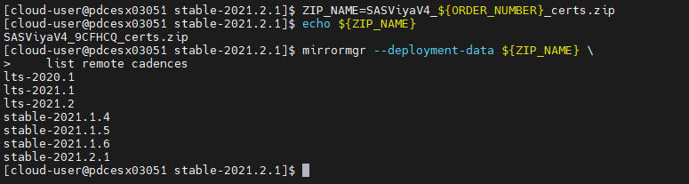
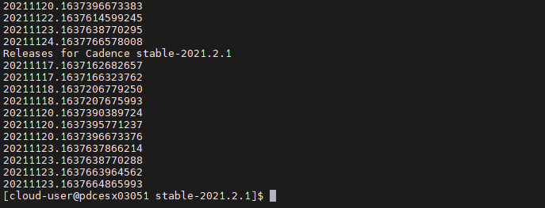
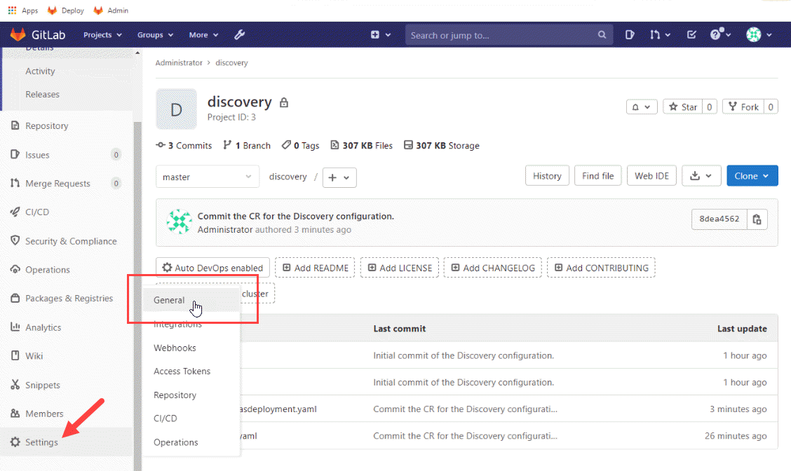
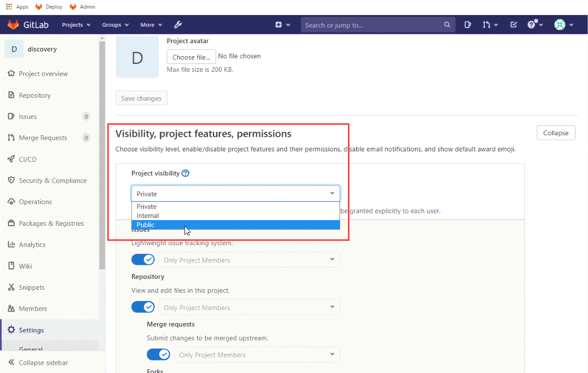
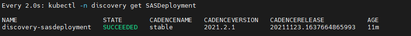
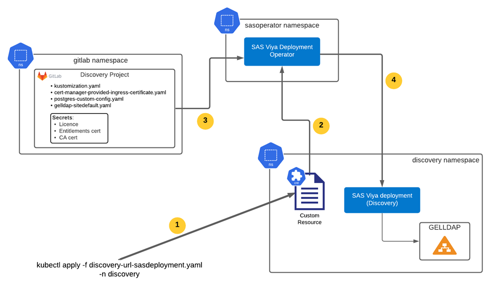

# Using the Deployment Operator with a Git Repository

- [Using the Deployment Operator with a Git Repository](#using-the-deployment-operator-with-a-git-repository)
  - [Introduction](#introduction)
  - [Using the Deployment Operator to deploy a specific version (CADENCE_RELEASE) of SAS Viya](#using-the-deployment-operator-to-deploy-a-specific-version-cadence_release-of-sas-viya)
    - [OPTIONAL: Using 'mirrormgr' to find the available cadence versions and releases](#optional-using-mirrormgr-to-find-the-available-cadence-versions-and-releases)
    - [Step 1. Extract the order secrets](#step-1-extract-the-order-secrets)
    - [Step 2. Create the Viya configuration for Discovery](#step-2-create-the-viya-configuration-for-discovery)
      - [2.1 Create the sitedefault file](#21-create-the-sitedefault-file)
      - [2.2 Prepare the TLS configuration](#22-prepare-the-tls-configuration)
      - [2.3 Create the storage class patch for the 'sas-nfs' StorageClass](#23-create-the-storage-class-patch-for-the-sas-nfs-storageclass)
      - [2.4 Create the kustomization.yaml file](#24-create-the-kustomizationyaml-file)
      - [2.5 Push the Viya configuration files to the Git project](#25-push-the-viya-configuration-files-to-the-git-project)
    - [Step 3. Create the deployment Custom Resource](#step-3-create-the-deployment-custom-resource)
    - [Step 5. Apply the CR to deploy the discovery environment](#step-5-apply-the-cr-to-deploy-the-discovery-environment)
    - [Step 6. Login to confirm you have a working environment (optional)](#step-6-login-to-confirm-you-have-a-working-environment-optional)
    - [Step 7. Confirm the version](#step-7-confirm-the-version)
    - [Review the deployment](#review-the-deployment)
  - [Making an admin change using the SAS Viya Deployment Operator](#making-an-admin-change-using-the-sas-viya-deployment-operator)
    - [Make a change to the deployment](#make-a-change-to-the-deployment)
    - [Applying the change to the environment](#applying-the-change-to-the-environment)
    - [Fixing CAS autoscaling problems](#fixing-cas-autoscaling-problems)
  - [Next Steps](#next-steps)
  - [Table of Contents for the Deployment Operator exercises](#table-of-contents-for-the-deployment-operator-exercises)
  - [Complete Hands-on Navigation Index](#complete-hands-on-navigation-index)

## Introduction

Now that you have deployed the SAS Viya Deployment Operator we can use it to deploy a SAS Viya environment.

The SAS Viya Deployment Operator watches the cluster for a SASDeployment custom resource. The data in the SASDeployment custom resource is used by the operator when installing SAS Viya.

There are two ways to provide the required files:

* In-line
* Using a Git repository.

In this exercise we will look at using the Git method, using the GitLab server that you set-up in the initial exercise.

To illustrate using the deployment operator, in this lab you will use the operator to perform the following tasks:

* Deploy a specific cadence release.
* Making an administration change.


This exercise assumes that you have completed the initial setup steps, [see here](02_300_Deployment_Operator_environment_set-up.md).

---

## Using the Deployment Operator to deploy a specific version (CADENCE_RELEASE) of SAS Viya

In this exercise you will install a specific cadence version of SAS Viya. A customer might do this to ensure that a *"tested deployment"* is promoted to a specific environment, for example, production.

Earlier you created the GitLab server, in this exercise you will create a "**Discovery**" project that will be used to manage the files for the SAS environment.

Again, we will use the default Administration (root) user to simplify the exercise instructions.

Set-up the environment variables for the exercise.

* Run the following commands.

    ```bash
    export ORDER_NUMBER=$(cat ~/order.txt)
    export DEPOP_VER=stable-2021.2.6
    ```

But first, let's look at how to find the available cadence versions.

### OPTIONAL: Using 'mirrormgr' to find the available cadence versions and releases

I guess you could just do a SAS Viya deployment and see what was installed, but there is a better way to see what is available. The following steps will show you how to use the 'mirrormgr' to get the details.

1. Download mirrormgr from the SAS website and install it

    https://support.sas.com/installation/viya/4/sas-mirror-manager/

    ```bash
    MIRRORMGR_URL=https://support.sas.com/installation/viya/4/sas-mirror-manager/lax/mirrormgr-linux.tgz

    wget ${MIRRORMGR_URL} -O - | sudo tar -xz -C /usr/local/bin/
    sudo chmod 0755 /usr/local/bin/
    ```

1. Check that it has been installed. Let's check the version that was downloaded.

    ```sh
    mirrormgr --version
    ```

1. Check for the available cadence versions.

    ```sh
    cd ~/project/operator-setup/${DEPOP_VER}

    ZIP_NAME=SASViyaV4_${ORDER_NUMBER}_certs.zip
    echo ${ZIP_NAME}
    mirrormgr --deployment-data ${ZIP_NAME} \
        list remote cadences
    ```

    You should see the available cadence versions. For LTS you will see three or four versions listed depending on when you are doing this lab, and for Stable you will see 4 versions. For example, at the time of updating this lab to use Stable 2021.2.1, the following versions were available.

    

1. Check for the available cadence releases.

    ```sh
    cd ~/project/operator-setup/${DEPOP_VER}

    ZIP_NAME=SASViyaV4_${ORDER_NUMBER}_certs.zip
    echo ${ZIP_NAME}
    mirrormgr --deployment-data ${ZIP_NAME} \
        list remote cadences releases
    ```

    As you can see the output it very long. If you look closely you will see that on some days multiple updates were released. Today, the following was available for Stable 2021.2.1.

    

Now use the following steps to configure and deploy the SAS environment.

---

### Step 1. Extract the order secrets

For this you need the certificates that are contained in the `SASViyaV4_{order number}_certs.zip` file, as well as the license file.

1. Unzip the files.

    ```bash
    # Create target directory
    mkdir -p ~/project/operator-driven/git-projects/discovery/secrets
    cd ~/project/operator-driven/git-projects/discovery/secrets
    #unzip files
    unzip ~/project/operator-setup/${DEPOP_VER}/SASViyaV4_*_certs.zip
    ```

1. Copy the license file.

   To make the next lab steps easier we will give the license file a generic name (**SASViyaV4_license.jwt**).

    ```bash
    # Create license directory
    mkdir -p ~/project/operator-driven/git-projects/discovery/secrets/license
    # Copy the files
    cp ~/project/operator-setup/${DEPOP_VER}/*.jwt ~/project/operator-driven/git-projects/discovery/secrets/license/SASViyaV4_license.jwt
    ```

### Step 2. Create the Viya configuration for Discovery

The Deployment Operator doesn't create the SAS Viya configuration, you need to provide this. Use the following steps to create the required configuration.

If you did the manual deployment, see [01_200 Deploy Viya 4 in AKS](../01-Manual/01_200_Deploying_Viya_4_on_AKS.md), you will have created a deployment that used an external Postgres database.

In this exercise we will use the internal database instance. This provides an instance of Postgres running within the Viya namespace. This also helps to keep the costs down for SAS!

*As always, the Viya configuration has to be valid for the cadence version being deployed. For example, Stable 2021.2.1.*

1. Create the site-config directory.

    ```bash
    mkdir -p ~/project/operator-driven/git-projects/discovery/site-config/
    cd ~/project/operator-driven/git-projects/discovery/
    ```

#### 2.1 Create the sitedefault file

In this exercise you will use the GEL AD (Azure Active Directory Domain Services). There is a pre-written sitedefault that we will use.

1. Let's copy the provided file in the proper location. This is under the site-config folder

    ```bash
    # Copy the site-default file
    cp /opt/gellow_code/scripts/loop/gelenable/gelenable_site-config/gelenable-sitedefault.yaml \
    ~/project/operator-driven/git-projects/discovery/site-config/
    ```

#### 2.2 Prepare the TLS configuration

By default all internal communications are TLS encrypted. With Stable 2021.2.6 SAS has replaced the default certificate generator used in the SAS Viya deployment with openssl (For the LTS cadence, this change will be available with LTS 2022.2).

More details are available in the “Certificate Generators” section of the security README file located at $deploy/sas-bases/examples/security/README.md

For this configuration we will use "TLS for full-stack" TLS mode, using openssl to generate the ingress certificate.

1. Prepare the TLS configuration.

    ```bash
    cd ~/project/operator-driven/git-projects/discovery
    mkdir -p ./site-config/security/
    
    cp ~/project/operator-setup/${DEPOP_VER}/sas-bases/examples/security/openssl-generated-ingress-certificate.yaml  \
    ./site-config/security/openssl-generated-ingress-certificate.yaml
    ```

#### 2.3 Create the storage class patch for the 'sas-nfs' StorageClass

1. Run this code to create a patch that we will reference in our kustomization.yaml file.

    ```bash
    cat > ~/project/operator-driven/git-projects/discovery/site-config/storageclass.yaml <<-EOF
    kind: PersistentStorageClass
    metadata:
      name: wildcard
    spec:
      storageClassName: sas-nfs #Storage Class using the NFS Server
    EOF
    ```

#### 2.4 Create the kustomization.yaml file

Now that you have created the above configuration files you need a kustomisation.yaml file that references them.

* Create the kustomization.yaml file.

    ```bash
    NS=discovery
    WORK_DIR=$HOME/project/vars
    RG=$(cat ${WORK_DIR}/variables.txt | grep resource-group | awk -F'::' '{print $2}')
    INGRESS_SUFFIX=discovery.${RG}.gelenable.sas.com

    cat > ~/project/operator-driven/git-projects/discovery/kustomization.yaml <<-EOF
    ---
    namespace: ${NS}
    resources:
      - sas-bases/base
      #- sas-bases/overlays/cert-manager-issuer # TLS
      - site-config/security/openssl-generated-ingress-certificate.yaml   # New with Stable 2021.2.6 using openssl
      - sas-bases/overlays/network/networking.k8s.io # New with Stable 2021.1.6
      - sas-bases/overlays/internal-postgres
      - sas-bases/overlays/cas-server
      - sas-bases/overlays/update-checker # added update checker
      - sas-bases/overlays/cas-server/auto-resources # CAS-related
      - sas-bases/overlays/internal-elasticsearch # Stable 2020.1.3
    configurations:
      - sas-bases/overlays/required/kustomizeconfig.yaml
    transformers:
      - sas-bases/overlays/internal-elasticsearch/internal-elasticsearch-transformer.yaml # Stable 2020.1.3
      - sas-bases/overlays/internal-elasticsearch/sysctl-transformer.yaml # Stable 2020.1.3 (must be after TLS but before required/transformers)
      - sas-bases/overlays/required/transformers.yaml
      - sas-bases/overlays/internal-postgres/internal-postgres-transformer.yaml
      #- sas-bases/overlays/external-postgres/external-postgres-transformer.yaml
      #- site-config/security/cert-manager-provided-ingress-certificate.yaml # TLS
      - sas-bases/overlays/cas-server/auto-resources/remove-resources.yaml # CAS-related
      #- sas-bases/overlays/scaling/zero-scale/phase-0-transformer.yaml
      #- sas-bases/overlays/scaling/zero-scale/phase-1-transformer.yaml

    # With 2021.1.3 we use kustomize components (instead of transformers for TLS configuration)
    components:
      - sas-bases/components/security/core/base/full-stack-tls
      - sas-bases/components/security/network/networking.k8s.io/ingress/nginx.ingress.kubernetes.io/full-stack-tls

    # set a custom Storage Class for PersistentVolumeClaims, as it's not currently possible to change the default SC in AKS
    # a new SC is required to support ReadWriteMany access
    # Note: annotationSelector is how we limit which PV use azurefiles/RWX versus default RWO.
    patches:
    - path: site-config/storageclass.yaml
      target:
        kind: PersistentVolumeClaim
        annotationSelector: sas.com/component-name in (sas-backup-job,sas-data-quality-services,sas-commonfiles,sas-cas-operator,sas-model-publish,sas-pyconfig)

    configMapGenerator:
      - name: ingress-input
        behavior: merge
        literals:
          - INGRESS_HOST=${INGRESS_SUFFIX}
      - name: sas-shared-config
        behavior: merge
        literals:
          - SAS_SERVICES_URL=https://${INGRESS_SUFFIX}

    secretGenerator:
      - name: sas-consul-config            ## This injects content into consul. You can add, but not replace
        behavior: merge
        files:
          - SITEDEFAULT_CONF=site-config/gelenable-sitedefault.yaml     ## Update to use the GEL ADDS
    EOF
    ```

#### 2.5 Push the Viya configuration files to the Git project

Now we need to push the configuration files to the Git project to put them under version control.

1. Issue the following commands to push the files.

    ```bash
    cd ~/project/operator-driven/git-projects/discovery
    WORK_DIR=$HOME/project/vars
    RG=$(cat ${WORK_DIR}/variables.txt | grep resource-group | awk -F'::' '{print $2}')
    GIT_URL=gitlab.${RG}.gelenable.sas.com

    PROJECT_URL=http://${GIT_URL}/root/discovery.git

    # Initialize the Discovery git repository
    git init
    git remote add origin $PROJECT_URL

    # Now push the file to your Git project
    git add .
    git commit -m "Initial commit of the Discovery configuration."

    # PUSH the files
    git push $PROJECT_URL
    ```

    The Discovery project should now have your Viya configuration files. Feel free to check!

    To get the URL and password for the admin user issue the following.

    ```sh
    cat ~/gitlab-details.txt
    ```

### Step 3. Create the deployment Custom Resource

The next step is to create the custom resource for the Discovery environment. But first some advice on creating the SASDeployment custom resource definition.

In order to use, or reference, the files storage in the Git project the 'userContent', license information and secrets all need to reference the Git project.

The deployment operator uses the HashiCorp 'Go-Getter' code. To understand the format of the reference see [HashiCorp's Go Getter](https://pkg.go.dev/github.com/hashicorp/go-getter@v1.4.1?tab=overview#url-format). For example, in your environment it would look something like the following.

```log
userContent:
  url: git::http://gitlab.{your_RG}.gelenable.sas.com/root/discovery.git
```

Before you create the custom resource we need to add an annotation to ensure that all the configuration files are read when the 'kubectl apply' is issued. In the code below you will see a line with the following: `operator.sas.com/checksum: ""`

**So, why do you need to do this?**

The short answer is that the deployment operator is only looking for changes to a Custom Resource. If the CR exists and the change is in the kustomization.yaml or one of the other configuration files this wouldn't be picked up.

Changing the 'checksum' will force a change to trigger the deployment operator, the operator will then go and access and read ALL the YAML configuration (YAML) files. Thus updating your deployment. Later you will change the CAS Server configuration to illustrate this type of change.

*Please note, at the time of updating this lab exercise the need to null the checksum is undocumented.*

To deploy the SAS Viya environment using a custom resource that references the files in the GitLab project you would need to create the following.

```log
apiVersion: orchestration.sas.com/v1alpha1
kind: SASDeployment
metadata:
  annotations:
    environment.orchestration.sas.com/readOnlyRootFilesystem: "false"
    operator.sas.com/checksum: ""
  name: discovery-sasdeployment
spec:
  cadenceName: "stable"
  cadenceVersion: "2021.2.6"
  cadenceRelease: "20220505.1651775712823"
  repositoryWarehouse:
    url: https://ses.sas.download/ses           ## this is the default value
    updatePolicy: Never                         ## this is the default value. The alternative is 'Releases'
  # The following is an example of using URLs to specify user
  # content, a license, a client certificate, and a CA certiciate.
  userContent:
    # See HashiCorp's Go Getter "URL Format" documentation for details:
    #    https://pkg.go.dev/github.com/hashicorp/go-getter@v1.4.1?tab=overview#url-format
    url: git::http://<your gitlab host alias>/root/discovery.git
  license:
    url: http://gitlab.<your gitlab host alias>/root/discovery/-/raw/master/secrets/license/SASViyaV4_license.jwt
  clientCertificate:
    url: http://gitlab.<your gitlab host alias>/root/discovery/-/raw/master/secrets/entitlement-certificates/entitlement_certificate.pem
  caCertificate:
    url: http://gitlab.<your gitlab host alias>/root/discovery/-/raw/master/secrets/ca-certificates/SAS_CA_Certificate.pem
```

*Note: You might have noticed that we have "hard-coded" the cadence version and release to use an older version of Viya. The goal is to show you (in the following steps) how to use the deployment operator to update the software to a more recent release and version.*

1. Issue the following command to create the custom resource.

    ```bash
    cd ~/project/operator-driven/git-projects/discovery/
    # Construct the Git URL
    WORK_DIR=$HOME/project/vars
    RG=$(cat ${WORK_DIR}/variables.txt | grep resource-group | awk -F'::' '{print $2}')
    GIT_URL=gitlab.${RG}.gelenable.sas.com
    # Create the CR
    bash -c "cat << EOF > ~/project/operator-driven/git-projects/discovery/discovery-url-sasdeployment.yaml
    apiVersion: orchestration.sas.com/v1alpha1
    kind: SASDeployment
    metadata:
      annotations:
        environment.orchestration.sas.com/readOnlyRootFilesystem: \"false\"
        operator.sas.com/checksum: \"\"
      name: discovery-sasdeployment
    spec:
      cadenceName: \"stable\"
      cadenceVersion: \"2021.2.6\"
      cadenceRelease: \"20220505.1651775712823\"
      repositoryWarehouse:
        url: https://ses.sas.download/ses           ## this is the default value
        updatePolicy: Never                         ## this is the default value. The alternative is 'Releases'
      # The following is an example of using URLs to specify user
      # content, a license, a client certificate, and a CA certiciate.
      userContent:
        # See HashiCorp's Go Getter \"URL Format\" documentation for details:
        #    https://pkg.go.dev/github.com/hashicorp/go-getter@v1.4.1?tab=overview#url-format
        url: git::http://${GIT_URL}/root/discovery.git
      license:
        url: http://${GIT_URL}/root/discovery/-/raw/master/secrets/license/SASViyaV4_license.jwt
      clientCertificate:
        url: http://${GIT_URL}/root/discovery/-/raw/master/secrets/entitlement-certificates/entitlement_certificate.pem
      caCertificate:
        url: http://${GIT_URL}/root/discovery/-/raw/master/secrets/ca-certificates/SAS_CA_Certificate.pem
    EOF"
    ```

1. Following good practice we should push the CR to your Discovery Git project.

    ```bash
    cd ~/project/operator-driven/git-projects/discovery

    PROJECT_URL=http://${GIT_URL}/root/discovery.git

    # Now push the CR file to your Git project
    git add .
    git commit -m "Commit the CR for the Discovery configuration."

    # PUSH the files
    git push $PROJECT_URL
    ```

<!--
### Step 4. Deploy GELLDAP to the Discovery namespace

We will use the GEL OpenLDAP (GELLDAP) as the LDAP for user authentication and identities. So we need to set this up first.  We will run the GELLDAP within the Discovery namespace to simplify the connectivity to the GELLDAP instance.

1. Create the discovery namespace.

    ```sh
    kubectl create ns discovery
    ```

1. Deploy GELLDAP into the Discovery namespace.

    ```sh
    cd ~/project/operator-driven/git-projects/gelldap2/
    # Set the namespace and deploy
    NS=discovery
    kubectl apply -f gelldap-build.yaml -n ${NS}
    ```

1. Use the following to confirm the pod is running.

    ```sh
    # Confirm that the gelldap pod is running
    kubectl -n ${NS} get all,cm -l app.kubernetes.io/part-of=gelldap
    ```

    You should see output similar to the following.

    ```log
    NAME                                  READY   STATUS    RESTARTS   AGE
    pod/gelldap-server-5bf7594dd7-xx429   1/1     Running   0          15s

    NAME                      TYPE        CLUSTER-IP     EXTERNAL-IP   PORT(S)             AGE
    service/gelldap-service   ClusterIP   10.0.145.81    <none>        389/TCP             15s
    service/gelmail-service   ClusterIP   10.0.174.233   <none>        1025/TCP,8025/TCP   15s

    NAME                             READY   UP-TO-DATE   AVAILABLE   AGE
    deployment.apps/gelldap-server   1/1     1            1           15s

    NAME                                        DESIRED   CURRENT   READY   AGE
    replicaset.apps/gelldap-server-5bf7594dd7   1         1         1       15s

    NAME                                 DATA   AGE
    configmap/gelldap-bootstrap-users    1      15s
    configmap/gelldap-memberof-overlay   1      15s
    ```
-->

### Step 5. Apply the CR to deploy the discovery environment

Now apply the CR yaml file to deploy the SAS Viya software.

You could do this using the local copy of the custom resource YAML, using the following command. But **DON'T!**

```sh
kubectl apply -f discovery-url-sasdeployment.yaml -n discovery
```

It would be better to use the custom resource stored in the Git project. This is to illustrate using files that have been placed under version control.

---


Before you can use the `kubectl apply` referencing the files in the Git project we will make the Discovery project "**Public**".

We need to do this as when you created the project using the command-line it was created as a private project by default. Additionally, to simplify the lab exercises we haven't created an SSH key and added it to your GitLab configuration.

Perform the following manual steps to make the Discovery project public.

1. Login to your GitLab instance. Use the following to get the URL and root user password.

    ```sh
    cat ~/gitlab-details.txt
    ```

1. Open the project settings.

    

1. Make the project "**Public**" and '**save changes**'.

    

---

<!-- trying to interrupt cheatcodes so student can manually change the project visibility

    ```bash
    # Get script
    cp -p ~/PSGEL298-sas-viya-4-deployment*/scripts/utils/GEL.310.Make.Project.Public.sh \
          ~/project/operator-driven/working/GEL.310.Make.Project.Public.sh
    # Run script
    cd ~/project/operator-driven/working/
    chmod +x GEL.310.Make.Project.Public.sh
    ./GEL.310.Make.Project.Public.sh
    ```
-->

Now that the Discovery project is Public you can proceed with deploying the SAS Viya environment.

1. Deploy the discovery environment.

    ```bash
    # Set the namespace and Git URL
    NS=discovery
    # Frist create the namespace
    kubectl create ns ${NS}

    # Issue the apply command using the Git project reference
    kubectl apply -f http://${GIT_URL}/root/discovery/-/raw/master/discovery-url-sasdeployment.yaml -n ${NS}
    ```

1. Make sure it has worked and that the SASDeployment CR was successfully deployed.

    ```sh
    watch kubectl -n discovery get SASDeployment
    ```

    You should see the state change from PENDING --> RECONCILING --> SUCCEEDED. For example.

    

    <!--
    ```log
    NAME                      STATE       CADENCENAME   CADENCEVERSION   CADENCERELEASE           AGE
    discovery-sasdeployment   SUCCEEDED   stable        2021.2.6         20220505.1651775712823   2m15s
    ```
    -->

    * If it is in a "FAILED" state, then run this command to determine the issue.

        ```sh
        kubectl -n discovery describe SASDeployment
        ```

1. Watch the deployment progress using the following command.

    ```sh
    watch kubectl -n discovery get pods -o wide
    ```

    Notice the presence, in that namespace, of a pod called `sas-deployment-operator-reconcile`. If you look at the logs of this pod, you will see the activities performed by it.

    Alternatively, you can use the '**gel_OKViya4**' command to confirm if SAS Viya is ready.

    ```sh
    cd /project/deploy/working/
    # Set the namesape to discovery
    NS=discovery
    time gel_OKViya4 -n ${NS} --wait -ps
    ```

    This will display the current status of your environment and will keep cycling until 90% of your endpoints are working.

    This can take between 15 minutes and 40 minutes for a fresh deployment.

<!--  Wait for cheatcode deployment
    ```bash
    set +x;
    printf "\nWaiting for the Deployment Operator to complete (this can take a few minutes)...\n"

    while [ $(kubectl -n discovery get SASDeployment | grep discovery | awk '{print $2}') != "SUCCEEDED" ]; do
      #DepOp=$(kubectl -n discovery get SASDeployment | grep discovery | awk '{print $2}')
      if [ $(kubectl -n discovery get SASDeployment | grep discovery | awk '{print $2}') = "FAILED" ];
      then
        printf "\nThe operator has FAILED. Check the Deployment Operator log for errors.\n\n"
        exit
      else
        sleep 30
      fi
    done

    printf "\nDeployment Operator status is: "$(kubectl -n discovery get SASDeployment | grep discovery | awk '{print $2}')"\n"

    printf "\nThe SAS Viya pods are now starting\n"
    sleep 60

    printf "\nWaiting for the SAS Viya pods to be READY (This can take around 90 minutes to complete)\n\n"
    set -x;

    kubectl wait --for=condition=Ready pod --selector="app.kubernetes.io/name=sas-readiness" --timeout=120m -n discovery

    (set +x; printf "\n\nYour SAS Viya deployment should be ready now.\n\n")
    ```
-->

### Step 6. Login to confirm you have a working environment (optional)

Before you proceed you might want to confirm that you have a working environment. Once the environment has started you could logon to confirm the access using one of the GEL AD users.

1. To get the URL for the 'DISCOVERY' environment you can use the `WhatsMyDetails` utility script.

    ```sh
    ~/WhatsMyDetails.sh -a urls
    ```

    'Ctl-click' on the "Discovery deployment" URL to launch the browser.


1. Login using the "Discovery" URL.

    Your will now have to use one of the GEL Domain users to login to SAS Viya.

    | Username | Description | Password |
    |-------------|-------------------|-----------|
    | gatedemo001 | Standard user     | Metadata0 |
    | gatedemo002 | Standard user     | Metadata0 |
    | sasadm      | SAS administrator | Metadata0 |

1. Logout when you are finished.

2. OPTIONAL: Let's store the URLs in a file, for later use.

    ```bash
    NS=discovery
    DRIVE_URL="https://$(kubectl -n ${NS} get ing sas-drive-app -o custom-columns='hosts:spec.rules[*].host' --no-headers | awk -F',' '{print $1}')/SASDrive/"
    EV_URL="https://$(kubectl -n ${NS} get ing sas-drive-app -o custom-columns='hosts:spec.rules[*].host' --no-headers | awk -F',' '{print $1}')/SASEnvironmentManager/"
    # Write the URLs to the urls.md file
    printf "\n" | tee -a ~/urls.md
    printf "\n  ************************ $NS URLs ************************" | tee -a ~/urls.md
    printf "\n* [Viya Drive ($NS) URL (HTTP**S**)]( ${DRIVE_URL} )" | tee -a ~/urls.md
    printf "\n* [Viya Environment Manager ($NS) URL (HTTP**S**)]( ${EV_URL} )\n\n" | tee -a ~/urls.md
    ```

### Step 7. Confirm the version

Earlier, we chose a very specific version of the software (`cadenceRelease: "20220505.1651775712823"`).

So now, we need to confirm that is what we got.

1. To confirm the version, you can run:

    ```sh
    kubectl -n discovery get cm -o yaml | grep ' SAS_CADENCE'
    ```

    You should see exactly (pay particular attention to the `SAS_CADENCE_RELEASE` line).

    ```log
    SAS_CADENCE_DISPLAY_NAME: Stable 2021.2.6
    SAS_CADENCE_DISPLAY_SHORT_NAME: Stable
    SAS_CADENCE_DISPLAY_VERSION: 2021.2.6
    SAS_CADENCE_NAME: stable
    SAS_CADENCE_RELEASE: "20220505.1651775712823"
    SAS_CADENCE_VERSION: 2021.2.6
    ```

---

### Review the deployment

The following diagram provides an overview of the deployment exercise.



1. Issue the kubectl apply for the Custom Resource (CR)

1. The operator watches for CR changes and this triggers the Discovery deployment.

1. The operator reads the source files described in the CR from the Git project.

1. The operator deploys the Discovery environment.

As you can see using the operator does simplify the deployment steps, as you don't have to build the manifest file and apply it. But you still need to edit / provide yaml files for the SAS Viya configurations.

---
---

## Making an admin change using the SAS Viya Deployment Operator

There are many reasons to make a change to the Viya environment, the most common is some form of administration or configuration change. For example, changing from running CAS in SMP mode to MPP mode.

This is the type of change that needs the annotation that we added to the custom resource (`operator.sas.com/checksum: ""`).

### Make a change to the deployment

In this exercise you will update the CAS Server. When we deployed the Discovery environment, we deployed an SMP CAS Server.

Now let's changing that to an MPP CAS Server with 3 workers and a secondary controller.

1. First create 2 files, the definition for the secondary controller and the second to define the number of CAS Workers.

    ```bash
    cd ~/project/operator-driven/git-projects/discovery
    # Create cas-default_secondary_controller.yaml
    bash -c "cat << EOF > ~/project/operator-driven/git-projects/discovery/site-config/cas-default_secondary_controller.yaml
    ---
    apiVersion: builtin
    kind: PatchTransformer
    metadata:
      name: cas-add-backup-default
    patch: |-
       - op: replace
         path: /spec/backupControllers
         value:
           1
    target:
      group: viya.sas.com
      kind: CASDeployment
      labelSelector: "sas.com/cas-server-default"
      version: v1alpha1
    EOF"

    # Create cas-default_workers.yaml
    bash -c "cat << EOF > ~/project/operator-driven/git-projects/discovery/site-config/cas-default_workers.yaml
    ---
    apiVersion: builtin
    kind: PatchTransformer
    metadata:
      name: cas-add-workers-default
    patch: |-
       - op: replace
         path: /spec/workers
         value:
           3
    target:
      group: viya.sas.com
      kind: CASDeployment
      labelSelector: "sas.com/cas-server-default"
      version: v1alpha1
    EOF"
    ```

1. Now you need to update the kustomization.yaml to reference them.

    ```sh
    ansible localhost \
        -m lineinfile \
        -a  "dest=~/project/operator-driven/git-projects/discovery/kustomization.yaml \
            insertafter='phase\-1' \
            line='  - site-config/cas-default_secondary_controller.yaml\n  - site-config/cas-default_workers.yaml' \
            state=present \
            backup=yes " \
            --diff
    ```

1. Now we need to create a file for the CAS_NODE_CONNECT_TIMEOUT configuration.

    We need this parameter to force the CAS Controller to wait long enough to allow the secondary CAS controller to be provisioned and started (with the autoscaling, the secondary CAS controller host is created on the fly wich can take more that ne the default 600 seconds).

    ```bash
    bash -c "cat << EOF > ~/project/operator-driven/git-projects/discovery/site-config/setcasnodetimeout.yaml
    ---
    apiVersion: builtin
    kind: ConfigMapGenerator
    metadata:
      name: sas-cas-config
    behavior: merge
    literals:
      - CAS_NODE_CONNECT_TIMEOUT=1800
    EOF"
    ```

1. Update the Kustomization.yaml file, to include this new configuration.

    ```sh
    cd ~/project/operator-driven/git-projects/discovery
    # Add the required line to the generators section
    sed -i '/generators:/ a \ \ - site-config/setcasnodetimeout.yaml # merges CAS_NODE_CONNECT_TIMEOUT configuration' ./kustomization.yaml
    ```

1. Now that this is done, we need to commit all this and push to Gitlab project.

    ```sh
    cd ~/project/operator-driven/git-projects/discovery
    WORK_DIR=$HOME/project/vars
    RG=$(cat ${WORK_DIR}/variables.txt | grep resource-group | awk -F'::' '{print $2}')
    GIT_URL=gitlab.${RG}.gelenable.sas.com

    PROJECT_URL=http://${GIT_URL}/root/discovery.git

    # Now push the updated CR file to your Git project
    git add .
    git commit -m "We are making changes to get an MPP CAS Server"

    # PUSH the files
    git push $PROJECT_URL
    ```

1. Once that is done, open up the Gitlab page to see your commit.

    ```sh
    cat ~/gitlab-details.txt
    ```

### Applying the change to the environment

Now, you might have thought that this (committing to git and pushing to gitlab) would be enough. It is not.

If you check your pods, you will see that CAS configuration has not changed.

So, you might think that you need to re-apply the CR definition of your SAS deployment. You would be right!

Remember you added the annotation (`operator.sas.com/checksum: ""`) to the CR when it was created, we need this for this type of change as the CR definition has not changed.

* Run the following to apply the changes.

    ```sh
    # Set the namespace and Git URL
    NS=discovery

    # Issue the apply command using the Git project reference
    kubectl apply -f http://${GIT_URL}/root/discovery/-/raw/master/discovery-url-sasdeployment.yaml -n ${NS}
    ```

It will take a few minutes to see any changes, but you can use the following command to watch the CAS pods: `watch 'kubectl get pods -n discovery -o wide | grep cas'`

If you wait long enough you should eventually see that there are 5 cas nodes. For example, *aks-cas-30181712-vmss000000* ... *aks-cas-30181712-vmss000004*.

### Fixing CAS autoscaling problems

You would not always need it.... but because of our CAS nodes autoscaling strategy (we started with just one CAS node) and the CAS Node timeout configuration, its is possible that the CAS pods enter in a RACE condition and keep waiting for each other without reaching a "happy" state.

* So in such case, it might help to restart CAS.

    ```sh
    #restart cas after update to new version
    kubectl -n discovery delete pods -l casoperator.sas.com/server=default
    ```

---

## Next Steps

Now that you have completed the exercise using a Git repository with the Deployment Operator, in the next exercise you will use the operator with an inline configuration.

Click [here](./02_330_Using_the_Orchestration_Tool.md) to move onto the next exercise: ***02_330 Using the Orchestration Tool to create the SASDeployment Custom Resource***

## Table of Contents for the Deployment Operator exercises

<!--Navigation for this set of labs-->
* [00-Common / 00 100 Creating an AKS Cluster](../00-Common/00_100_Creating_an_AKS_Cluster.md)
* [00-Common / 00 110 Performing the prerequisites](../00-Common/00_110_Performing_the_prerequisites.md)
* [02-DepOp / 02 300 Deployment Operator environment set up](./02_300_Deployment_Operator_environment_set-up.md)
* [02-DepOp / 02 310 Using the DO with a Git Repository](./02_310_Using_the_DO_with_a_Git_Repository.md) **<-- You are here**
* [02-DepOp / 02 330 Using the Orchestration Tool](./02_330_Using_the_Orchestration_Tool.md)
* [00-Common / 00 400 Cleanup](../00-Common/00_400_Cleanup.md)

---

## Complete Hands-on Navigation Index
<!-- startnav -->
* [Access and Setup / 00 001 Access Environments](/Access_and_Setup/00_001_Access_Environments.md)
* [README](/README.md)
* [Track A-Standard/00-Common / 00 100 Creating an AKS Cluster](/Track-A-Standard/00-Common/00_100_Creating_an_AKS_Cluster.md)
* [Track A-Standard/00-Common / 00 110 Performing the prerequisites](/Track-A-Standard/00-Common/00_110_Performing_the_prerequisites.md)
* [Track A-Standard/00-Common / 00 400 Cleanup](/Track-A-Standard/00-Common/00_400_Cleanup.md)
* [Track A-Standard/00-Common / 00 490 Cleanup Information](/Track-A-Standard/00-Common/00_490_Cleanup_Information.md)
* [Track A-Standard/01-Manual / 01 200 Deploying Viya 4 on AKS](/Track-A-Standard/01-Manual/01_200_Deploying_Viya_4_on_AKS.md)
* [Track A-Standard/01-Manual / 01 210 Deploy a second namespace in AKS](/Track-A-Standard/01-Manual/01_210_Deploy_a_second_namespace_in_AKS.md)
* [Track A-Standard/01-Manual / 01 220 CAS Customizations](/Track-A-Standard/01-Manual/01_220_CAS_Customizations.md)
* [Track A-Standard/01-Manual / 01 230 Install monitoring and logging](/Track-A-Standard/01-Manual/01_230_Install_monitoring_and_logging.md)
* [Track A-Standard/01-Manual / 01 240 Stop shrink and Start-scale in AKS](/Track-A-Standard/01-Manual/01_240_Stop-shrink_and_Start-scale_in_AKS.md)
* [Track A-Standard/02-DepOp / 02 300 Deployment Operator environment set up](/Track-A-Standard/02-DepOp/02_300_Deployment_Operator_environment_set-up.md)
* [Track A-Standard/02-DepOp / 02 310 Using the DO with a Git Repository](/Track-A-Standard/02-DepOp/02_310_Using_the_DO_with_a_Git_Repository.md)**<-- you are here**
* [Track A-Standard/02-DepOp / 02 330 Using the Orchestration Tool](/Track-A-Standard/02-DepOp/02_330_Using_the_Orchestration_Tool.md)
* [Track B-Automated / 03 500 Full Automation of AKS Deployment](/Track-B-Automated/03_500_Full_Automation_of_AKS_Deployment.md)
* [Track B-Automated / 03 590 Cleanup](/Track-B-Automated/03_590_Cleanup.md)
<!-- endnav -->
