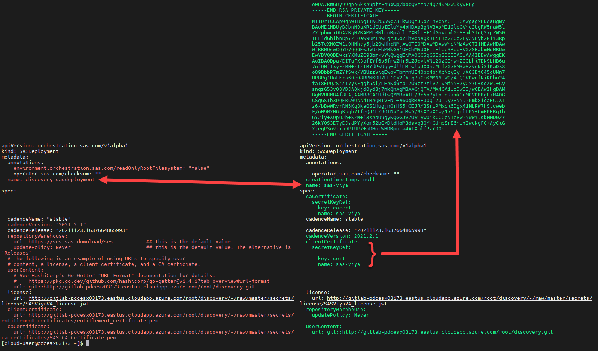

# Using the Orchestration Tool to create the SASDeployment Custom Resource

- [Using the Orchestration Tool to create the SASDeployment Custom Resource](#using-the-orchestration-tool-to-create-the-sasdeployment-custom-resource)
  - [Introduction](#introduction)
    - [Set-up: Create the working folder and set Viya cadence](#set-up-create-the-working-folder-and-set-viya-cadence)
  - [But first, some rules...](#but-first-some-rules)
  - [Create a Custom Resource using Git a project](#create-a-custom-resource-using-git-a-project)
    - [Inspect the new CR file](#inspect-the-new-cr-file)
  - [Create an "inline" Custom Resource definition](#create-an-inline-custom-resource-definition)
    - [Step 1. Get the certificates and license files](#step-1-get-the-certificates-and-license-files)
    - [Step 2. Create the SAS Viya configuration](#step-2-create-the-sas-viya-configuration)
      - [Create the sitedefault file](#create-the-sitedefault-file)
      - [Prepare the TLS configuration](#prepare-the-tls-configuration)
      - [Create the storage class patch for the 'sas-nfs' StorageClass](#create-the-storage-class-patch-for-the-sas-nfs-storageclass)
      - [Create the kustomization.yaml file](#create-the-kustomizationyaml-file)
      - [Create the inline CR definition](#create-the-inline-cr-definition)
    - [Inspect the CR](#inspect-the-cr)
  - [OPTIONAL: Deploy SAS Viya using the inline configuration](#optional-deploy-sas-viya-using-the-inline-configuration)
    - [Login to confirm you have a working environment (optional)](#login-to-confirm-you-have-a-working-environment-optional)
  - [Next Steps](#next-steps)
  - [Table of Contents for the Deployment Operator exercises](#table-of-contents-for-the-deployment-operator-exercises)
  - [Complete Hands-on Navigation Index](#complete-hands-on-navigation-index)

## Introduction

Using the Orchestration Tool... the easy path! :-)

To recap... in the previous lab exercises you have deployed the operator in its own namespace, running with cluster-wide mode.

Then, in the last lab, see [here](./02_310_Using_the_DO_with_a_Git_Repository.md), you used the operator with a Git repository, to deploy a SAS Viya environment. In that exercise you created the custom resource by hand, we "cut and paste" really!

In this exercise we will look at using the Orchestration Tool to create the Custom Resource (CR). The Orchestration Tool supports creating a CR for the supported input file methods, that is:

* Using a Git repository or a file share, and
* Using an inline configuration.

In this exercise you will look at both.

***This exercise assumes that you have completed the initial setup steps and the Discovery environment (using Git) exercises. See [here](./02_310_Using_the_DO_with_a_Git_Repository.md)***.

In exercise '*02_300 Deployment Operator environment set-up*' you pulled the ***sas-orchestration*** image from SAS. You will now use the orchestration tool to create the CR to deploy SAS Viya.

### Set-up: Create the working folder and set Viya cadence

* Create the working directory

    ```bash
    DEPOP_VER=stable-2021.2.6
    mkdir -p ~/project/operator-driven/cr-working
    cd ~/project/operator-driven/
    ```

## But first, some rules...

From testing the following should be noted:

* Keep the license separate from the user-content files.
* Don't output the CR yaml to the user-content folder.
* The user content can be in the local files system, web server or git.

## Create a Custom Resource using Git a project

That was nice, but it would be better if we had all the Viya configuration file in a Git project, to put them under source control.

Remember each Viya environment (configuration) should be in its own Git project. For this exercise we will use the Discovery Git project that you created earlier.  See [here](/06_Deployment_Steps/06_093_Using_the_DO_with_a_Git_Repository.md), using the operator with a Git Repository.

<!-- cheatcodes
    ```bash
    printf "\n\n Only run the following steps if you have created the Discovery GitLab project and made it Public.\n\n"

    read -r -p "Press Y or y to continue: " KEEPGOING

    if [ "$KEEPGOING" != "y" ]; then
      if [ "$KEEPGOING" != "Y" ]; then
        echo "Better stop then..."
        exit 1
        fi
    fi
    ```
-->

1. Copy the required assets to the Git project.

    As the tool is looking for the zip file you need to copy that to the Git project folder.

    ```bash
    cp ~/project/operator-setup/${DEPOP_VER}/*.zip ~/project/operator-driven/git-projects/discovery/secrets/SASViyaV4_certs.zip
    ```

1. Push the updates to the Git project.

    Now commit the files to the Discovery project.

    ```bash
    cd ~/project/operator-driven/git-projects/discovery
    WORK_DIR=$HOME/project/vars
    RG=$(cat ${WORK_DIR}/variables.txt | grep resource-group | awk -F'::' '{print $2}')
    GIT_HOST=${RG}.gelenable.sas.com
    PROJECT_URL=http://gitlab.${GIT_HOST}/root/discovery.git

    # Commit the updates
    git add .
    git commit -m "Commit the Viya certs zip file"

    # PUSH the files
    git push $PROJECT_URL
    ```

1. Create the Custom Resource using a Git project and write the CR to the Git project folder.  Once again, we will specify a specific cadence release, see the "--cadence-release" paramter.

    ```bash
    cd ~/project/operator-driven/git-projects/discovery
    GITLAB_URL=http://gitlab.${GIT_HOST}

    docker run --rm \
    -v ${PWD}:/cr-working \
    -w /cr-working \
    --user $(id -u):$(id -g) \
    sas-orch \
    create sas-deployment-cr \
    --deployment-data ${GITLAB_URL}/root/discovery/-/raw/master/secrets/SASViyaV4_certs.zip \
    --license  ${GITLAB_URL}/root/discovery/-/raw/master/secrets/license/SASViyaV4_license.jwt \
    --user-content git::${GITLAB_URL}/root/discovery.git \
    --cadence-name stable \
    --cadence-version 2021.2.6 \
    --cadence-release 20220505.1651775712823 \
    > ~/project/operator-driven/git-projects/discovery/discovery2-sasdeployment.yaml
    ```

### Inspect the new CR file

If you inspect the new CR file (`discovery2-sasdeployment.yaml`) you will notice that the secrets have been created inline while the license file and Viya configuration files are being read directly from the Git project.

* Use 'icdiff' to see the differences between the two files.

    ```sh
    # Compare the two CR files
    icdiff ~/project/operator-driven/git-projects/discovery/discovery-url-sasdeployment.yaml \
    ~/project/operator-driven/git-projects/discovery/discovery2-sasdeployment.yaml
    ```

    You should see output similar to the following. The file on the right is the new CR created by the Orchestration Tool. You can see the certificate block shown in green at the top of the image, and in the CR metadata the name has been set to '**sas-viya**'.

    

---

## Create an "inline" Custom Resource definition

As stated in the introduction, the Orchestration Tool can also be use to create an inline configuration.

A customer might use an inline configuration for a couple of reasons:

* The customer (or SAS administrators) doesn't have access to a Git server or other source control system, or doesn't want to store the files in a file share.

* The Kubernetes cluster is in a secure location that doesn't have access to a Git server or file share.

### Step 1. Get the certificates and license files

* Get the certificates and license files.

    For this you will copy the files from the /operator-setup folder to the working folder.

    ```bash
    cp ~/project/operator-setup/${DEPOP_VER}/*.zip ~/project/operator-driven/cr-working/SASViyaV4_certs.zip
    cp ~/project/operator-setup/${DEPOP_VER}/*.jwt ~/project/operator-driven/cr-working/SASViyaV4_license.jwt
    ```

### Step 2. Create the SAS Viya configuration

Once again, remember that the SAS Viya configuration is needed as input for the Deployment Operator.

*As always, the Viya configuration has to be valid for the cadence version being deployed. For example, Stable 2021.2.1.* We will also use the internal Postgres database for this Viya deployment.

1. Create the configuration directories.

    ```bash
    mkdir -p ~/project/operator-driven/inline-projects/discovery/site-config/
    cd ~/project/operator-driven/inline-projects/discovery/
    ```

#### Create the sitedefault file

In this exercise you will use the GEL AD (Azure Active Directory Domain Services). There is a pre-written sitedefault that we will use.

1. Let's copy the provided file in the proper location. This is under the site-config folder

    ```bash
    # Copy the site-default file
    cp /opt/gellow_code/scripts/loop/gelenable/gelenable_site-config/gelenable-sitedefault.yaml \
    ~/project/operator-driven/inline-projects/discovery/site-config/
    ```

#### Prepare the TLS configuration

By default all internal communications are TLS encrypted. With Stable 2021.2.6 SAS has replaced the default certificate generator used in the SAS Viya deployment with openssl (For the LTS cadence, this change will be available with LTS 2022.2).

For this configuration we will use "TLS for full-stack" TLS mode, using openssl to generate the ingress certificate.

1. Prepare the TLS configuration.

    ```bash
    cd ~/project/operator-driven/inline-projects/discovery
    mkdir -p ./site-config/security/
    # create the certificate issuer called "sas-viya-issuer"
    cp ~/project/operator-setup/${DEPOP_VER}/sas-bases/examples/security/openssl-generated-ingress-certificate.yaml  \
    ./site-config/security/openssl-generated-ingress-certificate.yaml
    ```

#### Create the storage class patch for the 'sas-nfs' StorageClass

1. Run this code to create a patch that we will reference in our kustomization.yaml file.

    ```bash
    cat > ~/project/operator-driven/inline-projects/discovery/site-config/storageclass.yaml <<-EOF
    kind: PersistentStorageClass
    metadata:
      name: wildcard
    spec:
      storageClassName: sas-nfs #Storage Class using the NFS Server
    EOF
    ```

#### Create the kustomization.yaml file

Now that you have created the above configuration files you need a kustomisation.yaml file that references them.

* Create the kustomization.yaml file.

    ```bash
    NS=discovery
    WORK_DIR=$HOME/project/vars
    RG=$(cat ${WORK_DIR}/variables.txt | grep resource-group | awk -F'::' '{print $2}')
    INGRESS_SUFFIX=discovery.${RG}.gelenable.sas.com

    cat > ~/project/operator-driven/inline-projects/discovery/kustomization.yaml <<-EOF
    ---
    namespace: ${NS}
    resources:
      - sas-bases/base
      #- sas-bases/overlays/cert-manager-issuer # TLS
      - site-config/security/openssl-generated-ingress-certificate.yaml   # New with Stable 2021.2.6 using openssl
      - sas-bases/overlays/network/networking.k8s.io # New with Stable 2021.1.6
      - sas-bases/overlays/internal-postgres
      - sas-bases/overlays/cas-server
      - sas-bases/overlays/update-checker # added update checker
      - sas-bases/overlays/cas-server/auto-resources # CAS-related
      - sas-bases/overlays/internal-elasticsearch # Stable 2020.1.3
    configurations:
      - sas-bases/overlays/required/kustomizeconfig.yaml
    transformers:
      - sas-bases/overlays/internal-elasticsearch/internal-elasticsearch-transformer.yaml # Stable 2020.1.3
      - sas-bases/overlays/internal-elasticsearch/sysctl-transformer.yaml # Stable 2020.1.3 (must be after TLS but before required/transformers)
      - sas-bases/overlays/required/transformers.yaml
      - sas-bases/overlays/internal-postgres/internal-postgres-transformer.yaml
      #- sas-bases/overlays/external-postgres/external-postgres-transformer.yaml
      #- site-config/security/cert-manager-provided-ingress-certificate.yaml # TLS
      - sas-bases/overlays/cas-server/auto-resources/remove-resources.yaml # CAS-related
      #- sas-bases/overlays/scaling/zero-scale/phase-0-transformer.yaml
      #- sas-bases/overlays/scaling/zero-scale/phase-1-transformer.yaml

    # With 2021.1.3 we use kustomize components (instead of transformers for TLS configuration)
    components:
      - sas-bases/components/security/core/base/full-stack-tls
      - sas-bases/components/security/network/networking.k8s.io/ingress/nginx.ingress.kubernetes.io/full-stack-tls

    # set a custom Storage Class for PersistentVolumeClaims, as it's not currently possible to change the default SC in AKS
    # a new SC is required to support ReadWriteMany access
    # Note: annotationSelector is how we limit which PV use azurefiles/RWX versus default RWO.
    patches:
    - path: site-config/storageclass.yaml
      target:
        kind: PersistentVolumeClaim
        annotationSelector: sas.com/component-name in (sas-backup-job,sas-data-quality-services,sas-commonfiles,sas-cas-operator,sas-model-publish,sas-pyconfig)

    configMapGenerator:
      - name: ingress-input
        behavior: merge
        literals:
          - INGRESS_HOST=${INGRESS_SUFFIX}
      - name: sas-shared-config
        behavior: merge
        literals:
          - SAS_SERVICES_URL=https://${INGRESS_SUFFIX}

    secretGenerator:
      - name: sas-consul-config            ## This injects content into consul. You can add, but not replace
        behavior: merge
        files:
          - SITEDEFAULT_CONF=site-config/gelenable-sitedefault.yaml     ## Update to use the GEL ADDS
    EOF
    ```

#### Create the inline CR definition

* Use the Orchestration Tool to create the CR definition.

    This time we won't specify the cadence release, the latest available release for the cadence version will be used.

    ```bash
    cd ~/project/operator-driven/
    docker run --rm \
    -v ${PWD}:/cr-working \
    -w /cr-working \
    --user $(id -u):$(id -g) \
    sas-orch \
    create sas-deployment-cr \
    --deployment-data ./cr-working/SASViyaV4_certs.zip \
    --license ./cr-working/SASViyaV4_license.jwt \
    --user-content ./inline-projects/discovery \
    --cadence-name stable \
    --cadence-version 2021.2.6 \
    > ~/project/operator-driven/inline-projects/discovery-inline-sasdeployment.yaml
    ```

* Update the deployment name metadata.

    As stated earlier, when the Orchestration Tool creates the CR it uses the default name of 'sas-viya'. If you want to update this for the Discovery environment, use the following command.

    ```bash
    cd ~/project/operator-driven/inline-projects/
    # Backup the orginal file
    #cp discovery-sasdeployment.yaml discovery-sasdeployment.yaml.org
    # Set the CR name to discovery-sasdeployment
    sed -i '0,/sas-viya/! {0,/sas-viya/ s/sas-viya/discovery-sasdeployment/}' ./discovery-inline-sasdeployment.yaml
    ```

### Inspect the CR

Let's compare the inline CR definition to the pervious version.

* Use 'icdiff' to see the differences between the two files created by the Orchestration Tool..

    ```bash
    # Compare the two CR files
    icdiff ~/project/operator-driven/git-projects/discovery/discovery2-sasdeployment.yaml \
    ~/project/operator-driven/inline-projects/discovery-inline-sasdeployment.yaml
    ```

    The key things to notice are, the first section of green is the SAS license, followed by the Viya configuration, the inline configuration.

---
---

## OPTIONAL: Deploy SAS Viya using the inline configuration

If you have the time and energy to test the CR that was generated, you should clean-up the old discovery deployment before applying the new CR.

```bash
# Clean up any existing Discovery environment
kubectl delete ns discovery
kubectl create ns discovery

# Apply the CR to deploy a new discovery environment
cd ~/project/operator-driven/inline-projects/
kubectl apply -f discovery-inline-sasdeployment.yaml -n discovery
```

As you can see, using the Orchestration Tool is definitely easier than manually creating and editing the custom resource YAML file.

Remember you still need to create the Viya kustomizations to configure the SAS Viya environment. In this case we reused the Discovery configuration that you created earlier.

### Login to confirm you have a working environment (optional)

Before you proceed you might want to confirm that you have a working environment. Once the environment has started you could logon to confirm the access using one of the GEL AD users.

1. To get the URL for the 'DISCOVERY' environment you can use the `WhatsMyDetails` utility script.

    ```sh
    ~/WhatsMyDetails.sh -a urls
    ```

    'Ctl-click' on the "Discovery deployment" URL to launch the browser.


1. Login using the "Discovery" URL.

    Your will now have to use one of the GEL Domain users to login to SAS Viya.

    | Username | Description | Password |
    |-------------|-------------------|-----------|
    | gatedemo001 | Standard user     | Metadata0 |
    | gatedemo002 | Standard user     | Metadata0 |
    | sasadm      | SAS administrator | Metadata0 |

1. Logout when you are finished.

**This concludes the deployment operator exercises**.

<!--  Wait for cheatcode deployment
    ```bash
    set +x;
    printf "\nWaiting for the Deployment Operator to complete (this can take a few minutes)...\n"

    while [ $(kubectl -n discovery get SASDeployment | grep discovery | awk '{print $2}') != "SUCCEEDED" ]; do
      #DepOp=$(kubectl -n discovery get SASDeployment | grep discovery | awk '{print $2}')
      if [ $(kubectl -n discovery get SASDeployment | grep discovery | awk '{print $2}') = "FAILED" ];
      then
        printf "\nThe operator has FAILED. Check the Deployment Operator log for errors.\n\n"
        exit
      else
        sleep 30
      fi
    done

    printf "\nDeployment Operator status is: "$(kubectl -n discovery get SASDeployment | grep discovery | awk '{print $2}')"\n"

    printf "\nThe SAS Viya pods are now starting\n"
    sleep 60

    printf "\nWaiting for the SAS Viya pods to be READY (This can take around 90 minutes to complete)\n\n"
    set -x;

    kubectl wait --for=condition=Ready pod --selector="app.kubernetes.io/name=sas-readiness" --timeout=120m -n discovery

    (set +x; printf "\n\nYour SAS Viya deployment should be ready now.\n\n")
    ```
-->

---

## Next Steps

Don't forget to Clean up the cloud assets to save $ when you are done.

Click [here](../00-Common/00_400_Cleanup.md) to move onto the next exercise: ***00_400_Cleanup.md***

## Table of Contents for the Deployment Operator exercises

<!--Navigation for this set of labs-->
* [00-Common / 00 100 Creating an AKS Cluster](../00-Common/00_100_Creating_an_AKS_Cluster.md)
* [00-Common / 00 110 Performing the prerequisites](../00-Common/00_110_Performing_the_prerequisites.md)
* [02-DepOp / 02 300 Deployment Operator environment set up](./02_300_Deployment_Operator_environment_set-up.md)
* [02-DepOp / 02 310 Using the DO with a Git Repository](./02_310_Using_the_DO_with_a_Git_Repository.md)
* [02-DepOp / 02 330 Using the Orchestration Tool](./02_330_Using_the_Orchestration_Tool.md) **<-- You are here**
* [00-Common / 00 400 Cleanup](../00-Common/00_400_Cleanup.md)

---

## Complete Hands-on Navigation Index

<!-- startnav -->
* [Access and Setup / 00 001 Access Environments](/Access_and_Setup/00_001_Access_Environments.md)
* [README](/README.md)
* [Track A-Standard/00-Common / 00 100 Creating an AKS Cluster](/Track-A-Standard/00-Common/00_100_Creating_an_AKS_Cluster.md)
* [Track A-Standard/00-Common / 00 110 Performing the prerequisites](/Track-A-Standard/00-Common/00_110_Performing_the_prerequisites.md)
* [Track A-Standard/00-Common / 00 400 Cleanup](/Track-A-Standard/00-Common/00_400_Cleanup.md)
* [Track A-Standard/00-Common / 00 490 Cleanup Information](/Track-A-Standard/00-Common/00_490_Cleanup_Information.md)
* [Track A-Standard/01-Manual / 01 200 Deploying Viya 4 on AKS](/Track-A-Standard/01-Manual/01_200_Deploying_Viya_4_on_AKS.md)
* [Track A-Standard/01-Manual / 01 210 Deploy a second namespace in AKS](/Track-A-Standard/01-Manual/01_210_Deploy_a_second_namespace_in_AKS.md)
* [Track A-Standard/01-Manual / 01 220 CAS Customizations](/Track-A-Standard/01-Manual/01_220_CAS_Customizations.md)
* [Track A-Standard/01-Manual / 01 230 Install monitoring and logging](/Track-A-Standard/01-Manual/01_230_Install_monitoring_and_logging.md)
* [Track A-Standard/01-Manual / 01 240 Stop shrink and Start-scale in AKS](/Track-A-Standard/01-Manual/01_240_Stop-shrink_and_Start-scale_in_AKS.md)
* [Track A-Standard/02-DepOp / 02 300 Deployment Operator environment set up](/Track-A-Standard/02-DepOp/02_300_Deployment_Operator_environment_set-up.md)
* [Track A-Standard/02-DepOp / 02 310 Using the DO with a Git Repository](/Track-A-Standard/02-DepOp/02_310_Using_the_DO_with_a_Git_Repository.md)
* [Track A-Standard/02-DepOp / 02 330 Using the Orchestration Tool](/Track-A-Standard/02-DepOp/02_330_Using_the_Orchestration_Tool.md)**<-- you are here**
* [Track B-Automated / 03 500 Full Automation of AKS Deployment](/Track-B-Automated/03_500_Full_Automation_of_AKS_Deployment.md)
* [Track B-Automated / 03 590 Cleanup](/Track-B-Automated/03_590_Cleanup.md)
<!-- endnav -->
