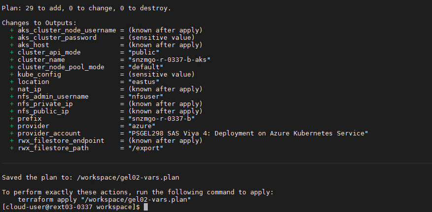
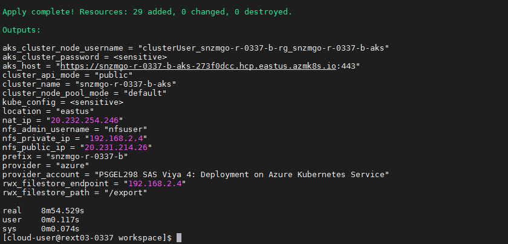
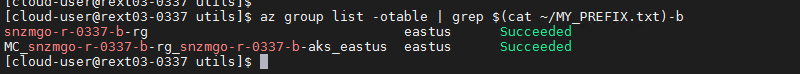
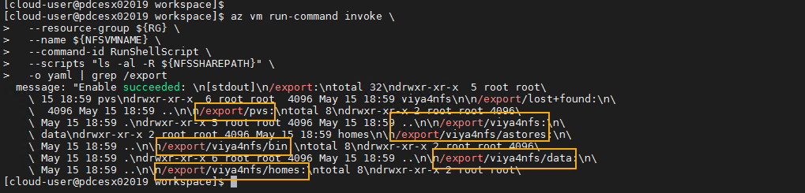
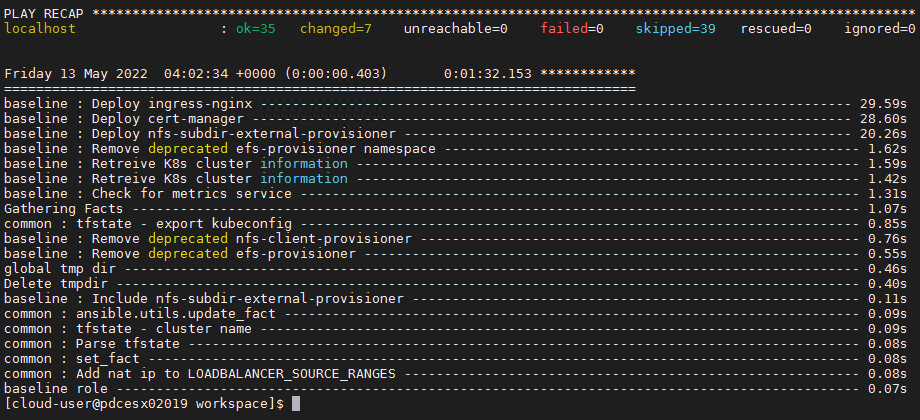

<!--
```bash
#!/bin/bash -x

```
-->

# Full automation of deployment

* [Create working folder](#create-working-folder)
* [Preparing tools](#preparing-tools)
  * [Getting the github projects cloned](#getting-the-github-projects-cloned)
  * [Building the docker images](#building-the-docker-images)
* [Authenticating to Azure and getting static credentials for Terraform](#authenticating-to-azure-and-getting-static-credentials-for-terraform)
  * [Install Azure CLI and Login with the workshop Service Principle](#install-azure-cli-and-login-with-the-workshop-service-principle)
* [Prep the required files for the creation of the AKS cluster](#prep-the-required-files-for-the-creation-of-the-aks-cluster)
  * [Create and copy our public ssh key in the workspace](#create-and-copy-our-public-ssh-key-in-the-workspace)
* [Full automated deployment with NFS Storage (gel02)](#full-automated-deployment-with-nfs-storage-gel02)
  * [Create a .tfvars file for a deployment with NFS storage (gel02)](#create-a-tfvars-file-for-a-deployment-with-nfs-storage-gel02)
  * [Deploy new AKS cluster (with NFS storage)](#deploy-new-aks-cluster-with-nfs-storage)
    * [Build the Terraform plan](#build-the-terraform-plan)
    * [Show the plan](#show-the-plan)
    * [Apply the plan to build the AKS cluster](#apply-the-plan-to-build-the-aks-cluster)
  * [Using the Azure CLI and Portal to view the resources](#using-the-azure-cli-and-portal-to-view-the-resources)
    * [Using the Azure CLI](#using-the-azure-cli)
    * [Using the Azure Portal](#using-the-azure-portal)
  * [Get the kubeconfig](#get-the-kubeconfig)
    * [Validate AKS access (and NFS storage class)](#validate-aks-access-and-nfs-storage-class)
  * [Precreate the NFS folders](#precreate-the-nfs-folders)
  * [Prepare AKS and the SAS Viya configuration using the NFS storage (gel02)](#prepare-aks-and-the-sas-viya-configuration-using-the-nfs-storage-gel02)
    * [Create vars.yaml for gel02](#create-varsyaml-for-gel02)
    * [Create directory structure](#create-directory-structure)
    * [Deploy the Pre-reqs for SAS Viya](#deploy-the-pre-reqs-for-sas-viya)
  * [Create the wildcard DNS alias for your cluster](#create-the-wildcard-dns-alias-for-your-cluster)
    * [Using the DNS Within the GELENABLE Tenant](#using-the-dns-within-the-gelenable-tenant)
  * [Deploy SAS Viya](#deploy-sas-viya)
    * [Option 1. Deploy SAS Viya](#option-1-deploy-sas-viya)
    * [Option 2. Deploy Viya with logging and monitoring](#option-2-deploy-viya-with-logging-and-monitoring)
    * [Monitor Viya startup (deployment progress)](#monitor-viya-startup-deployment-progress)
      * [Waiting for the environment to report "ready" state](#waiting-for-the-environment-to-report-ready-state)
      * [Watching pod status using the "kubectl get pods" command](#watching-pod-status-using-the-kubectl-get-pods-command)
      * [Monitor with OKViya](#monitor-with-okviya)
* [Post-Deployment tasks](#post-deployment-tasks)
  * [Validate your deployment](#validate-your-deployment)
    * [Confirm the cadence version that was deployed](#confirm-the-cadence-version-that-was-deployed)
    * [Login to SAS Viya](#login-to-sas-viya)
  * [Optional : Configure Ephemeral Storage](#optional-configure-ephemeral-storage)
* [Destroy everything](#destroy-everything)
* [Use the cheat codes to build your Viya platform](#use-the-cheat-codes-to-build-your-viya-platform)
* [Complete Hands-on Navigation Index](#complete-hands-on-navigation-index)

# Introduction

In this hands-on we use the GitHub [SAS Viya 4 resources](https://github.com/sassoftware/viya4-resource-guide) open source projects to fully automate the build of the Kubernetes cluster in Azure (with the [SAS Viya 4 Infrastructure as Code (IaC) for Microsoft Azure](https://github.com/sassoftware/viya4-iac-azure)), then the pre-requisite installation and finally the Viya 4 deployment (with the [SAS Viya 4 Deployment](https://github.com/sassoftware/viya4-deployment))

* We will use the "Docker" method to run the tools, so we only need a machine with Docker installed on it.
* We will use a RACE machine as a jumphost to interact with AKS
* Unless you already booked your collection, follow the "Book a RACE Collection" steps in this [Hands-on](../00_001_Access_Environments.md).

## Create working folder

* Create a working folder for the hands-on

    ```bash
    sudo rm -Rf ~/deploy-using-docker/
    mkdir -p ~/deploy-using-docker/
    mkdir -p ~/deploy-using-docker/workspace
    ```

* We need to choose a default region

    ```bash
    # set AZURE region
    AZUREREGION=${AZUREREGION:-eastus}

    echo ${AZUREREGION} > ~/deploy-using-docker/workspace/.azureregion.txt
    ```

## Preparing tools

### Getting the github projects cloned

1. Clone the IAC project

    ```bash
    # clone the viya4-iac project
    cd  ~/deploy-using-docker/
    git clone https://github.com/sassoftware/viya4-iac-azure.git
    cd ~/deploy-using-docker/viya4-iac-azure
    git fetch --all
    # 4.3.0 - Mar 2022
    # 5.0.0 - Apr 2022
    git reset --hard 5.0.0
    ```

1. Clone the Deployment Project

    ```bash
    # clone the viya4-deployment project
    cd  ~/deploy-using-docker/
    git clone https://github.com/sassoftware/viya4-deployment.git
    cd ~/deploy-using-docker/viya4-deployment
    git fetch --all
    # 4.8.0 - Mar 2022
    # 4.12.1 - Apr 2022
    git reset --hard 4.12.1
    ```

### Building the docker images

1. Before you build the viya4-iac and viya-deploy image, make sure the ubuntu and terraform images are already on the machine (we pre-pulled them in advance during the RACE machine bootstrap to avoid the [docker hub rate limit](https://www.docker.com/increase-rate-limits) issue.)

    ```bash
    ## check if ubuntu and terraform images are there
    docker image ls

    ```

    If you don't see the ubuntu and terraform images, make sure the RACE machine bootstrap has completed. See [these instructions](../Track-A-Standard/00-Common/00_100_Creating_an_AKS_Cluster.md#has-the-collection-finished-bootstrapping).

<!-- 1. Update the Dockerfile so the images are built from local versions of ubuntu and terraform

    ```sh
    ## update the viya4-iac docker file so it uses the local image of Terraform
    ansible localhost -m lineinfile -a "dest=~/jumphost/viya4-iac-azure/Dockerfile regexp='FROM hashicorp/terraform' line='FROM gelharbor.race.sas.com/dockerhubstaticcache/hashicorp/terraform:\$TERRAFORM_VERSION as terraform'" --diff
    ## update the viya4-deploy docker file so it uses the local image of ubuntu
    ansible localhost -m lineinfile -a "dest=~/jumphost/viya4-deployment/Dockerfile regexp='FROM ubuntu:20.04' line='FROM gelharbor.race.sas.com/dockerhubstaticcache/ubuntu:20.04 as baseline'" --diff
    ```
    -->

1. Build the IAC container image

    ```bash
    # Build docker images (iac)
    ## this should take about 1m20s
    cd  ~/deploy-using-docker/viya4-iac-azure
    time docker image build -t viya4-iac-azure .

    ```

1. Build the deployment container image

    ```bash
    # Build docker images (deploy)
    ## this should take about 8 to 9 minutes
    cd  ~/deploy-using-docker/viya4-deployment
    time docker image build -t viya4-deployment .

    ```

1. Confirm that both image have been built

    ```bash
    #check docker images locally
    docker image ls | grep viya4\-

    ```

    You should see output similar to the following:

    ```log
    viya4-deployment  latest      176fce5e225a        10 seconds ago      2.93GB
    viya4-iac-azure   latest      0665c1cfc1a6        48 seconds ago      1.47GB
    ```

## Authenticating to Azure and getting static credentials for Terraform

### Install Azure CLI and Login with the workshop Service Principle

While the Azure CLI is in the Docker IaC container, we will still install it on the Linux server. This will enable you to login to Azure with the workshop Service Principle to capture the credentials to be used with Terraform.

It will also enable you to run Azure CLI commands to query the deployment and delete the environment when you have finished the lab exercises.

1. Install the Azure CLI client.

    ```bash
    sudo rpm --import https://packages.microsoft.com/keys/microsoft.asc
    echo -e "[azure-cli]
    name=Azure CLI
    baseurl=https://packages.microsoft.com/yumrepos/azure-cli
    enabled=1
    gpgcheck=1
    gpgkey=https://packages.microsoft.com/keys/microsoft.asc" | sudo tee /etc/yum.repos.d/azure-cli.repo
    sudo yum install azure-cli -y
    ```

1. Authenticate to Azure with the Workshop Service Principal.

    We will use one of the GEL workshop scripts to do this. It will save the environment variables for the workshop subscription.

    ```bash
    code_dir=$HOME"/PSGEL298-sas-viya-4-deployment-on-azure-kubernetes-service/scripts"

    bash -E ${code_dir}/utils/GEL.510.Define.Environment.sh logon-sp
    ```

1. Edit the **main.tf** file to use Azure CLI authentication.

    The default configuration needs to be updated to use Azure CLI authentication. Run the following to update the 'main.tf' file.

    ```bach
    cd ~/deploy-using-docker/viya4-iac-azure

    sed -i '0,/subscription_id/{//d;}' ./main.tf
    sed -i '0,/client_id/{//d;}' ./main.tf
    sed -i '0,/client_secret/{//d;}' ./main.tf
    sed -i '0,/tenant_id/{//d;}' ./main.tf
    sed -i '0,/partner_id/{//d;}' ./main.tf
    sed -i '0,/use_msi/{//d;}' ./main.tf
    ```

## Prep the required files for the creation of the AKS cluster

### Create and copy our public ssh key in the workspace

1. just run this:

    ```bash
    ssh-keygen -t rsa -b 4096 -f ~/.ssh/viya_deploy_idrsa <<< y
    # Copy our public ssh key in the workspace
    cp  ~/.ssh/viya_deploy_idrsa.pub \
        ~/deploy-using-docker/workspace/viya_deploy_idrsa.pub

    ```

## Full automated deployment with NFS Storage (gel02)

In this hands-on we perform a fully automated deployment of Viya 4 in AKS, we use an NFS based storage for the Viya 4 applications persistent volumes.

### Create a .tfvars file for a deployment with NFS storage (gel02)

To avoid having to cut and paste a large code block a template has been set-up. We need to update this for your environment.

1. Get the template for the 'tfvars' file.

    ```bash
    code_dir=$HOME"/PSGEL298-sas-viya-4-deployment-on-azure-kubernetes-service/scripts"
    workspace=$HOME/deploy-using-docker/workspace
    cd ${workspace}
    # Copy and rename the template
    cp ${code_dir}/gelenable_tfvars/track_b_gel02-vars.tfvars \
    ${workspace}/gel02-vars.tfvars
    ```

1. Update the template for your environment.

    ```bash
    workspace=$HOME/deploy-using-docker/workspace
    myPrefix=$(cat ~/MY_PREFIX.txt)-b
    myLocation=$(cat ${workspace}/.azureregion.txt )
    myTags=$(cat ~/MY_TAGS.txt)", \"gel_project\" = \"PSGEL298 Track-B\" "
    k8s_version="1.21.9"

    # Update the prefix
    sed -i 's/{{tfvars_prefix}}/'"${myPrefix}"'/' ${workspace}/gel02-vars.tfvars
    # Update the location
    sed -i 's/{{tfvars_location}}/'"${myLocation}"'/' ${workspace}/gel02-vars.tfvars
    # Set K8s version
    sed -i 's/{{tfvars_k8s_version}}/'"${k8s_version}"'/' ${workspace}/gel02-vars.tfvars
    # Update the tags
    sed -i 's/{{tfvars_tags}}/'"${myTags}"'/' ${workspace}/gel02-vars.tfvars
    ```

1. Review the Terraform variables file (gel02).

    Take a moment to review and understand the content of the files. It defines how our Kubernetes cluster will look like in Azure.

    ```sh
    less ${workspace}/gel02-vars.tfvars
    ```

   * It defines the node pools and what kind of Azure Instance sizes will be used for the Kubernetes Workers

   * Hit "q" to quit from the interactive "less" command.

### Deploy new AKS cluster (with NFS storage)

#### Build the Terraform plan

* Run the command to build the terraform plan (inside the docker image).

    ```bash
    workspace=$HOME/deploy-using-docker/workspace
    cd ~/deploy-using-docker/workspace
    # plan
    docker container run --rm -it \
        --env-file $HOME/deploy-using-docker/workspace/vars/.aztf_creds \
        -v $HOME/deploy-using-docker/workspace:/workspace \
        viya4-iac-azure \
        plan \
        -var-file /workspace/gel02-vars.tfvars \
        -state /workspace/gel02-vars.tfstate \
        -out /workspace/gel02-vars.plan

    ```

    You should see output similar to the following for your environment.

    

#### Show the plan

* Run the command to show the terraform plan.

    ```bash
    docker container  run --rm -it \
        --env-file $HOME/deploy-using-docker/workspace/vars/.aztf_creds \
        -v $HOME/deploy-using-docker/workspace:/workspace \
        viya4-iac-azure \
        show \
        /workspace/gel02-vars.plan
    ```

#### Apply the plan to build the AKS cluster

* Run the command to apply the terraform plan (from inside the docker image).

    ```bash
    time docker container  run --rm -it \
        --env-file $HOME/deploy-using-docker/workspace/vars/.aztf_creds \
        -v $HOME/deploy-using-docker/workspace:/workspace \
        viya4-iac-azure \
        apply \
        -auto-approve \
        -var-file /workspace/gel02-vars.tfvars \
        -state /workspace/gel02-vars.tfstate
    ## this should take between 5 and 16 minutes.
    ```

* If the command is successful, then the AKS cluster and the required infrastructure has been created in Azure.

    You should see output similar to the following for your environment.

    

* Let's save the environment variables.

    ```bash
    workspace=$HOME/deploy-using-docker/workspace
    # Get the cluster name from Terraform
    myCluster=$(docker container  run --rm \
      --env-file $HOME/deploy-using-docker/workspace/vars/.aztf_creds \
      -v $HOME/deploy-using-docker/workspace:/workspace \
      viya4-iac-azure \
      output -raw \
      -state /workspace/gel02-vars.tfstate\
      cluster_name)
    myPrefix=$(cat ~/MY_PREFIX.txt)-b
    myLocation=$(cat ${workspace}/.azureregion.txt )
    RG=${myPrefix}"-rg"
    rm -f ${workspace}/variables.txt
    echo "location::"${myLocation} | tee -a ${workspace}/variables.txt
    echo "cluster-name::"${myCluster} | tee -a ${workspace}/variables.txt
    echo "resource-group::"${RG} | tee -a ${workspace}/variables.txt
    echo "node-res-group::MC_"${RG}"_"${myCluster}"_"${myLocation} | tee -a ${workspace}/variables.txt
    echo "nfs-server::"${myPrefix}"-nfs-vm" | tee -a ${workspace}/variables.txt
    cat ${workspace}/variables.txt
    ```

### Using the Azure CLI and Portal to view the resources

When the AKS was built two resource groups were created. The first resource group contains the Kubernetes service resources. A second resource group is also created.

The second resource group, known as the 'node resource group', contains all of the infrastructure resources associated with the cluster. These resources include the Kubernetes node VMs, virtual networking, and storage. By default, the node resource group has a name like MC_myResourceGroup_myAKSCluster_eastus.

AKS automatically deletes the node resource group whenever the cluster is deleted, so it should only be used for resources that share the cluster's lifecycle.

#### Using the Azure CLI

You can use the Azure CLI to confirm that you have successfully created the resources. For example, using the to list command (`az group list -otable`) or the show command (`az group show -n ResourceGroupName -otable`) to show the resource groups.

* Run the following command to confirm your resource groups.

    ```bash
    az group list -otable | grep $(cat ~/MY_PREFIX.txt)-b
    ```

    You will see the resource groups names, the regions where they have been created and the status. For example.

    

* View the primary resource group.

    You can use the 'az resource list' command (`az resource list --resource-group`) to view the resources in a resource group.

    ```sh
    workspace=$HOME/deploy-using-docker/workspace
    rg=$(cat ${workspace}/variables.txt | grep resource-group | awk -F'::' '{print $2}')
    az resource list --resource-group ${rg} -otable
    ```

#### Using the Azure Portal

1. Access the Azure Portal.

    Open the browser on your Windows client and access the Azure Portal, Click here.
    Login with user '**gatedemo001@gelenable.sas.com**' and password '**Metadata0**' (with a zero).

* You can check that in the Azure portal and notice that an NFS vm and associated disks have been provisioned.

    For example...

    

### Get the kubeconfig

* Let's grab our KUBECONFIG file with terraform

    ```bash
    ## get the kubeconfig file
    docker container  run --rm \
        --env-file $HOME/deploy-using-docker/workspace/vars/.aztf_creds \
        -v $HOME/deploy-using-docker/workspace:/workspace \
        viya4-iac-azure \
        output -raw \
        -state /workspace/gel02-vars.tfstate\
        kube_config > $HOME/deploy-using-docker/workspace/.kubeconfig_aks

    mv ~/.kube/config ~/.kube/config_old
    ln -s  $HOME/deploy-using-docker/workspace/.kubeconfig_aks  $HOME/.kube/config
    #secure the KUBECONFIG file
    chmod 700 $HOME/.kube/config
    ```

<!-- This code might need the Azure credentials
* or with az ( in case you lost your tfstate file)

    ```sh
    rm -rf $HOME/deploy-using-docker/workspace/.kubeconfig_aks
    touch $HOME/deploy-using-docker/workspace/.kubeconfig_aks
    workspace=$HOME/deploy-using-docker/workspace
    RG=$(cat ${workspace}/variables.txt | grep resource-group | awk -F'::' '{print $2}')
    myCluster=$(cat ${workspace}/variables.txt | grep cluster-name | awk -F'::' '{print $2}')

    docker container  run  --rm \
        --env-file $HOME/deploy-using-docker/workspace/vars/.aztf_creds \
        -v $HOME/deploy-using-docker/workspace/.kubeconfig_aks:/root/.kube/config \
        --entrypoint az \
        viya4-iac-azure \
        aks \
        get-credentials \
        --name ${myCluster} \
        --resource-group ${RG}
    ```
-->

#### Validate AKS access (and NFS storage class)

* run this command to see if you can list the Kubernetes nodes

    ```bash
    kubectl get nodes
    kubectl get sc
    ```

### Precreate the NFS folders

In order to use NFS-based storage, the Viya 4 automated deployment assumes that there is a specific sub-folder structure for the NFS shared folder.

* Reference: [SAS Viya 4 deployment](https://github.com/sassoftware/viya4-deployment)

Below is the required nfs exports folder structure

```log
<export_dir>        <- nfs export path
    /pvs              <- location for persistent volumes
    /<namespace>      <- folder per namespace
        /astores        <- location for astores
        /bin            <- location for open source directories
        /data           <- location for SAS and CAS Data
        /homes          <- location for user home directories to be mounted
```

It is important to note that a part of the structure depends on the **namespace** name. that's the reason why it can not be pre-created in advance.

If you combine the viya4-iac and the viya4-deployment tools, assuming that you provide the terraform state file ("tfstate") generated by the first tool as an input for the second tool, then this sub-folder structure can be created **automatically** by the viya4-deployment tool with the proper namespace.

This is done using ssh access from our client machine (with docker) to the Azure Jumpbox VM from where the command to create the directory structure will run.

Unfortunately in RACE.EXNET, there is a firewall rule that only allow access to the outside (Internet) on port 80 and 443. As a consequence we can not ssh (with port 22) to the Jump VM running in Azure.

So, we will manage the NFS server by ourselves and in this case the Jumpbox is not required (we will assume that our initial namespace for the viya deployment is called "viya4nfs").

The following steps will guide you through the set-up.

1. Get the required environment variables.

    ```bash
    # set the NFS VM name
    workspace=$HOME/deploy-using-docker/workspace
    NFSVMNAME=$(cat ${workspace}/variables.txt | grep nfs-server | awk -F'::' '{print $2}')
    echo "NFS Server: "${NFSVMNAME}
    # Get rwx_filestore_path
    docker container run --rm \
      --env-file $HOME/deploy-using-docker/workspace/vars/.aztf_creds \
      -v $HOME/deploy-using-docker/workspace:/workspace \
      viya4-iac-azure \
      output -raw \
      -state /workspace/gel02-vars.tfstate \
      rwx_filestore_path > $HOME/deploy-using-docker/workspace/.NFSSHAREPATH.txt

    NFSSHAREPATH=$(cat $HOME/deploy-using-docker/workspace/.NFSSHAREPATH.txt)
    echo "NFS path: "${NFSSHAREPATH}
    ```

1. Create the folder structure on the NFS Server.

    As we can't SSH into the NFS Server we will used the Azure CLI to set-up the folders.

    ```bash
    RG=$(cat ${workspace}/variables.txt | grep resource-group | awk -F'::' '{print $2}')
    NS="viya4nfs"
    az vm run-command invoke \
    --resource-group ${RG} \
    --name ${NFSVMNAME} \
    --command-id RunShellScript \
    --scripts "mkdir -p ${NFSSHAREPATH}/pvs && mkdir -p ${NFSSHAREPATH}/${NS}/bin && mkdir -p ${NFSSHAREPATH}/${NS}/data && mkdir -p ${NFSSHAREPATH}/${NS}/homes && mkdir -p ${NFSSHAREPATH}/${NS}/astores"
    ```

1. If you want to confirm that the folders have been created. Run the following command.

    While the format of the output isn't that great, you can use '-o yaml' to format the output as yaml, this will make it more readable. Then grep for '/export' to help to highlight the directories.

    ```sh
    az vm run-command invoke \
      --resource-group ${RG} \
      --name ${NFSVMNAME} \
      --command-id RunShellScript \
      --scripts "ls -al -R ${NFSSHAREPATH}" \
      -o yaml | grep /export
    ```

    You should see the following output for your environment.

    

<!--
1. Set the Azure credentials from the Docker 'viya4-iac' container.

    ```sh
    code_dir=$HOME"/PSGEL298-sas-viya-4-deployment-on-azure-kubernetes-service/scripts"
    # Get the Service Principle login script
    cp ${code_dir}/utils/GEL.520.Docker.SP.Login.sh \
    $HOME/deploy-using-docker/workspace/

    # Clean-up any existing cached credentials
    sudo rm -Rf $HOME/deploy-using-docker/workspace/azure/
    mkdir -p $HOME/deploy-using-docker/workspace/azure/

    # Login to cache the Azure credentials
    docker run --rm \
      -v $HOME/deploy-using-docker/workspace/azure:/root/.azure \
      -v $HOME/deploy-using-docker/workspace:/workspace \
      --entrypoint bash \
      viya4-iac-azure -c "sh -x /workspace/GEL.520.Docker.SP.Login.sh"
    ```

1. Create the folder structure on the NFS Server.

    ```sh
    # set the NAMESPACE name for the initial deployment
    NS="viya4nfs"
    ## Now we run the "az vm run-command invoke" inside Docker to create the required diretcory structure in our NFS Server VM.
    workspace=$HOME/deploy-using-docker/workspace
    RG=$(cat ${workspace}/variables.txt | grep resource-group | awk -F'::' '{print $2}')
    docker container  run  --rm \
      --group-add root \
      --user $(id -u):$(id -g) \
      -v $HOME/deploy-using-docker/workspace/azure:/root/.azure \
      --entrypoint az \
      viya4-iac-azure \
      vm run-command invoke \
      --name ${NFSVMNAME} \
      --command-id RunShellScript \
      --scripts "mkdir -p /${NFSSHAREPATH}/pvs && mkdir -p /${NFSSHAREPATH}/${NS}/bin && mkdir -p /${NFSSHAREPATH}/${NS}/data && mkdir -p /${NFSSHAREPATH}/${NS}/homes && mkdir -p /${NFSSHAREPATH}/${NS}/astores" \
      --resource-group ${RG}
    ```
-->

### Prepare AKS and the SAS Viya configuration using the NFS storage (gel02)

#### Create vars.yaml for gel02

* Let's prepare our vars.yaml for the automated Viya 4 deployment.

    ```bash
    workspace=$HOME/deploy-using-docker/workspace
    export NS="viya4nfs"
    RG=$(cat ${workspace}/variables.txt | grep resource-group | awk -F'::' '{print $2}')
    myCluster=$(cat ${workspace}/variables.txt | grep cluster-name | awk -F'::' '{print $2}')

    V4_CFG_INGRESS_FQDN=${NS}.${RG}.gelenable.sas.com

    tee  ${workspace}/gel02-vars.yaml > /dev/null << EOF
    ## Cluster
    PROVIDER: azure
    CLUSTER_NAME: ${myCluster}
    NAMESPACE: ${NS}

    ## MISC
    DEPLOY: true # Set to false to stop at generating the manifest

    ## Cadence and version
    V4_CFG_CADENCE_NAME: 'stable'
    V4_CFG_CADENCE_VERSION: '2021.2.6'

    ## SAS API Access
    V4_CFG_SAS_API_KEY: 'otHGJtno8QGTqys9vRGxmgLOCnVsHWG2'
    V4_CFG_SAS_API_SECRET: 'banKYbGZyNkDXbBO'
    V4_CFG_ORDER_NUMBER: 9CMCCD

    #LOADBALANCER_SOURCE_RANGES: ['<cluster_nat_ip>/32']
    LOADBALANCER_SOURCE_RANGES: ["149.173.0.0/16",  "52.226.102.80/31"]

    ## Storage - we let the tool create the SC for us
    V4_CFG_MANAGE_STORAGE: true
    JUMP_SVR_RWX_FILESTORE_PATH: /export

    ## JUMP VM ACCESS TO PREPARE NFS DIRECTORIES
    # JUMP_SVR_PRIVATE_KEY: '/config/jump_svr_private_key'

    ## CR Access
    # V4_CFG_CR_USER: <container_registry_user>
    # V4_CFG_CR_PASSWORD: <container_registry_password>

    ## Ingress
    V4_CFG_INGRESS_TYPE: ingress
    V4_CFG_INGRESS_FQDN: ${V4_CFG_INGRESS_FQDN}
    V4_CFG_TLS_MODE: "full-stack" # [full-stack|front-door|disabled]

    ## Postgres
    V4_CFG_POSTGRES_TYPE: internal

    ## LDAP
    V4_CFG_EMBEDDED_LDAP_ENABLE: true

    ## Consul UI
    #V4_CFG_CONSUL_ENABLE_LOADBALANCER: false

    ## SAS/CONNECT
    V4_CFG_CONNECT_ENABLE_LOADBALANCER: false

    ## CAS Configuration
    V4_CFG_CAS_WORKER_COUNT: '3'
    V4_CFG_CAS_ENABLE_BACKUP_CONTROLLER: true
    V4_CFG_CAS_ENABLE_LOADBALANCER: true

    # Monitoring and logging tools
    V4M_BASE_DOMAIN: ${RG}.gelenable.sas.com

    # allow ELASTIC SEARCH to be properly configured
    V4_CFG_ELASTICSEARCH_ENABLE: true

    EOF
    ```

#### Create directory structure

* The viya4-deployment tool fully manages the kustomization.yaml file.
* Users can make change by adding custom overlays into sub-folders under the site-config folder.
* we can pre-create our local directory structure and add any specific customization we want there.

    ```bash
    # create local directories
    workspace=$HOME/deploy-using-docker/workspace
    myCluster=$(cat ${workspace}/variables.txt | grep cluster-name | awk -F'::' '{print $2}')
    rm -Rf ${workspace}/deploy/
    mkdir -p ${workspace}/deploy/
    mkdir -p ${workspace}/deploy/${myCluster}
    mkdir -p ${workspace}/deploy/${myCluster}/${NS}
    mkdir -p ${workspace}/deploy/${myCluster}/${NS}/site-config
    ```

#### Deploy the Pre-reqs for SAS Viya

* Simply run the command below to deploy all the pre-requisites for Viya 4 ("baseline")

    ```bash
    workspace=$HOME/deploy-using-docker/workspace
    # Deploy all the pre-requisites for Viya 4
    docker container run -it \
      --group-add root \
      --user $(id -u):$(id -g) \
      --env GIT_CEILING_DIRECTORIES=/viya4-deployment \
      -v ${workspace}/deploy:/data \
      -v ${workspace}/.kubeconfig_aks:/config/kubeconfig \
      -v ${workspace}/gel02-vars.yaml:/config/config \
      -v ${workspace}/gel02-vars.tfstate:/config/tfstate \
      viya4-deployment \
        --tags "baseline,install"
    ```

    You should see output similar to the following for your environment. If you get an error, just run the command for a second time.

    


### Create the wildcard DNS alias for your cluster

In Azure we can associate only one DNS alias to our public IP. For things like the SAS CONNECT service or the logging and monitoring domain (grafana.xxx, alertmanager.xxx) ingresses, you need DNS aliases.

A wildcard alias would also be needed if you were to run multiple SAS Viya namespaces in your cluster, making them available to the outside world using the Ingress controller.

#### Using the DNS Within the GELENABLE Tenant

The GELENABLE Azure AD Tenant includes a domain registration for gelenable.sas.com. In addition, an Azure DNS zone has been created for gelenable.sas.com. The nameserver details for gelenable.sas.com have also been updated to point to the Azure DNS servers for this zone.  This allows for DNS names under gelenable.sas.com to be managed within Azure.

This means that DNS records placed in the Azure DNS zone can be resolved internally at SAS, including within RACE EXNET, and externally.

***Ensure that the "Deploy Pre-reqs" set-up has successfully completed prior to performing the following steps. The Ingress Controller needs to be deployed and running.***

1. Create the DNS entries.

    ```bash
    # Set-up variables
    workspace=$HOME/deploy-using-docker/workspace
    RG=$(cat ${workspace}/variables.txt | grep resource-group | awk -F'::' '{print $2}')
    node_res_group=$(cat ${workspace}/variables.txt | grep node-res-group | awk -F'::' '{print $2}')
    GEL_PERSISTENT_SUB=$(cat ${workspace}/vars/.aztf_creds | grep GEL_PERSISTENT_SUB| awk -F'=' '{print $2}')
    SUBSCRIPTION=$(cat ${workspace}/vars/.aztf_creds | grep subscription_id | awk -F'=' '{print $2}')

    # Get the Public IP for the Ingress loadbalancer
    LBIP=$(kubectl get service -n ingress-nginx | grep LoadBalancer | awk '{print $4}')
    # Get the Public IP name and ID
    PublicIPName=$(az network public-ip list --subscription ${SUBSCRIPTION} --out table | grep ${LBIP} | awk '{print $1}')
    PublicIPID=$(az network public-ip show -g ${node_res_group} -n ${PublicIPName} --query "id" -o tsv)

    # Create DNS Entries in the GELENABLE DNS
    az network dns record-set a create -g gel_dns --subscription ${GEL_PERSISTENT_SUB} \
    -z gelenable.sas.com -n ${RG} --target-resource "${PublicIPID}"
    az network dns record-set a create -g gel_dns --subscription ${GEL_PERSISTENT_SUB} \
    -z gelenable.sas.com -n *.${RG} --target-resource "${PublicIPID}"
    ```

1. Validate the DNS alias is working.

    ```bash
    RG=$(cat ${workspace}/variables.txt | grep resource-group | awk -F'::' '{print $2}')
    INGFQDN="*.${RG}.gelenable.sas.com"

    nslookup $INGFQDN
    ```

    You should see output similar to the following.

    ```log
    $ nslookup $INGFQDN
    Server:         149.173.5.54
    Address:        149.173.5.54#53

    Non-authoritative answer:
    Name:   *.snzmgo-p03067-b-rg.gelenable.sas.com
    Address: 20.232.2.225
    ```

### Deploy SAS Viya

The following provides two options to deploy SAS Viya: (1) install Viya and (2) install Viya and the logging and monitoring components. Both options use NFS storage.

#### Option 1. Deploy SAS Viya

* Now we deploy Viya 4 (with the NFS storage class)

    ```bash
    workspace=$HOME/deploy-using-docker/workspace
    # Deploy Viya 4
    docker container run -it \
      --group-add root \
      --user $(id -u):$(id -g) \
      --env GIT_CEILING_DIRECTORIES=/viya4-deployment \
      -v ${workspace}/deploy:/data \
      -v ${workspace}/.kubeconfig_aks:/config/kubeconfig \
      -v ${workspace}/gel02-vars.yaml:/config/config \
      -v ${workspace}/gel02-vars.tfstate:/config/tfstate \
      viya4-deployment \
        --tags "baseline,viya,install"
    ```

    Completion you should see output similar to the following.

    

#### Option 2. Deploy Viya with logging and monitoring

* We can also deploy Viya with the monitoring and logging tools.

    ```sh
    # Deploy Monioring and Logging tools
    docker container run -it \
      --group-add root \
      --user $(id -u):$(id -g) \
      --env GIT_CEILING_DIRECTORIES=/viya4-deployment \
      -v ${workspace}/deploy:/data \
      -v ${workspace}/.kubeconfig_aks:/config/kubeconfig \
      -v ${workspace}/gel02-vars.yaml:/config/config \
      -v ${workspace}/gel02-vars.tfstate:/config/tfstate \
      viya4-deployment \
        --tags "baseline,viya,cluster-logging,cluster-monitoring,viya-monitoring,install"
    ```

#### Monitor Viya startup (deployment progress)

* There are several ways to monitor your Viya deployment progress.
* Pick one of the method presented below (sas-readiness, GEL_OKViya4 script, Lens)
* If after 50-70 minutes your environment is still not ready ...it's time to start debugging.
* Make sure you are not in one of the situation described in the [Troubleshooting](#troubleshooting) paragraph.
* If not you can use commands like "kubectl describe" or "kubectl logs" to troubleshoot your issues.
* Watching pod status with the "kubectl get pods" command.

_Note: The Kubernetes Lens tool is also very handy to look at logs and Kuberenetes events (you can learn a lot about Kubernetes just by using it)._

##### Waiting for the environment to report "ready" state

* The following command will only return when the environment is ready (or after 45 minutes):

    ```sh
    time kubectl -n viya4nfs wait \
         --for=condition=ready \
         pod \
         --selector='app.kubernetes.io/name=sas-readiness' \
          --timeout=2700s

    ```

* The following command will monitor the log of the readiness pod:

    ```sh
    watch -c -n 20 'kubectl -n viya4nfs logs \
         --selector=app.kubernetes.io/name=sas-readiness \
          | tail -n 1  '

    ```

##### Watching pod status using the "kubectl get pods" command

* You can also use standard kubectl commands to watch the status.

    ```sh
    watch kubectl get pods -n viya4nfs -o wide
    ```

    Or, filter on READY status.

    ```sh
    watch 'kubectl get pods -n viya4nfs -o wide | grep 0/'
    ```

##### Monitor with OKViya

* The OKViya script is a very handy tool to manage the Viya 4 applications (get status, start, stop), let's get it from the payload tarball.

    ```bash
    # Copy the OKViya script from the payload
    cp ~/payload/gel_OKViya4/gel_OKViya4.sh* \
       ~/deploy-using-docker/workspace
    ```

* Watching the environment come up with the `gel_OKViya4.sh` script:

    ***Note, the endpoint test will not work until the DNS alias has been created. See the Post-Deployment tasks.***

    ```sh
    cd ~/deploy-using-docker/workspace
    ./gel_OKViya4.sh -n viya4nfs --wait -ps -hs "https://"
    ```

* If you prefer to see the tested URL (showing the curl command with the ingress host), you can type :

    ```sh
    cd ~/deploy-using-docker/workspace
    ./gel_OKViya4.sh -n viya4nfs --wait -ps -co lines -hs "https://"
    ```

* At the end you should see something like :

  

## Post-Deployment tasks

### Validate your deployment

<!-- Wait for cheatcode deployment
```bash
cd ~/deploy-using-docker/workspace
./gel_OKViya4.sh -n viya4nfs --wait -ps -hs "https://"

printf "\n\nA final check to confirm that the Viya pods are ready, using the 'sas-readiness' probe (This may take a few minutes to complete).\n\n"
set -x;

kubectl wait --for=condition=Ready pod --selector="app.kubernetes.io/name=sas-readiness" --timeout=30m -n viya4nfs

(set +x; printf "\n\nSAS Viya is now ready for use.\n\n")
```
-->

#### Confirm the cadence version that was deployed

1. To confirm the version, you can run the following command:

    ```bash
    kubectl -n viya4nfs get cm -o yaml | grep ' SAS_CADENCE'
    ```

    You should see output similar to the following (for the cadence version that was specified).

    ```log
    SAS_CADENCE_DISPLAY_NAME: Stable 2021.2.6
    SAS_CADENCE_DISPLAY_SHORT_NAME: Stable
    SAS_CADENCE_DISPLAY_VERSION: 2021.2.6
    SAS_CADENCE_NAME: stable
    SAS_CADENCE_RELEASE: "20220515.1652585159118"
    SAS_CADENCE_VERSION: 2021.2.6
    ```

#### Login to SAS Viya

* Once all your pods are READY, open the url corresponding to the Viya web application ingress and login using the following:

    * Username: `viya_admin` or `user1`

    * Password: `Password123`

    Use the 'WhatsMyDetails' script to get the URL.

    ```bash
    code_dir=$HOME"/PSGEL298-sas-viya-4-deployment-on-azure-kubernetes-service/scripts"
    bash ${code_dir}/utils/WhatsMyDetails.sh -b urls
    ```

### Optional : Configure Ephemeral Storage

* Run the code below to also provision ephemeral storage for our deployment

    ```bash
    cd $HOME/deploy-using-docker/
    git clone https://gelgitlab.race.sas.com/GEL/deployment/kev
    cd $HOME/deploy-using-docker/kev/nodestrap
    kustomize build | kubectl apply -f -
    ```

This very handy tool called KEV (Kubernetes Ephemral Volumes) will deploy a Kubernetes daemonset and other resources in the "nodestrap" namespace that can take care to prepare a deicated directory for things like CAS Disk cache and SASWORK on the CAS, Compute and Connect nodes.

If the Azure instance comes with ephemeral storage suche as NVMe Drives on LSv2 instances, it will also fromat, strip and mount them.

What remains to do, though,  is to configure our Viya deployment so CAS, Compute and Connect pods can use those mountpoints as HostPath instead of the default emptyDir volume type (visit the other Hands-on of this VLE to know how to do it).

Consult this [page](https://gelgitlab.race.sas.com/GEL/deployment/kev) for additional details.

---

## Destroy everything

Once you have finished the Hands-on, don't forget to clean-up the resources in the Cloud! We encourage you to clean up to minimise the Azure costs to SAS.

As there are a number of resource definitions that have been created for resources outside of your cluster, the recommended approach is to use the provided GEL clean-up script.

* Run the following script to delete the cluster and related resources.

    ```sh
    code_dir=$HOME"/PSGEL298-sas-viya-4-deployment-on-azure-kubernetes-service/scripts"

    bash ${code_dir}/utils/GEL.500.Delete.Environment.sh
    ```

    _Note, it is normal to see that the delete of the 'MC' resource group has already been done by the first step. For example, see below._

    

Additional information on deleting the environment is provided [here](03_590_Cleanup.md).

---

## Use the cheat codes to build your Viya platform

* Run the code below to generate the cheat codes

    ```sh
    cd ~/PSGEL298-sas-viya-4-deployment-on-azure-kubernetes-service/
    git pull
    # optionnaly you can switch to a diffent version branch
    # ex:
    # git checkout "release/stable-2020.1.5"
    /opt/gellow_code/scripts/cheatcodes/create.cheatcodes.sh /home/cloud-user/PSGEL298-sas-viya-4-deployment-on-azure-kubernetes-service/

* Run this command to execute the fully automated deployment

    ```sh
    bash -x /home/cloud-user/PSGEL298-sas-viya-4-deployment-on-azure-kubernetes-service/Track-B-Automated/03_500_Full_Automation_of_AKS_Deployment.sh 2>&1 \
    | tee -a ~/03_500_Full_Automation_of_AKS_Deployment.log
    ```

* You can also select, copy and paste the appropriate lines in `/home/cloud-user/PSGEL298-sas-viya-4-deployment-on-azure-kubernetes-service/Track-B-Automated/03_500_Full_Automation_of_AKS_Deployment.sh` depending on the kind of deployment you want to perform.

---

## Complete Hands-on Navigation Index
<!-- startnav -->
* [Access and Setup / 00 001 Access Environments](/Access_and_Setup/00_001_Access_Environments.md)
* [README](/README.md)
* [Track A-Standard/00-Common / 00 100 Creating an AKS Cluster](/Track-A-Standard/00-Common/00_100_Creating_an_AKS_Cluster.md)
* [Track A-Standard/00-Common / 00 110 Performing the prerequisites](/Track-A-Standard/00-Common/00_110_Performing_the_prerequisites.md)
* [Track A-Standard/00-Common / 00 400 Cleanup](/Track-A-Standard/00-Common/00_400_Cleanup.md)
* [Track A-Standard/00-Common / 00 490 Cleanup Information](/Track-A-Standard/00-Common/00_490_Cleanup_Information.md)
* [Track A-Standard/01-Manual / 01 200 Deploying Viya 4 on AKS](/Track-A-Standard/01-Manual/01_200_Deploying_Viya_4_on_AKS.md)
* [Track A-Standard/01-Manual / 01 210 Deploy a second namespace in AKS](/Track-A-Standard/01-Manual/01_210_Deploy_a_second_namespace_in_AKS.md)
* [Track A-Standard/01-Manual / 01 220 CAS Customizations](/Track-A-Standard/01-Manual/01_220_CAS_Customizations.md)
* [Track A-Standard/01-Manual / 01 230 Install monitoring and logging](/Track-A-Standard/01-Manual/01_230_Install_monitoring_and_logging.md)
* [Track A-Standard/01-Manual / 01 240 Stop shrink and Start-scale in AKS](/Track-A-Standard/01-Manual/01_240_Stop-shrink_and_Start-scale_in_AKS.md)
* [Track A-Standard/02-DepOp / 02 300 Deployment Operator environment set up](/Track-A-Standard/02-DepOp/02_300_Deployment_Operator_environment_set-up.md)
* [Track A-Standard/02-DepOp / 02 310 Using the DO with a Git Repository](/Track-A-Standard/02-DepOp/02_310_Using_the_DO_with_a_Git_Repository.md)
* [Track A-Standard/02-DepOp / 02 330 Using the Orchestration Tool](/Track-A-Standard/02-DepOp/02_330_Using_the_Orchestration_Tool.md)
* [Track B-Automated / 03 500 Full Automation of AKS Deployment](/Track-B-Automated/03_500_Full_Automation_of_AKS_Deployment.md)**<-- you are here**
* [Track B-Automated / 03 590 Cleanup](/Track-B-Automated/03_590_Cleanup.md)
<!-- endnav -->
